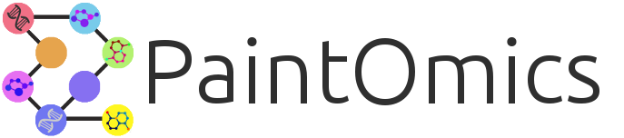
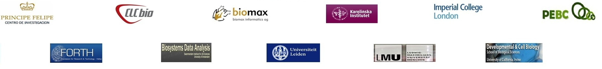

    

# Paintomics, integrative visualization of multiple *omic* data                                    
For any question on **PaintOmics 4**, users can send a mail to [paintomics4@outlook.com](mailto:paintomics4@outlook.com).

**PaintOmics 4** official instance: [https://www.paintomics.org/](https://www.paintomics.org/)

## Welcome to PaintOmics 4 documentation.

**PaintOmics 4** is a web tool for the integrative visualization of multiple *omic* datasets onto [KEGG](https://www.genome.jp/kegg/), [Reactome](https://reactome.org/), and [MapMan](http://www.gomapman.org/) pathways.

**PaintOmics 4** consists of three simple steps:

* **Data uploading**: typically data matrices, containing, for example, gene expression, metabolite levels, and metabolite levels for the same set of samples.
* **Identifier and Name Matching and Metabolite assignment**: as PaintOmics requires Entrez IDs for working with KEGG pathways, the tool will try to convert the names and identifiers from different sources and databases for the input data. Additionally, it's necessary to specify metabolite assignments in ambiguous cases.
* **Results:** Pathways summary, Pathways classification, Pathways network, Metabolite hub analysis, Metabolite class enrichment, Pathways enrichment, Pathways visualization (by clicking for any of the displayed pathways in the Pathways enrichment section). Understand more about these analyses in [our documentation](http://paintomics.readthedocs.io/en/latest/) or [video tutorial](https://www.youtube.com/channel/UCSoQ3LSli9ZxOQTX56_WJeA).

Currently, **PaintOmics 4** supports integrated visualization of multiple species of different biological kingdoms and allows users to request any other organism present in the [KEGG](https://www.genome.jp/kegg/), [Reactome](https://reactome.org/), and [MapMan](http://www.gomapman.org/) databases.

**PaintOmics 4** application is distributed under **GNU General Public License, Version 3**.

    

**Paintomics 4** is part of the [STATegra Project](https://cordis.europa.eu/project/id/306000/reporting) and was developed by the [Genomics of Gene Expression Lab](http://conesalab.org/) at [Príncipe Felipe Research Centre](http://www.cipf.es/).

## Video tutorial 

**PaintOmics concepts tutorial**

The PaintOmics concepts tutorial helps you understand why and how we conduct different analysis methods and functionalities in PaintOmics.

1. [0:00](https://www.youtube.com/watch?v=brvToUmL1n4&t=0s) Introduction of **PaintOmics 4**
2. [2:24](https://www.youtube.com/watch?v=brvToUmL1n4&t=144s) Pathway Enrichment Analysis 
3. [4:16](https://www.youtube.com/watch?v=brvToUmL1n4&t=256s) Metabolite Hub Analysis 
4. [6:30](https://www.youtube.com/watch?v=brvToUmL1n4&t=390s) Metabolite Class Activity Analysis  
5. [8:13](https://www.youtube.com/watch?v=brvToUmL1n4&t=493s) Metagenes 
6. [10:09](https://www.youtube.com/watch?v=brvToUmL1n4&t=609s) Pathway Interactions Network 
7. [13:00](https://www.youtube.com/watch?v=brvToUmL1n4&t=780s) Regulatory Omics

check the full [PaintOmics concepts tutorial](https://youtu.be/brvToUmL1n4)

**PaintOmics step-by-step tutorial**

The PaintOmics step-by-step tutorial helps you learn how to analyze different data types supported by PaintOmics step-by-step. 

1. [0:00](https://www.youtube.com/watch?v=4XxPKqAubsA&t=0s) Introduction of **PaintOmics 4**
2. [0:59](https://www.youtube.com/watch?v=4XxPKqAubsA&t=59s) Overview of the video
3. [3:34](https://www.youtube.com/watch?v=4XxPKqAubsA&t=214s) How to analyze gene/metabolomics data 
4. [16:11](https://www.youtube.com/watch?v=4XxPKqAubsA&t=971s) How to analyze region-based omics data
5. [19:20](https://www.youtube.com/watch?v=4XxPKqAubsA&t=1160s) How to analyze regulatory omics analysis

check the full [PaintOmics step-by-step tutorial](https://youtu.be/4XxPKqAubsA)

## Contact

**Tian-Yuan Liu**, Main Developer.

**Ana Conesa, Ph.D.**, Head Genomics of Gene Expression Lab.

For any question on STATegraEMS, users can send a mail to [paintomics4@outlook.com](mailto:paintomics4@outlook.com).

    
    

    

