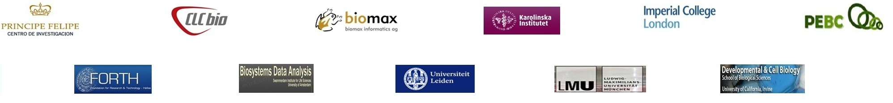

<p align="center">
  
</p>

<h1 align="center">PaintOmics AI</h1>

<p align="center">
  <b>Integrative visualization and analysis of multi-omics data on KEGG, Reactome and MapMan pathways —<br>
  now with an interpretation agent that reads the results and writes up the biology with citations you can check.</b>
</p>

<p align="center">
  <a href="https://paintomics.uv.es/"></a>
  <a href="https://paintomics.readthedocs.io/en/latest/"></a>
  <a href="https://doi.org/10.1093/nar/gkac352"></a>
  
  <a href="LICENSE"></a>
</p>

---

## Overview

PaintOmics takes several *omic* measurements from the same experiment —
transcriptomics, proteomics, metabolomics, region-based assays such as ChIP-seq
or Methyl-seq, and regulatory layers such as miRNA or transcription factors —
and paints them together onto biological pathways, so that the layers can be
read against each other rather than one at a time.

It supports [KEGG](https://www.genome.jp/kegg/),
[Reactome](https://reactome.org/) and [MapMan](http://www.gomapman.org/)
pathways for organisms across all biological kingdoms, and any other organism
present in those databases can be installed on request.

**PaintOmics AI is the current release, and the successor to PaintOmics 4**
([*Nucleic Acids Research*, 2022](https://doi.org/10.1093/nar/gkac352)). It
keeps everything PaintOmics 4 does and adds the AI interpretation agent, the
MORE regulatory model, multi-condition designs, and a rebuilt interface — see
[What's new](#whats-new-in-paintomics-ai). The public instance runs on
[Supercomputador Drago](https://aic.csic.es/supercomputador-drago/) (CSIC).

**Try it without installing anything:** [https://paintomics.uv.es](https://paintomics.uv.es/)

## What's new in PaintOmics AI

| Area | What changed |
|---|---|
| **AI interpretation** | New. An agent reads your ranked pathways, searches PubMed for supporting work, and drafts the biology with numbered, checkable citations — per pathway, across the whole analysis, and as follow-up questions. Opt-in per job. [Details below](#the-ai-interpretation-agent). |
| **MORE regulatory model** | Regulatory Omics gained the [MORE](https://github.com/BiostatOmics/MORE) model behind a method chooser, with three engines: PLS1 on a Rust port (default, measured byte-identical to R and several hundred times faster), PLS1 on R, and MLR on R. A job predicted not to fit inside the queue's budget is refused at submit time instead of being killed at the end. |
| **Regulator–target network** | New Step 3 panel drawing regulators against their targets with Cytoscape.js — free layout, per-condition colouring, search, spotlight, exports, and a "Find in pathways" hand-off into the pathway view. Regulation-per-condition tables sit alongside it. |
| **Multi-condition designs** | Analyses run across any number of conditions, not two. Per-condition significance stars in the Step 4 heatmaps, in Metabolite Hub and in Class Activity; columns labelled with your condition names; a Stouffer weights panel; and the combined-p-value statistics checked against SciPy. |
| **Replicate aggregation** | Replicates collapse onto the conditions you declare, in both the pathway visualization and MORE, and the experiment design is drafted from your column headers before a job exists. |
| **Rebuilt interface** | Navigation moved into the header and the left rail is gone; one token-based design system for surfaces, shapes and type; WCAG AA contrast throughout; a dark theme with a header toggle; a redrawn landing page and mark; a contents sidebar on the results page; and modernized dialogs, tables and upload controls. |
| **Examples for every pipeline** | Bundled, manifest-driven example datasets built from a seeded generator, with the pathways the enrichment should recover listed alongside the files. **Load example** now works for Regions2Genes, miRNA2Genes and MORE too, not only pathway acquisition. |
| **Container deployment** | A Docker Compose stack (nginx/TLS → app → MongoDB), a post-deployment smoke test that fails on the mistakes that are expensive to find in production, an operator runbook, and species installation from the command line. |
| **Platform** | Python 3.11, Flask 3, pymongo 4 against MongoDB 7, and the imaging and HTTP stacks upgraded onto versions that carry their security fixes. One pip manifest, pinned. |
| **Security** | Path traversal through job and file names closed; forgeable identity (`userID=0` and ID reuse) fixed; session and password-reset tokens drawn from `secrets`; per-request authorisation guards on job, image and admin routes; password hashes no longer sent to the admin panel; AI consent enforced server-side. |
| **Statistics and correctness** | Enrichment counting, an independent denominator for the hub scorer, BH applied across the whole p-value vector, non-finite p-values dropped before FDR, reproducible metagene clustering, and the R drop-to-vector bug that silently killed metagenes for whole omic/database pairs. |
| **Installers** | KEGG and Reactome download paths repaired (KEGG retired `/list/organism`; Reactome cached error bodies as data), every step made idempotent so reruns skip finished work, and an install that can no longer lose files it does not replace. |
| **Tests** | 135 test scripts, including an end-to-end run against a real installed species, the real R backend rather than a double, an import smoke test over every tracked module, and a check that edited assets get their cache marker bumped. |

## The AI interpretation agent

It turns your ranked pathways into a written interpretation: it reads the
cross-omic patterns, finds the supporting literature, and drafts the biology
with citations you can check.

The pipeline runs in six phases — triage the pathways worth reading, plan the
literature searches, retrieve papers from PubMed, interpret each batch, synthesize
one report, then verify it. **Verification is not cosmetic:** every claim and
quotation is checked back against the retrieved sources, and what cannot be
grounded is redacted rather than published. References are rendered from the
retrieved records, in the order the citations are numbered, and each `[n]` links
to PubMed.

It is off unless you ask for it. The consent box in Step 1 says what leaves the
server — your pathway results and the values of the matched features — and names
the service that receives them; the server re-checks that consent before every
request it sends, and refuses the job up front if no LLM token is configured.
The provider is any OpenAI-compatible endpoint, and a deployment can switch the
feature off entirely with `AI_INTERPRETATION_ENABLED=false`.

## How it works

| Step | What happens |
|---|---|
| **1 · Upload** | Pick an organism and the pathway databases to explore, decide whether to enable the AI interpretation, then upload one data matrix per omic — or load a bundled example. |
| **2 · Match** | Identifiers are converted to the ones the pathway databases use, and ambiguous metabolite names are resolved by you. The screen reports how many features mapped. |
| **3 · Explore** | Enrichment, classification, networks, hub and class analyses, metagenes, regulator–target networks, and pathway diagrams painted with every omic at once. |

## Analyses

| Analysis | What it answers |
|---|---|
| [Pathway enrichment](https://paintomics.readthedocs.io/en/latest/4_1_pathway_enrichment/) | Which pathways are significantly affected, per omic and combined |
| [Pathway classification](https://paintomics.readthedocs.io/en/latest/4_2_kegg_categories/) | Where the affected pathways sit in the database hierarchy |
| [Pathway interaction network](https://paintomics.readthedocs.io/en/latest/4_3_pathways_network/) | How the enriched pathways connect through shared features |
| [Metabolite hub analysis](https://paintomics.readthedocs.io/en/latest/4_4_metabolite_hub_analysis/) | Which metabolites act as hubs for the observed changes |
| [Metabolite class activity](https://paintomics.readthedocs.io/en/latest/4_5_metabolite_class_activity_analysis/) | Which chemical classes of metabolites move as a group |
| [Regulatory omics](https://paintomics.readthedocs.io/en/latest/4_6_Regulatory_omics/) (incl. MORE) | Which trans-acting regulators (miRNA, TF, SF, RBP…) drive the changes |
| [Metagenes](https://paintomics.readthedocs.io/en/latest/4_7_Metagenes/) | The dominant expression trends inside a pathway |
| [Pathway visualisation](https://paintomics.readthedocs.io/en/latest/5_1_browsing_pathways/) | All omics painted on one diagram, with per-feature heatmaps |
| **AI interpretation** | What the ranked pathways mean biologically, with literature to back it |

Two supporting tools convert data into a usable input format: **Regions to
Genes** (RGmatch, for region-based assays) and **miRNA to Genes**.

## Deploy your own instance

### With Docker (recommended)

```bash
git clone https://github.com/ConesaLab/paintomics4.git
cd paintomics4

cp deploy/env.example deploy/.env
$EDITOR deploy/.env                        # PAINTOMICS_BASE_URL is mandatory
./deploy/make-cert.sh <your-hostname-or-ip>

docker compose -f deploy/compose.yaml up -d --build
./deploy/smoke-test.sh
```

Three containers: nginx (TLS) → app (Flask + uWSGI + in-process job queue) →
MongoDB. The first build takes 15–30 minutes, most of it R packages. See
[`deploy/README.md`](deploy/README.md) for configuration, backups, certificates,
and the two constraints that must not be relaxed.

AI interpretation needs an OpenAI-compatible endpoint and its key in
`deploy/.env`; without one the rest of the application runs normally and the
feature refuses jobs, or set `AI_INTERPRETATION_ENABLED=false` to hide it.

### From source (development)

Requires **Python 3.11**, **MongoDB**, **R**, and the `libcairo2` shared library.

```bash
git clone https://github.com/ConesaLab/paintomics4.git
cd paintomics4

python3.11 -m venv .venv && source .venv/bin/activate
pip install -r requirements.txt

# R packages used by hub analysis, metagenes and regulatory omics
Rscript -e 'install.packages(c("purrr","amap","cluster","factoextra","mclust","optparse"))'

cd PaintomicsServer
python src/launch_server.py                # http://localhost:8000
```

The first launch copies `src/resources/example_serverconf.py` to
`src/conf/serverconf.py`; edit that file (or the environment variables it reads)
to set paths, MongoDB host, SMTP, quotas and the AI and MORE backends.
`./start_server.sh` does the same through a conda environment and starts MongoDB
if it is not already running.

MORE's PLS1 runs on the Rust port whenever a `more-rs` binary is discoverable —
beside `runMORE.R` or on `PATH` — and falls back to R when it is not, so a host
that has never heard of the port behaves exactly as before. Set
`PAINTOMICS_MORE_RS=off` to force R for every job; MLR always runs on R.

### Load pathway data

A fresh instance has an empty database — install each organism explicitly:

```bash
cd PaintomicsServer
python src/AdminTools/DBManager.py download --specie=mmu --kegg=1 --mapping=1 --common=1 --reactome=1
python src/AdminTools/DBManager.py install  --specie=mmu
```

Use `--common=0` for every species after the first: the common step re-downloads
shared KEGG reference data and dominates the runtime. Reactome curates human and
infers about twenty other species — use `--reactome=0` for the rest.

### Tests

Tests are standalone scripts, run from `PaintomicsServer`:

```bash
cd PaintomicsServer
python -m src.tests.test_release_hygiene     # no secret is committed
python -m src.tests.test_pymongo4_compat     # no removed pymongo API is used
python -m src.tests.test_bug_fixes           # multi-condition statistics
```

## Documentation

Full user guide: **[paintomics.readthedocs.io](https://paintomics.readthedocs.io/en/latest/)**
— including [accepted input formats](https://paintomics.readthedocs.io/en/latest/2_1_accepted_input/),
a [step-by-step guide](https://paintomics.readthedocs.io/en/latest/8_step_by_step/)
and the [FAQ](https://paintomics.readthedocs.io/en/latest/9_faq/).
The sources live in [`docs/`](docs) and build with `mkdocs`.

## Video tutorials

<details>
<summary><b>Concepts tutorial</b> — why and how each analysis works (<a href="https://youtu.be/brvToUmL1n4">watch</a>)</summary>

| Time | Topic |
|---|---|
| [0:00](https://www.youtube.com/watch?v=brvToUmL1n4&t=0s) | Introduction to PaintOmics |
| [2:24](https://www.youtube.com/watch?v=brvToUmL1n4&t=144s) | Pathway enrichment analysis |
| [4:16](https://www.youtube.com/watch?v=brvToUmL1n4&t=256s) | Metabolite hub analysis |
| [6:30](https://www.youtube.com/watch?v=brvToUmL1n4&t=390s) | Metabolite class activity analysis |
| [8:13](https://www.youtube.com/watch?v=brvToUmL1n4&t=493s) | Metagenes |
| [10:09](https://www.youtube.com/watch?v=brvToUmL1n4&t=609s) | Pathway interactions network |
| [13:00](https://www.youtube.com/watch?v=brvToUmL1n4&t=780s) | Regulatory omics |

</details>

<details>
<summary><b>Step-by-step tutorial</b> — analysing each data type (<a href="https://youtu.be/4XxPKqAubsA">watch</a>)</summary>

| Time | Topic |
|---|---|
| [0:00](https://www.youtube.com/watch?v=4XxPKqAubsA&t=0s) | Introduction to PaintOmics |
| [0:59](https://www.youtube.com/watch?v=4XxPKqAubsA&t=59s) | Overview of the video |
| [3:34](https://www.youtube.com/watch?v=4XxPKqAubsA&t=214s) | Gene expression and metabolomics data |
| [16:11](https://www.youtube.com/watch?v=4XxPKqAubsA&t=971s) | Region-based omics data |
| [19:20](https://www.youtube.com/watch?v=4XxPKqAubsA&t=1160s) | Regulatory omics analysis |

</details>

These cover the analyses as released in PaintOmics 4; the pipeline they describe
is unchanged. More on the
[PaintOmics YouTube channel](https://www.youtube.com/channel/UCSoQ3LSli9ZxOQTX56_WJeA).

## Citation

If PaintOmics contributed to your work, please cite:

> **PaintOmics 4**: new tools for the integrative analysis of multi-omics
> datasets supported by multiple pathway databases.
> *Nucleic Acids Research* (2022). [10.1093/nar/gkac352](https://doi.org/10.1093/nar/gkac352)

<details>
<summary>Earlier releases and related tools</summary>

- **PaintOmics 3** — *Nucleic Acids Research* (2018), [10.1093/nar/gky466](https://doi.org/10.1093/nar/gky466)
- **PaintOmics 2** — *Bioinformatics* (2011), [10.1093/bioinformatics/btq594](https://doi.org/10.1093/bioinformatics/btq594)
- **RGmatch** — *BMC Bioinformatics* (2016), [10.1186/s12859-016-1293-1](https://doi.org/10.1186/s12859-016-1293-1)
- **MORE** — the regulatory model behind the Regulatory Omics option, [BiostatOmics/MORE](https://github.com/BiostatOmics/MORE)

BibTeX records are available from the **More → Cite PaintOmics** menu in the
application.

</details>

## Contact and contributing

Questions, bug reports and organism requests: [paintomics4@gmail.com](mailto:paintomics4@gmail.com)
or an [issue](https://github.com/ConesaLab/paintomics4/issues) on this
repository. Pull requests are welcome.

## License

Distributed under the **GNU General Public License, Version 3** — see
[`LICENSE`](LICENSE).

## Acknowledgements

PaintOmics is developed by the [Genomics of Gene Expression Lab](http://conesalab.org/)
and originated in the [STATegra Project](https://cordis.europa.eu/project/id/306000/reporting),
funded by the European Commission's 7th Framework Programme.

<p align="center">
  
  &nbsp;&nbsp;
  
</p>

<p align="center">
  
</p>
