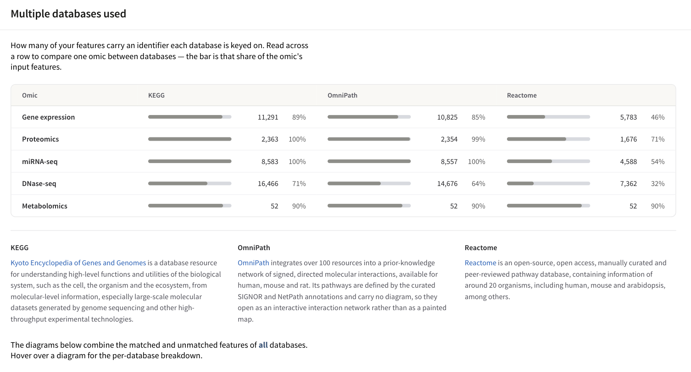

# Supported identifiers

You do not have to convert your files before uploading them. PaintOmics reads
the first column of each data file as a feature name and looks that string up
in the identifier tables it installed for your organism, then translates it
into whatever identifier each pathway database is keyed on. This page says
which strings it can recognise, how the translation works, and what to do when
a file maps badly.

Two things are true of everything below, and it is worth reading them first.

* **Support varies by organism, and by server.** The identifier types an
  organism accepts are whatever its installer actually built, and the pathway
  databases it can be analysed against are whatever that server installed for
  it. Nothing here is universal.
* **The mapping summary in Step 2 is the only authority for your own file.**
  It reports, per omic and per database, how many of your features resolved.
  If this page and that card disagree about your organism, the card is right.

## How a name becomes an identifier

Every gene-based omic goes through the same three steps when you press **Run
PaintOmics**.

1. **Your string is looked up exactly as you typed it.** The lookup does not
   filter on identifier type, so an Ensembl gene id, a UniProt accession and a
   gene symbol all go through the same query — and a column that mixes them
   works.
2. **The identifiers that name the same gene are collected**, and among them
   PaintOmics takes the one the selected database is keyed on. That target is
   different for each database, and for KEGG it is different for each organism.
3. **If that fails, one further hop is tried**, and only through gene-level
   identifiers: NCBI Gene ID, Ensembl gene id and KEGG gene id. Transcript and
   protein identifiers are deliberately excluded from this hop, because a
   shared peptide can join two paralogues — PaintOmics will not map your gene
   onto a family member to gain a match.

!!! warning "The gene-side match is literal"
    It is an exact, case-sensitive string comparison, and nothing is stripped.
    A versioned Ensembl id (`ENSMUSG00000102693.2`) is a different string from
    `ENSMUSG00000102693` and matches nothing. If nothing at all maps,
    PaintOmics says so and, when it recognises version suffixes in your
    unmatched identifiers, tells you to strip them and run again. Metabolite
    names are the exception: they are matched case-insensitively (see
    [Metabolites and other compound-based omics](#metabolites-and-other-compound-based-omics)).

## What each database is keyed on

| Database | Your features are translated into | Where it is offered |
|---|---|---|
| KEGG | The NCBI Gene ID for ten organisms; KEGG's own gene id for all the rest | Every organism, always — the KEGG checkbox is ticked and disabled, and the server adds KEGG to every job whatever you submitted |
| Reactome | Reactome's own gene identifier, which is an upper-cased gene symbol | 15 of the 23 organisms configured in this release, where the server installed Reactome data for them |
| MapMan | The MapMan gene identifier its bin mapping uses | Arabidopsis, tomato, potato and rice |
| OmniPath | A UniProt accession | Human, mouse and rat only — the OmniPath web service serves no other organism |

The organisms whose KEGG data is keyed on the **NCBI Gene ID** are human,
mouse, rat, cow, pig, dog, chicken, chimpanzee, green anole and *Xenopus
tropicalis*. Every other organism — including zebrafish, fruit fly, worm, both
yeasts, *Plasmodium*, *Dictyostelium* and all the plants — is keyed on
**KEGG's own gene id**, which spells a gene differently in each organism
(`Dmel_CG3068` for fly, `CELE_C17G1.7` for worm, `Os01g0147900` for rice under
the RAP-DB code). You never have to type these yourself; they are the target
of the translation, not an input requirement.

An organism that has no identifier configuration at all is offered KEGG and
nothing else, even if pathways from another database are sitting in its
database — a source whose identifiers cannot be mapped would contribute
pathways that stay permanently empty, so it is not offered.

### Which databases you actually see

Step 1 asks the server which databases are installed for the organism you
picked, ticks those, and disables the rest with a **not installed** tag. The
answer is computed per organism from two facts: that database's pathways are
loaded for that organism, and that organism has an identifier mapping for it.
Changing the organism re-ticks and re-labels the row.

If that request fails, Step 1 offers every database and prints a note under
the checkbox group saying so. A row where all four boxes are tickable is a
degraded state, not a server that has everything.

## What you can upload

The identifier types an organism accepts are decided by its build script. Each
build step registers its own identifier types, and a step whose download was
missing is skipped with a warning — the organism installs anyway, without
those types.

| Build step | Identifier types it installs |
|---|---|
| KEGG mapping | UniProt accession, NCBI Gene ID, KEGG gene id, KEGG gene symbol and its synonyms |
| Ensembl | Ensembl gene, transcript and protein ids, and NCBI Gene ID |
| RefSeq accessions | RefSeq RNA and protein accessions, curated and predicted |
| RefSeq gene symbols | Gene symbols and their synonyms |
| UniProt | UniProt accession and UniProt identifier |
| MapMan | MapMan gene identifier |
| Reactome | Reactome gene identifier |

**Most installed organisms run only the KEGG mapping step.** The source tree
carries a bespoke build script for 24 organisms; every other organism is built
by the default script, which runs the KEGG mapping and nothing else. Those
organisms accept UniProt accessions, NCBI Gene IDs, KEGG gene ids and KEGG
gene symbols with their synonyms — and nothing else. On the public server at
paintomics.uv.es, which listed 133 organisms on 21 August 2026, that is about
110 of the list.

### Organisms with an identifier configuration

These 23 organisms have an entry in the shipped identifier configuration. That
entry is what names the target identifier for each database, so it is also what
decides which databases the organism can be offered at all: an organism absent
from it is offered KEGG and nothing else, and resolves through KEGG gene ids
and KEGG gene symbols. Twenty-two of the 23 also have a build script of their
own; the last column is what that script asks for, not a guarantee that every
table came out populated — see the caveat under the table.

| Organism | Code | Databases it can offer | Build steps its install runs |
|---|---|---|---|
| *Anolis carolinensis* (green anole) | acs | KEGG | Ensembl, RefSeq accessions, RefSeq symbols, UniProt |
| *Arabidopsis thaliana* | ath | KEGG, MapMan | Ensembl, RefSeq accessions, RefSeq symbols, UniProt, KEGG mapping, MapMan |
| *Bos taurus* (cow) | bta | KEGG, Reactome | Ensembl, RefSeq accessions, RefSeq symbols |
| *Caenorhabditis elegans* | cel | KEGG, Reactome | Ensembl, RefSeq accessions, RefSeq symbols, UniProt, KEGG mapping |
| *Canis lupus familiaris* (dog) | cfa | KEGG, Reactome | Ensembl, RefSeq accessions |
| *Danio rerio* (zebrafish) | dre | KEGG, Reactome | Ensembl, RefSeq accessions, RefSeq symbols, UniProt, KEGG mapping — its Ensembl and RefSeq steps produced nothing, see below |
| *Dictyostelium discoideum* | ddi | KEGG, Reactome | UniProt, KEGG mapping |
| *Drosophila melanogaster* (fruit fly) | dme | KEGG, Reactome | Ensembl, RefSeq accessions, RefSeq symbols, UniProt, KEGG mapping |
| *Gallus gallus* (chicken) | gga | KEGG, Reactome | Ensembl, RefSeq accessions, RefSeq symbols, UniProt |
| *Homo sapiens* (human) | hsa | KEGG, Reactome, OmniPath | Ensembl, RefSeq accessions, RefSeq symbols, UniProt |
| *Mus musculus* (house mouse) | mmu | KEGG, Reactome, OmniPath | Ensembl, RefSeq accessions, RefSeq symbols, UniProt |
| *Oryza sativa japonica* (rice) | osa | KEGG, MapMan | KEGG mapping, MapMan |
| *Oryza sativa japonica*, RAP-DB identifiers | dosa | KEGG | Ensembl, KEGG mapping — its Ensembl tables were registered and never filled, see below |
| *Pan troglodytes* (chimpanzee) | ptr | KEGG | Ensembl, RefSeq accessions, RefSeq symbols |
| *Plasmodium falciparum* 3D7 | pfa | KEGG, Reactome | RefSeq accessions, RefSeq symbols, KEGG mapping |
| *Rattus norvegicus* (rat) | rno | KEGG, Reactome, OmniPath | Ensembl, RefSeq accessions, RefSeq symbols, UniProt |
| *Saccharomyces cerevisiae* (budding yeast) | sce | KEGG, Reactome | Ensembl, RefSeq accessions, RefSeq symbols, UniProt, KEGG mapping |
| *Schizosaccharomyces pombe* (fission yeast) | spo | KEGG, Reactome | UniProt, KEGG mapping |
| *Solanum lycopersicum* (tomato) | sly | KEGG, MapMan | Ensembl, KEGG mapping, MapMan |
| *Solanum tuberosum* (potato) | sot | KEGG, MapMan | KEGG mapping, MapMan |
| *Sus scrofa* (pig) | ssc | KEGG, Reactome | Ensembl, RefSeq accessions, RefSeq symbols |
| *Xenopus tropicalis* (tropical clawed frog) | xtr | KEGG, Reactome | Ensembl, RefSeq accessions, RefSeq symbols |
| *Bifidobacterium animalis* subsp. *lactis* BB-12 | bbb | KEGG | KEGG mapping only — it has no build script of its own and is built by the default one |

Two organisms are the other way round: `mtu` and `bvu` have a build script of
their own but no identifier configuration, so they are offered KEGG alone and
resolve like any default-built organism.

* `mtu` runs exactly what the default script runs — the KEGG mapping and the
  KEGG pathways — so its script asks for nothing extra. The code is stale as
  well: the KEGG organism catalogue this release ships — the list **Request an
  organism** offers you — does not contain `mtu`, and names *Mycobacterium
  tuberculosis* H37Rv `mtv`.
* `bvu` additionally downloads and builds MapMan data, and that data cannot be
  reached: MapMan is offered only where the identifier configuration names a
  MapMan target, and `bvu` has no entry. It is also data for a different
  organism. The build fetches GoMapMan's sugar beet export, whose gene ids are
  RefBeet loci, while `bvu` is the KEGG code for *Phocaeicola vulgatus*.
  GoMapMan's species codes are not KEGG codes, and this is one of the pairs
  where they disagree. Do not install `bvu` expecting MapMan.

!!! warning "A build step can run and still install nothing"
    Some steps — the KEGG mapping, MapMan and Reactome — register their
    identifier types before they read their input files, so a missing or failed
    download leaves a type declared and empty; the others skip before
    registering and leave it absent altogether. Either way the lookup resolves
    without an error and maps nothing. Three cases are recorded in the
    configuration itself:

    * **Zebrafish (dre)** never got its Ensembl or RefSeq downloads, so it
      carries no Ensembl-derived NCBI Gene IDs and no RefSeq gene symbols even
      though its build script asks for both. Its KEGG identifiers and its gene
      symbols come from the KEGG mapping instead.
    * **Rice under RAP-DB identifiers (dosa)** carries an Ensembl transcript
      table its build registered and never filled, so nothing resolves through
      it. Its RAP-DB gene ids and its gene symbols come from the KEGG mapping
      instead.
    * **Dog (cfa)** builds no gene-symbol table at all. Uploading dog gene
      symbols maps nothing, and the names shown on painted boxes are the
      numeric gene ids rather than symbols.

    This is exactly what the mapping summary exists to tell you for your own
    file. Run the job and read it before rewriting your identifiers.

Organisms outside this table can still be added. Any of the 11,550 organisms
in the KEGG catalogue can be installed on request — use **Request an
organism** under the organism field in Step 1 — and organisms KEGG does not
cover can be installed from a gene-to-KO annotation. Newly installed organisms
get the default identifier set unless someone writes a build script for them.

## Metabolites and other compound-based omics

Compound-based omics are matched a different way, and identically whichever
pathway databases you selected. There is no per-organism identifier table:
your feature name is matched against PaintOmics' KEGG compound-name table.

* **Compound names** are matched case-insensitively, as a **substring**. The
  name you type is escaped first, so `NAD+` and `(R)-lactate` are read as
  literal text and not as patterns. If a name is generic enough to match more
  than 500 KEGG names — the default limit — the substring search is thrown
  away and only exact-name matches are kept.
* **KEGG compound ids** work directly: `C00002` is filed as a name of itself.
* **ChEBI ids** work with or without the prefix — `chebi:15422` and `15422`
  both find ATP.
* A cell made only of punctuation (`-`, `.`) identifies nothing and is
  rejected rather than matched against every compound whose name contains that
  character.

Because a compound name is not unique — "D-Fructose" is the primary name of
three different KEGG compounds — one uploaded name often matches several ids.
Step 2 then raises a **Compounds disambiguation** card per ambiguous name,
headed with how many there are (47 of them in the STATegra 5-omic example).
Each card lists the candidates whose name closely matches what you uploaded,
with the rest collapsed behind a **N more matches** link. Those close matches
are ticked for you — where two of your input names claim the same KEGG
compound, only the closer one keeps it. Untick what you did not measure and
tick anything the card missed; only ticked compounds go into the analysis.

If the deployment has PaintOmics AI enabled and configured and you gave
consent in Step 1, the card also offers **Choose for me**, which settles every
ambiguous name at once and reports how many it changed by name and how many by
PaintOmics AI, with an **Undo** that puts every tick back. Its answers are checked
against each card's own candidate list, so it can only pick something that was
already on the card. On a server without AI configured the panel does not
appear at all.

!!! note "Why an exact name match is not enough on its own"
    It would be wrong often enough to matter. "Alanine" is the literal name of
    C01401, the unspecified form, not of C00041 (L-alanine); "Serine" and
    "Malic acid" are each the literal name of two different KEGG compounds.
    So **Choose for me** settles a card without asking the model only when one
    candidate survives on the evidence — one close name match, or one that this
    organism actually draws on a pathway. Everything else goes to the model,
    and what the model is unsure of is left for you.

## Regulatory and region-based omics

These two omic types are not matched by their own feature names.

* A **region-based omic** (ChIP-seq, DNase-seq, ATAC-seq, Methyl-seq) is a BED
  file of coordinates plus a GTF annotation. PaintOmics associates regions with
  genes itself, and the gene identifiers it produces are whatever the GTF
  attribute named in **GTF Tag for gene ID/name** holds — `gene_id` unless you
  change it on the panel. If your GTF names genes by Ensembl id, that is
  what gets translated; a GTF whose `gene_id` is a locus tag the organism's
  tables do not carry will map poorly however good the regions are.
* A **regulatory omic** (miRNA, transcription factors, methylation) carries a
  two-column associations file pairing each regulator with its target gene. The
  **gene** side is what is translated. The regulator name becomes the display
  label, and a symbol lookup is attempted for it: when that resolves, the
  canonical gene symbol is shown in its place. miRNA names normally miss, which
  is expected — the name you wrote is kept as you wrote it.

See [Preparing your data](2_1_accepted_input.md) for the file layouts and
[Regulatory omics (MORE)](4_6_Regulatory_omics.md) for what the regulatory
analysis does with them.

## Reading the mapping summary

Step 2 opens on **Feature ID/name translation summary**: the percentage of
your input features that resolved into the identifier each database is keyed
on. Beside it, when a job runs more than one database, **Multiple databases
used** puts one row per omic and one column per database, so you can read
across a row and compare one omic between databases.

*One row per omic, one bar and count per database, with each database described underneath.*

These figures are **not a ranking**. The databases use different identifier
types and differ in scope by design, and a feature counts as soon as its name
resolves, even if it belongs to no pathway in that database. Pathway coverage
is reported later, in [the enrichment table](4_1_pathway_enrichment.md).

To see exactly which of your identifiers resolved and to what, use **Download
ID/Name mapping results** under the translation summary. You get one zip per
job holding, for every omic, a `_matched.txt` — your input name, the name and
identifier it resolved to, which database it matched, your values and the
relevance flags — and a `_unmatched.txt` listing everything that did not
resolve. The same link is on Step 3 under **Mapping and data statistics**, but
that card starts collapsed: press **Show mapping** in the toolbar first.

## When a file maps poorly

Work through these in order.

1. **Check the organism.** A human file run as mouse resolves almost nothing.
   This is the single most common cause.
2. **Check the first column for version suffixes.** `ENSMUSG00000102693.2` is
   not `ENSMUSG00000102693`. Strip the suffix and run again.
3. **Check that the identifier type is one the organism has.** Consult the
   table above, then confirm against your own `_unmatched.txt`. For an organism
   built by the default script, gene symbols and KEGG gene ids are the safest
   choices; Ensembl and RefSeq accessions will not resolve.
4. **Look at which database is low, not just the total.** A file that maps well
   to KEGG and badly to OmniPath is normal — OmniPath is keyed on UniProt
   accessions and covers a curated subset of signalling.
5. **Expect a metabolite file to look worse than a gene file.** Names are
   matched against KEGG compound names; a house naming scheme, a lipid species
   name or an unannotated feature id has nothing to match. Uploading KEGG
   compound ids or ChEBI ids avoids the problem entirely.

If every gene-based omic maps to zero and no compound was selected either,
PaintOmics stops when you continue from Step 2 and says so — naming the omic,
how many identifiers it holds and a few of the ones that failed — rather than
carrying an empty analysis forward.

If instead you see a message that the organism *cannot translate identifiers
for* a database, that is a server configuration fault, not a problem with your
file: the database's pathways are installed but the identifier table it is
configured to use was never built. Report it to the administrators and run the
job against another database in the meantime.

The [AI input converter](ai-input-converter.md) can repair a file whose
*format* the analysis cannot read — the wrong delimiter, a spreadsheet with a
header block, values in the wrong columns. It does not translate identifiers;
that is what the mapping described on this page does.

## See also

* [Your first analysis](8_step_by_step.md) — where Step 1 and Step 2 sit in a
  whole job.
* [Preparing your data](2_1_accepted_input.md) — file layouts for each kind of
  omic.
* [The KEGG pathways database](1_1_kegg.md),
  [Reactome](1_2_reactome.md), [MapMan](1_3_mapman.md) and
  [OmniPath](1_6_omnipath.md) — what each source contributes.
* [Frequently asked questions](9_faq.md) — limits, errors and job recovery.
