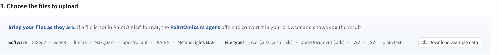
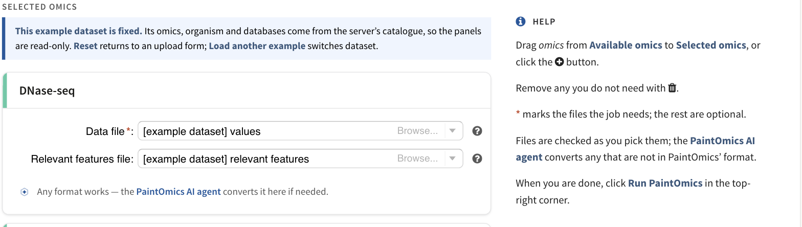

# Preparing your data

This page is the reference for what goes into a PaintOmics job: the shape of
each file, which files are required, and what to do when a file is refused or
matches badly. Everything on it is what the server actually checks, not a
recommendation.

If your data is not in this shape yet, you do not have to reshape it by hand.
PaintOmics checks every file the moment you pick it and offers to repair or
convert it — see [what happens when you pick a file](#what-happens-when-you-pick-a-file).

## What PaintOmics reads



*The specification at the top of **3. Choose the files to upload**, and the
**Download example data** link that gives you the whole example catalogue to
copy from.*

Every file described below is a delimited text table, and PaintOmics is
deliberately relaxed about the details:

| | What the server does |
|---|---|
| Separator | Detected from the first non-empty line. If that line contains a tab, the file is read as tab-separated; otherwise, if it contains a comma, as comma-separated. Tabs and commas both work — you do not have to convert a CSV. |
| Encoding | UTF-8, and a byte-order mark is stripped. A file in another encoding the server can identify — cp1252, latin-1, UTF-16 — is transcoded to UTF-8 for you; a binary file, or one whose encoding cannot be determined at all, is refused with an explanation. The check in the browser is stricter than the server on this one point: it marks any file that is not already UTF-8 red and offers to convert it. |
| Quoting | Standard CSV quoting is honoured, so a quoted field may contain the separator. |
| Header row | Optional. The first row is treated as a header **only if its second cell is not a number**. A header whose second cell happens to be numeric is read as data. |
| Decimal mark | A dot. `0,77` is not a number to PaintOmics — this is the single most common reason a real file is refused, and the browser offers to fix it for you. |
| Missing values | `NaN` and `inf` are accepted in a values file (case-insensitive). An empty cell in a value column is not. |
| Spreadsheets | `.xlsx`, `.xlsm`, `.xls` and `.ods` are not parsed directly; they always go to the [AI input converter](ai-input-converter.md). |

Two hard limits apply. One submission may carry at most **100 MB** in total,
and any single file at most **1,000,000 lines**. Both are set by the server
operator, so a local installation may differ.

!!! warning "Every omic in one job must have the same number of value columns"
    PaintOmics paints all your omics onto one set of conditions, so it fixes
    that number from the first values file it reads and refuses any omic that
    disagrees. One fold-change column in your proteomics and twelve sample
    columns in your metabolomics is not a job PaintOmics can run — bring them
    to the same contrasts, or run them as separate analyses. The browser now
    catches this before you submit and offers to harmonise the files for you.

## Gene-based omics

This covers everything whose measured entity is, or can be attributed to, a
gene: RNA-seq and microarrays, proteomics (the protein is charged to its coding
gene), and the gene-level output of the region-based and regulatory tools.

### The values file (required)

One row per feature. The first column is the identifier; every remaining column
is one condition, and each of them must be numeric on every row.

| #geneID | T00h | T02h | T06h | T12h | T18h | T24h |
|---|---|---|---|---|---|---|
| ENSMUSG00000000001 | 0.7718 | 0.0765 | -0.4919 | 0.5690 | -0.2082 | -0.1489 |
| ENSMUSG00000000028 | -0.1583 | 0.2198 | 0.0718 | -0.4796 | 0.1183 | 0.3137 |
| ENSMUSG00000000037 | -0.3069 | -0.0084 | 0.5791 | 0.1722 | -0.2686 | -0.5804 |

The values are read as they are given. The convention the interface assumes is
a **log ratio against a reference or control**: positive means more of the
feature, negative means less. The colour scale on the pathway maps is set, by
default, from the 10th and 90th percentiles of your own data, so an unlogged
ratio will paint but will not read the way you expect.

The header row is optional but worth writing: those labels become the condition
names shown on every heatmap, box plot and hover readout. Without one,
PaintOmics calls them *Condition 1*, *Condition 2* and so on.

If the same identifier appears on more than one row, the server merges those
rows into one feature. The browser tells you when that is about to happen, and
names the worst offender. The one place a repeated identifier is fatal rather
than merged is a [MORE](4_6_Regulatory_omics.md) matrix, which is read into a
table keyed on that column.

### The relevant-features file (optional)

A plain list of the features you consider significant — typically your
differentially expressed genes. One identifier per line, no header:

```
ENSMUSG00000000159
ENSMUSG00000000555
ENSMUSG00000000579
ENSMUSG00000000740
```

This file is **optional**, on the server as well as on the form. A job with a
values file alone runs, and your data is still mapped and painted. What you lose
is the enrichment: the pathway p-value asks how many of your *relevant* features
land in a pathway, so an omic with no relevant list scores every pathway at
exactly p = 1. Supply the list whenever you have one.

No field in this file may be longer than 80 characters; the server takes a
longer one as evidence that the file is not a list of identifiers at all.

## Compound-based omics

Metabolomics, and anything else whose entities are metabolites. The two files
have exactly the same shape as the gene-based ones — the first column holds a
compound name or identifier instead of a gene:

| #compound | T00h | T06h | T12h | T24h |
|---|---|---|---|---|
| Alanine | -0.11 | 0.39 | 0.62 | 0.08 |
| Valine | 0.57 | 0.42 | -0.19 | -0.44 |
| Leucine | 0.85 | 1.03 | 0.44 | -0.12 |

The relevant-compounds file is again one name per line and again optional.

### What a compound name is matched against

PaintOmics resolves the first column against KEGG's compound table, which
holds, for every compound: its KEGG identifier, its primary name, and all of
its synonyms. So `C00031`, `D-Glucose` and `Grape sugar` all reach the same
place. Matching is **case-insensitive** and is a **substring** search, which
has two consequences worth knowing:

* A short or generic name matches a lot. `Alanine` matches every KEGG name that
  contains the word, so it resolves to several compounds at once. A name that
  hits more than 500 KEGG names — the shipped ceiling — falls back to exact
  matches only.
* Because one name can legitimately belong to several KEGG compounds
  (`D-Fructose` is the primary name of C00095, C05003 and C10906), PaintOmics
  does not choose for you. Every ambiguous name is collected and handed to you
  on the mapping step, where you tick the compounds you meant — see the
  **Compounds disambiguation** card in
  [your first analysis](8_step_by_step.md).

A cell that holds only punctuation — `-`, `.`, `?` — is treated as a missing
identifier and skipped rather than matched.

### The experimental design file (optional, compound omics only)

A compound-mapped omic card carries one extra file row, **Experimental design**.
Use it when your values file has one column per *sample* rather than one column
per contrast: the design says which condition each sample column belongs to, and
that is what lets the
[metabolite class activity test](4_5_metabolite_class_activity_analysis.md) run a
permutation test on your own replicates instead of a binomial test on your
relevant list.

Two columns, one row per value column of the data file. A `#` header is allowed:

| #sample | condition |
|---|---|
| Ctr_0H_B9 | Ctr_0H |
| Ctr_0H_B10 | Ctr_0H |
| Ctr_0H_B11 | Ctr_0H |
| Ctr_2H_B9 | Ctr_2H |

A MORE-style 0/1 indicator matrix (see [below](#association-and-design-files-for-regulatory-omics))
is accepted here too. Every value column of the data file must appear in it; a
column the design does not name stops the job with a message listing it.

!!! note "Replicate-level metabolomics usually runs on its own"
    The same-width rule applies to the file as uploaded, before the replicates
    are collapsed. A 36-sample metabolomics matrix therefore only sits beside
    other omics if those omics also carry 36 columns. The bundled STATegra
    replicates example is a single-omic job for exactly this reason.

## Region-based omics

ChIP-seq, DNase-seq, ATAC-seq, Methyl-seq — anything whose features are genomic
intervals. The values file is a BED-like table: the first three columns are the
chromosome, the start and the end coordinate, and the rest are the measurements.

| #CHR | start | end | T00h | T02h | T06h | T12h |
|---|---|---|---|---|---|---|
| 1 | 40098 | 40498 | -0.1143 | 0.1536 | -0.1026 | 0.7611 |
| 1 | 60000 | 60400 | -0.3096 | 0.2624 | -0.0683 | 0.4886 |
| 1 | 129499 | 129899 | -0.0957 | -0.1797 | -0.1881 | -0.3045 |

The relevant-regions file is the coordinate triple alone, with no values. A
`#`-prefixed header line, if you write one, is ignored:

```
1	249499	249899
1	969499	969899
1	2649499	2649899
```

Together, chromosome, start and end name the region: two rows that share all
three are the same feature.

A region-based omic cannot be enriched or painted as it stands, because pathways
are drawn on genes. The **Region-based omic** card therefore runs
[RGmatch](#matching-regions-to-genes-rgmatch) first, which needs one more file —
a **GTF annotation** for your organism, carrying `exon` rows in its third
column. It does not have to be sorted. PaintOmics ships GTFs for some
organisms; the caret menu beside **Browse...** on that row offers **Use a GTF
from Paintomics**.

Two shortcuts sit at the top of the card:

* **My regions are already mapped to Gene IDs, skip this step.** Replaces the
  card with a plain gene-based form: give it a values file keyed by gene and it
  behaves like any other omic.
* **Provide own associations lists.** Keeps your own region identifiers and asks
  you for a two-column **Associations file** relating each of them to a gene,
  plus an optional relevant-associations list.

!!! warning "Chromosome names have to agree"
    `1` and `chr1` are different chromosomes as far as the matching is
    concerned. If the regions file and the GTF disagree, nothing associates and
    the job stops with a message naming the distance it searched. Check the two
    files' first column before you upload.

## Per-condition relevance

A relevant-features file may hold **one column per condition** instead of a
single list — use it when a feature is significant at some timepoints and not at
others. Write one column per value column of the data file, in the same order,
with a header of condition names, and leave a cell blank where nothing more is
relevant in that column:

| T00h | T02h | T06h | T12h | T18h | T24h |
|---|---|---|---|---|---|
| ENSMUSG00000000037 | ENSMUSG00000000037 | ENSMUSG00000000394 | ENSMUSG00000000037 | ENSMUSG00000000037 | ENSMUSG00000000037 |
| ENSMUSG00000000157 | ENSMUSG00000000394 | ENSMUSG00000000579 | ENSMUSG00000000394 | ENSMUSG00000000157 | ENSMUSG00000000157 |
| ENSMUSG00000000876 | ENSMUSG00000000876 | ENSMUSG00000001445 | ENSMUSG00000000579 | ENSMUSG00000000394 | ENSMUSG00000000394 |

The columns are independent lists: the same identifier may appear in several of
them, in different rows, or not at all. Blank cells are the format, not a fault.

The width is checked. A relevant-features file must have either one column, or
exactly as many columns as the values file has value columns. Two columns are
the one exception: that shape is always accepted, because it is also a
target/regulator pair list — see the warning below.

!!! warning "A two-column relevance file is ambiguous"
    Two columns of identifiers is also the shape of a target/regulator pair list,
    which the regulatory tools produce, so PaintOmics has to tell them apart. It
    does so from the first row: a plain header of condition names commits the
    file to the per-condition reading. If your experiment has exactly two
    conditions, give the file that header — without one, a file whose first data
    row holds two identifier-looking cells is read as a pair list.

## Association and design files for regulatory omics

The [regulatory analyses](4_6_Regulatory_omics.md) take files that are not
quantification matrices at all. They are listed here because they are checked in
the browser like everything else, and because their column order matters.

**A regulator-to-target list** relates each regulator to the genes it may act
on. The **Regulatory Omic — Pairwise** card reads it as *regulator, target*, and
tolerates a third column holding a prediction score:

| miRNA | Ensembl.Gene.ID | PLR |
|---|---|---|
| mmu-miR-100-3p | ENSMUSG00000016498 | 4.22 |
| mmu-miR-100-3p | ENSMUSG00000022248 | 4.27 |
| mmu-miR-100-3p | ENSMUSG00000027120 | 3.68 |

The regulator identifiers in this file must be spelled exactly as in the
regulator quantification file, and the target identifiers exactly as in the gene
expression file. Those two mismatches are the usual cause of a regulatory run
that finds nothing, and the error message names both identifier spaces when it
happens.

MORE's association file carries the same information written the other way round
— *target, regulator*, with an optional third column naming the interaction type
— and MORE detects the orientation itself by checking which of the two columns
contains identifiers it recognises as regulators. It requires a header row and
refuses a file with four or more columns.

| Target | Regulator |
|---|---|
| ENSMUSG00000000489 | mmu-miR-226-5p |
| ENSMUSG00000000489 | mmu-miR-235-5p |
| ENSMUSG00000000489 | mmu-miR-238-5p |

**A relevant-associations file** — the Pairwise card only — is the subset of
those pairs you consider real. One or two columns; an empty file is legitimate,
and means the correlation filter kept nothing.

**MORE's Conditions file** is an experimental design written as an indicator
matrix: a sample column, then one column per condition, `1` where the sample
belongs to that condition and `0` where it does not.

| Sample | Control | Early | Mid | Late |
|---|---|---|---|---|
| Control_R1 | 1 | 0 | 0 | 0 |
| Control_R2 | 1 | 0 | 0 | 0 |
| Early_R1 | 0 | 1 | 0 | 0 |
| Early_R2 | 0 | 1 | 0 | 0 |

**MORE's data files** are the one place the log-ratio convention does not apply.
Both the target gene expression matrix and each regulator matrix carry **one
column per sample**, with the replicates present, and the same sample names as
the design file. Identifiers must be unique: whichever engine runs the job, a
repeated row name is refused outright — `duplicate 'row.names' are not allowed`
— rather than merged into one row.

| RegulatorID | Control_R1 | Control_R2 | Control_R3 | Early_R1 | Early_R2 | Early_R3 |
|---|---|---|---|---|---|---|
| mmu-miR-200-5p | 9.9642 | 7.7285 | 8.2007 | 5.1361 | 8.3521 | 5.9348 |
| mmu-miR-201-5p | 5.4626 | 4.7241 | 4.7780 | 6.1653 | 4.9035 | 6.7263 |

## Which files are required

Every file row on the form declares whether the analysis needs it: a red
asterisk after the label means the job cannot run without that file, and
nothing means it is optional.



*The **Data file** row carries a red asterisk; the **Relevant features file**
row does not.*

| Panel | Required | Optional |
|---|---|---|
| Gene expression, Proteomics, Other data type | Data file | Relevant features file |
| Metabolomics (and any card set to *Metabolites*) | Data file | Relevant features file, Experimental design |
| Region-based omic | Regions file, Annotations file (GTF) | Relevant regions file |
| Region-based omic, *Provide own associations lists* | Data file, Associations file | Relevant features file, Relevant associations file |
| Regulatory Omic — Pairwise | Regulators expression file, Associations file, **and** either a Relevant associations file or a Gene expression dataset with the correlation filter | Relevant regulators file |
| Regulatory Omic — MORE | Conditions file, Gene expression dataset, one Regulators expression file per regulatory omic | Relevant regulators file, Associations file |

An omic panel you added but left completely empty is simply dropped when you
press **Run PaintOmics**; it is not an error.

## What happens when you pick a file

The check runs in your browser, the moment you choose the file, with nothing
sent anywhere. It reads the file the way the server will — the same separator
detection, the same header rule, the same validation loop — so a green verdict
here is the server's verdict, hours earlier. Each slot is judged against its
own contract: a values matrix, a relevant list, an associations file and a
design matrix are each checked for what they are meant to be.

The browser is deliberately stricter in two places. A file that is not UTF-8 is
marked red here, and you are offered a conversion, where the server would
transcode a cp1252, latin-1 or UTF-16 file itself and carry on. A spreadsheet is
refused on its file name, before anything is read; the server refuses workbooks
too, but it judges by content, so a plain text file that happens to be named
`.xls` is red here and accepted on upload.

A strip appears inside the omic card with one of three verdicts.

**Green.** The file is accepted, and the strip says what it found: the number of
data rows, the number of value columns, a few example identifiers, whether any
identifier repeats, and — for a file over 25 MB — that only the first 5 MB were
read. If another slot in the same card is still blocked, it says so here too, so
a green tick on the values file never reads as "this card is ready" when it is
not.

**Amber, with a Fix automatically button.** The fault is mechanical and a direct
find-and-replace makes the file valid. The strip describes exactly what would
change before you accept it. The repairs are deliberately few and all of them
are reversible in your head:

| Repair | What it does |
|---|---|
| Use dots as the decimal mark | Rewrites `0,77` as `0.77` in the value columns only. Identifiers and the header are left alone. Offered only on tab-separated files — in a comma-separated file the decimal comma has already been consumed as a separator and the original number cannot be recovered. |
| Remove empty trailing columns | Drops columns that are blank on every row, which spreadsheet exports often add. |
| Remove blank lines | Drops rows that are empty in every column. |
| Remove title rows | Drops rows holding a title in the first column and nothing else — a merged Excel banner, flattened by the export. |

This is a find-and-replace, not an AI conversion, and the interface says so. It
carries no AI mark.

**Red.** The fault needs a judgement call — which column is the identifier, which
of fifteen columns are measurements, which sheet of the workbook you meant — and
the strip offers to hand the file to the
[AI input converter](ai-input-converter.md). The converter runs in your browser,
sends only the file's structure and never its measurements, and shows you the
script it wrote and the table it produced before you accept anything. It is off
unless your server operator has enabled it; that page says how to tell.

Pressing **Run PaintOmics** with a red file does not submit. A banner explains
that submitting would only produce the same error more slowly, and offers to fix
or convert — with **Submit anyway** there if you disagree with the verdict.

## Identifier and name conversion

Biological databases do not share a naming convention, and KEGG keys its genes
differently for every species. PaintOmics therefore translates your identifiers
rather than asking you to.

**What it translates from.** The installer builds a cross-reference table per
species out of Ensembl, RefSeq, UniProt and KEGG. Depending on which of those
downloads exist for your organism, that table can hold Ensembl gene, transcript
and protein identifiers, NCBI Gene (Entrez) identifiers, RefSeq transcript and
protein accessions, RefSeq and KEGG gene symbols and their synonyms, UniProt
accessions and identifiers, and KEGG's own feature identifiers. Which ones your
species actually has is a property of the installation — see
[supported identifiers](1_4_id.md), and treat the mapping summary on the second
step as the real answer.

**What it translates to.** One target per pathway database: the identifier KEGG
uses for your species (an NCBI Gene ID for most animals, a KEGG feature ID for
several plants and microbes), Reactome's gene identifiers, MapMan's gene
identifiers, and UniProt accessions for OmniPath.

**How.** Cross-references are grouped by shared transcript. Given an identifier,
PaintOmics looks up its group and keeps the members that belong to the target
database; when a group cannot reach the target directly — Ensembl and RefSeq
transcripts are near-disjoint sets, so this is common — it takes a second hop
through the gene-level identifiers the two sides share. Not every entity exists
in every database, so the translation is never complete; the interface reports
exactly how complete it was.

!!! warning "Gene identifiers are matched exactly"
    There is no case folding and no version-suffix stripping on the gene side.
    `ENSMUSG00000000001.5` will not match `ENSMUSG00000000001`, and `gnai3` will
    not match `Gnai3`. Compound names are the exception: those are matched
    case-insensitively. If a file matches nothing at all, this is the first thing
    to check.

### When a file matches poorly


*One card per omic on the mapping step: how many features were matched, how many
were not, and the distribution of the values that will be painted.*

The mapping step reports, per omic, how many of your features were translated
and how many were not, and lets you download both lists. Work through this in
order:

1. **Read the unmatched list.** Download it from the translation summary card.
   If the unmatched identifiers all look like one namespace, that namespace is
   not installed for your species.
2. **Check for a version suffix or a case difference.** Stripping `.5` from
   Ensembl identifiers, or restoring the capitalisation your species' symbols
   use, often recovers most of a file in one edit.
3. **Check the organism.** A mouse file against a human installation matches
   almost nothing, and nothing in the interface will tell you that except the
   match rate.
4. **Try a different identifier column.** If your table carries both a symbol
   and an accession, the accession usually maps better; symbols are ambiguous
   and change between annotation releases.
5. **Translate the file yourself** with a third-party tool, into the identifier
   KEGG uses for your species, and upload that instead. This always works and is
   the right answer for an organism whose cross-reference tables are thin.

A low match rate is worth fixing before you go on. Every pathway p-value is
computed from the features that matched, so an omic that mapped 12% of its rows
is not a weak result — it is a different experiment from the one you ran.

<!-- Linked from DM_Bed2GenesViews.js as
     2_1_accepted_input/#matching-regions-to-genes-rgmatch. -->
## Matching regions to genes (RGmatch) {#matching-regions-to-genes-rgmatch}

Region-based assays return intervals, and intervals mean nothing to a pathway
until they are attributed to genes. A transcription-factor binding site is
expected near the transcription start site or the promoter of the gene it
regulates; a peak 9 kb downstream is a much weaker claim about the same gene.

PaintOmics does this with **RGmatch** ([Furio and
Tarazona](https://bitbucket.org/pfurio/rgmatch)), a rule-based method that
associates each region with every gene within the search distance — one row per
gene — and records *which area of the gene* the region falls in: upstream,
promoter, TSS, first exon, intron, gene body or downstream. PaintOmics' build additionally carries your quantification
values through the association, so the result is a gene-level values file.

It runs in two places: inside a **Region-based omic** panel on the upload form,
where its output goes straight into the job, and as a standalone page under
**Tools → From Regions to Genes**, which puts the gene-level file into your data
section and offers the whole result as a download, for you to use in a job of
your own. Both take the same inputs — the [BED-like values
file](#region-based-omics), an optional relevant-regions list, and a GTF — and
expose the same settings:

| Setting | Ships as | What it does |
|---|---|---|
| Ignore missing entries | on | Skips regions whose chromosome is absent from the GTF instead of failing the run. |
| Distance | 10 kb | The furthest a region may be from a gene and still be associated with it. |
| TSS region distance | 200 bp | The TSS area starts this far upstream of the TSS and ends at it. |
| Promoter region distance | 1300 bp | The length of the promoter area, ending where the TSS area begins. |
| Overlapped gene area | 90% | How much of the gene a region must cover to be judged at gene rather than transcript level. |
| Overlapped region area | 50% | How much of the region the gene must cover, for the same judgement. |
| GTF Tag for gene ID/name | `gene_id` | Which GTF attribute names the gene. |
| Summarization method | Mean | How several regions landing on one gene are combined: None, Mean or Maximum. |
| Report | All regions | Keep every association, or tick the gene areas you want — for a ChIP-seq experiment, typically TSS and promoter only. |

If nothing associates, the run stops rather than handing you an empty omic, and
the message names the distance it searched. The usual cause is a chromosome
naming mismatch between the regions file and the GTF.

<!-- The explicit id is a contract with the application:
     PaintomicsClient/.../DM_miRNA2GenesViews.js links to
     2_1_accepted_input/#matching-mirnas-to-genes-rgmatch from the
     "From miRNA to Genes" dialog. The heading text is deliberately
     NOT that slug -- miRNA2Genes is not RGmatch -- so the id is
     pinned here rather than left to be derived. Do not remove it
     without changing that link too. -->
## Matching miRNAs to genes (miRNA2Genes) {#matching-mirnas-to-genes-rgmatch}

The companion tool serves the same purpose for regulators, by a different
method. **miRNA2Genes** takes miRNA quantification and a table of predicted
miRNA-to-target relationships, and produces a gene-level file in which each
miRNA's values are carried onto the genes it plausibly regulates. It sits beside
RGmatch at **Tools → From miRNA to Genes**, saves its output the same way, and
the same machinery runs inside a **Regulatory Omic — Pairwise** panel on the
upload form.

It takes:

* the **miRNA quantification file**, in the ordinary [values file](#gene-based-omics) shape;
* the **miRNA-to-target table**, [regulator then target](#association-and-design-files-for-regulatory-omics),
  optionally with a score;
* optionally, a **list of relevant miRNAs**;
* optionally, a **gene expression matrix**, used to filter the predicted targets
  by correlation.

There is no restriction on the identifiers, and no translation happens here: the
only requirement is that the same convention is used on both sides. If your
quantification file says `mmu-miR-100-3p`, the targets file must say
`mmu-miR-100-3p` too, and its target column must use the identifiers your gene
expression file uses.

!!! note "This tool reads tab-separated files with a header row"
    Unlike the upload form, miRNA2Genes always splits on tabs, and always treats
    the first line of the quantification file as a header. A comma-separated
    file, or one that begins with data, will not be read the way you intend.

Most miRNAs have many predicted targets and few real ones at any given moment,
so the point of the tool is to discriminate:

* If you supply a **list of relevant miRNAs**, you can report targets for every
  miRNA in the file or only for the relevant ones.
* If you supply a **gene expression matrix**, each miRNA-target pair is scored by
  the correlation between the two profiles — Kendall by default, Spearman or
  Pearson on request — and filtered on it. A miRNA usually represses its target,
  so the default selection keeps pairs whose correlation is more negative than
  -0.5.

A correlation needs at least two conditions. With a single column every pair is a
tie and nothing can be scored; the tool says so rather than returning an empty
result.
