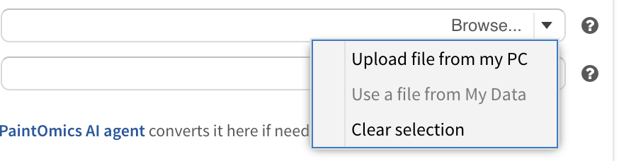

# Accounts, storage and sharing

PaintOmics will run a full analysis for you whether or not you sign in. What an
account changes is what happens *after* the job finishes: whether your input
files are kept where you can reuse them, whether the job appears in a list you
can come back to, and how long the result survives before it is deleted. This
page covers all of that, and the retention rules that decide when a job goes.

## With and without an account

The analysis itself is the same either way. Every omic type, every pathway
database, every result screen and every AI feature works without an account.

| | Without an account | With an account |
|---|---|---|
| Run a job | Yes | Yes |
| Get back to the result | Only from the job's own URL | From the URL, or from **My jobs** |
| Input files kept for reuse | No | Yes, automatically |
| Who else can open the job | Anyone holding the URL | Nobody, until you turn link sharing on |
| Kept for | 7 days | 14 days |
| Warned before it is deleted | No | Yes, by email, 7 days ahead |

The two retention figures are this server's configuration and are explained
under [How long a job is kept](#how-long-a-job-is-kept).

!!! warning "Without an account, the URL is the only way back"
    A job run without signing in belongs to nobody. It is not listed anywhere,
    it cannot be searched for, and PaintOmics cannot email it to you. The
    progress dialog shows the URL while the job runs — save it then. It also
    means the reverse: anyone you give that URL to can open the job, read its
    results and its AI report, and change its saved view.

## Signing in, and creating an account

The sign-in dialog has two columns. On the left you sign in with your email
address and password. On the right, **Continue without an account** starts an
anonymous session.

**Create an account** asks for an email address, a name, a password and,
optionally, your affiliation, and requires you to tick that you have read the
rules and privacy policy. There is no activation step: the account works
immediately, and a welcome email follows.

**Forgot your password?** emails you a reset link together with a generated
password. Following the link puts that password on the account; sign in with
it, then set your own with **Change password** on the **My account** card.

## My files and Jobs

This is the personal storage page, reached from the cloud icon labelled
**Storage** in the top bar. It holds four things.

**My account** shows the user name and email the session is signed in as, and
carries the **Change password** button.

**Used space** shows how much room your account occupies on the server — the
stored input files together with the working directories of the jobs you have
run — as a figure in MB and a bar that turns amber above 60% of the quota and
red above 90%, with the number of files and jobs beside it. The default quota is 200 MB and the
server operator can change it. The meter reports; no upload is refused for
exceeding it.

### My files

Every file you submit through any PaintOmics form is stored here
automatically — you do not have to upload it separately — so a dataset can be
reused in a later job without sending it again. **Upload new files** adds
several at once; that page asks two things of each file, a **Data type** (what
the file holds: a gene expression file, a relevant compound list, a GTF file)
and an **Omic type** (the omic family it belongs to).

| Column | What it holds |
|---|---|
| File Name | The name of the uploaded file. The search box filters on this column. |
| Omic | The omic family the file was submitted under. |
| File type | What the file holds — values, relevant features, and so on. |
| Description | The job and parameters it arrived with. Hover for the full list. |
| Size | File size. |
| Submission Date | When it was stored. Newest first by default. |
| File Options | **Download**, **View** and **Delete**. |

**View** opens the file in a table, 50 rows at a time, with a **Load more**
button at the foot — enough to check that a file has the columns you expect
without downloading it. Rows can also be ticked and deleted together.

### My jobs

Every analysis the account has run is listed here.

| Column | What it holds |
|---|---|
| Job ID | The identifier that appears in the job's URL. The search box filters on this column. |
| Type | The kind of job — a pathway analysis, a MORE regulatory analysis, or a Regions-to-Genes or miRNA-to-Genes conversion. |
| Last step | The furthest step the job reached. |
| Submission date | When it was submitted. Newest first by default. |
| Expiration date | See the warning below. |
| Job name | The first line of the **Experiment design** box on the upload form, cut to 100 characters. For an example job, the dataset's title. |
| Description | The omics, files and settings the job was submitted with. Hover for the full breakdown. |
| Job Options | **Recover** and **Delete**. |

**Recover** on a pathway analysis reopens the job where you left it. On a
Regions-to-Genes or miRNA-to-Genes conversion it offers the output zip for
download instead.

A MORE regulatory analysis is a conversion job too, so **Recover** offers a
download link for it as well — but the link names a file that job never wrote.
It is built as `bed2genes_<date>.zip` for every job that is neither a pathway
analysis nor a miRNA conversion, while MORE names its archive
`more_results_<date>.zip`, so the server answers *File not found*. The results
are not lost: a MORE run feeds a pathway analysis, which is listed here as its
own row with its own job ID, and **Recover** on that row reopens it with MORE's
regulator–target tables in place.

**Delete** removes the job and its files immediately; rows can be ticked and
deleted together.

!!! warning "The Expiration date column is not the retention rule"
    That column is computed in the browser as the date the job was last opened
    plus a fixed 365 days. It does not read the server's retention setting, so
    on the shipped configuration it is roughly a year too late. Use the rule in
    [How long a job is kept](#how-long-a-job-is-kept) instead.

## Reusing a file you have already uploaded

Every file field in the application — on the upload form, and in the
Regions-to-Genes and miRNA-to-Genes tools — carries a **Browse** control inside
the field itself. The caret at its right opens a menu of three items — two
fields add a fourth of their own, the GTF field on a Region-based omic ("Use a
GTF from Paintomics") and the gene expression field on a miRNA omic ("Use a file
from other omic").

*The Browse menu. **Use a file from My Data** is greyed out when you are not
signed in, because there is no personal storage to pick from.*

**Use a file from My Data** opens a picker over the files in your account —
the same table as **My files** — and puts the one you choose into the field.
**Clear selection** empties the field again.

## Coming back to a job

A job has one URL, of the form `<server>/?jobID=<job id>`. It is shown in the
progress dialog while the job runs ("You can come back to this job at any
time"), it is in the address bar once the job opens, and the **Share** dialog
repeats it. Pasting it into a browser reopens the job.

If you are signed in, **Recover** in **My jobs** does the same thing without
needing the URL.

Opening a job — by either route — resets its retention clock. See below.

## Sharing a job

**Share** in the results toolbar opens **Sharing options**.

A job created while you are signed in is **private by default**: the server
refuses it to anyone but you. A job created without an account is open to
everyone holding its URL, because it has no owner to be private from.

The dialog gives the owner two tick-boxes:

* **Allow link sharing** — anyone holding the URL may open the job.
* **Read-only (for others)** — they may look but not change it. Without it,
  anyone who can open the job can also re-run its Step 2, save visual settings
  over yours, apply a replicate mapping or run metagenes on it.

Filtering and visual settings are stored on the server rather than in your
browser, so everyone who opens the link sees the same view.

A job with no owner cannot be made read-only. Every visitor to it is equally
anonymous, so the server has no way to tell the person who created the job from
anyone else; the dialog does not offer the tick-boxes for those jobs, and the
server refuses to set them. If a result needs to stay private, run it signed
in.

## How long a job is kept

**The clock runs from the last time the job was opened, not from when it was
submitted.** Every time a job is shown, the browser tells the server, which
rewrites the job's access date. A job you keep coming back to is never deleted.

In the configuration PaintOmics ships with:

| Job | Kept for |
|---|---|
| Run without an account | **7 days** since it was last opened (`MAX_GUEST_JOB_DAYS`) |
| Belonging to a registered account | **14 days** since it was last opened (`MAX_JOB_DAYS`) |

Both are settings in the server's `serverconf.py`, so the operator of the
server you are using may have chosen different numbers. The message PaintOmics
shows when a job has gone quotes the shipped ones. If you are not sure, ask
whoever runs the instance.

A housekeeping task runs once every 24 hours and deletes the jobs that are past
their limit. For a registered account, a warning email goes out roughly seven
days before, with a link to the job; following that link counts as opening it,
which resets the clock and re-arms the warning for next time.

**What deletion removes.** The job record, its mapped features, its matched
pathways, its saved visual settings, its AI interpretation and chat, and the
job's own directory of files — all of it, permanently, with no undo and no
archive. Opening the URL afterwards gives a message naming the job, followed
by:

> Please, note that jobs are automatically removed after 7 days for guests and
> 14 days for registered users.

"Guests" there means any job that does not belong to a registered account,
including one run without signing in at all.

**What deletion leaves alone.** Your account, and the input files stored under
**My files** — those live in your account rather than in the job, so a later
job can still use them. Your account is not removed for inactivity.

If a result matters, take it out of PaintOmics rather than relying on the job
surviving: the painted diagram downloads as a PNG, the pathway networks as PNG
or SVG, and the complete matched-and-unmatched feature lists as one zip from
**Download ID/Name mapping results** on the mapping card. Reopening the job
every fortnight is not a backup strategy.

## Where to go next

* [Your first analysis](8_step_by_step.md) — the whole tool, screen by screen.
* [Preparing your data](2_1_accepted_input.md) — what each file must contain.
* [Frequently asked questions](9_faq.md) — including what to do when a job
  fails or an error dialog appears.
