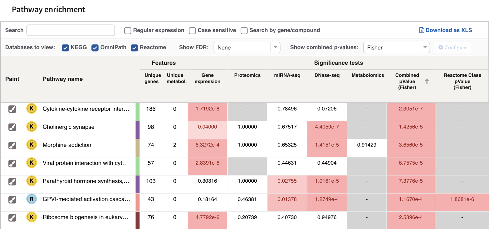
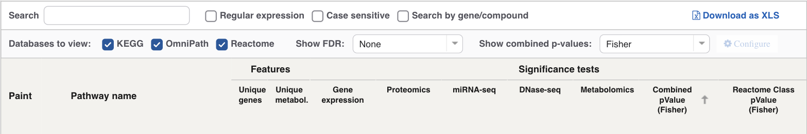

# Pathway enrichment

Enrichment is the ranked answer to "which pathways is my data pointing at?".
For every pathway in every database the job used, PaintOmics asks one question
per omic: of this pathway's features that your data matched, are more of them
on your relevant list than you would expect by chance? This page says exactly
how that question is asked, how the per-omic answers are combined into one
number, and what each column of the results table means.

*The enrichment table, sorted by the combined p-value. One row per pathway,
one p-value column per omic. Illustrated with the STATegra 5-omic example.*

## Found is not significant

The two counters at the top of the results page count different things, and
the difference matters.

*1,007 pathways found, 114 significant, in the STATegra 5-omic example. The
same split is given per database.*

**Found** means the pathway contains at least one feature your input matched.
That is all it means. A pathway is found if one gene out of two hundred was
measured, whether or not anything about it changed. Most of the 1,007 above
are found and nothing else.

**Significant** means a p-value of 0.05 or below. The counter always reads a
raw value: it never uses the FDR-adjusted columns, and 0.05 is not adjustable.

Which p-value it reads depends on how many *databases* the job used, not on
how many omics. On a job that used more than one database it is the pathway's
combined p-value, in whichever method **Show combined p-values** has selected.
On a job that used a single database it is the global p-value of one omic on
its own — the first omic of the job — whatever the combined column says. So on
a single-database job with several omics the count is not the number of rows
whose combined p-value is at or below 0.05, and switching between Fisher and
Stouffer leaves it unchanged. When the exact number matters, sort by the
combined column and count the rows yourself.

Both counters describe the pathways currently visible, so they follow the
[category filter](4_2_kegg_categories.md) and the **Show combined p-values**
choice. They do not follow the search box or the **Databases to view**
tick-boxes, which filter the table's rows without changing what is visible.

## The test

One test per pathway, per omic, per condition. It is a right-tailed
hypergeometric test — the one-sided Fisher exact test for over-representation
— computed on this 2×2 table:

|  | Relevant | Not relevant | Total |
|---|---|---|---|
| **Found** in this pathway | k | n − k | n |
| **Not found** | K − k | N − n − K + k | N − n |
| **Total** | K | N − K | N |

* **N** — every feature of this omic that PaintOmics matched into at least one
  pathway **of this database**. This is the background, and it is not the
  number of rows in your file: features that matched no pathway are outside
  the test entirely, and a KEGG pathway is tested against the KEGG background
  while a Reactome pathway is tested against Reactome's.
* **K** — how many of those N your relevant features file flags.
* **n** — how many features of this pathway your input matched, for this omic.
* **k** — how many of those n are flagged relevant.

The p-value is the probability of drawing k or more relevant features when
drawing n at random from the N. Because the test is right-tailed it only ever
detects over-representation: a pathway whose measured features are
conspicuously *unchanged* will never get a small p-value. When k is zero the
p-value is exactly 1.

Hover any p-value cell and the table shows you the four counts it was computed
from.

!!! note "The tooltip is not on every cell"
    The contingency table is drawn for a per-condition column, and for any
    column of a job that has a single condition. On a multi-condition job the
    **Global** column shows its value with no table, because that value is not
    the product of a single 2×2 table — it is a combination of several. Expand
    the omic to see the tables.

### The relevant features file is what makes the test possible

K and k both come from the relevant features file. An omic uploaded without
one has k = 0 in every pathway and every p-value of 1, so it contributes
nothing except a column of ones. What that file may contain is covered in
[Preparing your data](2_1_accepted_input.md).

### What counts as one feature

Every cell of the table is a count, and PaintOmics has to decide what it is
counting. That is the **Enrichment type** setting, and it has three values:

| Setting | One unit is | Use it when |
|---|---|---|
| **Genes** (the default) | the identifier in the first column of your data file | the file is an ordinary feature-by-condition matrix |
| **Features** | the feature the row was measured on | one measured thing maps to several database entries, or the row names a regulator |
| **Associations** | each `target:::regulator` pair on its own | you care about the pairing rather than either end of it, and you have a relevant-associations file |

Whichever you choose, both sides of the test are counted in that unit — the
background and the pathway always agree, so the sample can never be larger
than the population. Neither setting inflates a count when the mapper resolves
one input identifier to several database genes: the unit is the identifier you
submitted, counted once, not once per copy the mapper made.

**Genes** and **Features** therefore give the same answer on an ordinary
feature-by-condition file. They diverge in two situations:

* **A `target:::regulator` file** — a regulatory or region-based omic. Under
  **Genes** the unit is the target gene, so two miRNAs hitting the same gene
  count once. Under **Features** the unit is the regulator, so they count
  twice. Under **Associations** each pairing is its own unit, and "relevant"
  is taken from the relevant-associations file rather than the relevant
  features file.
* **Metabolomics.** Under **Genes** the unit is the KEGG compound PaintOmics
  resolved your name to; under **Features** it is the name you submitted. The
  counts differ wherever that resolution is not one-to-one, in both
  directions: one submitted name that matched several compounds is one unit
  under **Features** and one unit per compound under **Genes**; two submitted
  names that resolved to the same compound are two units under **Features**
  and one under **Genes**. A name that resolved to exactly one compound is one
  unit either way, whatever that compound is called. The
  [compound disambiguation](8_step_by_step.md) step is where you settle a name
  that matched more than one compound.

The setting is exposed on the panels you name yourself, and not every one of
them offers all three values:

| Panel | What its **Enrichment type** combo offers |
|---|---|
| **Other data type** | **Genes** or **Features**. There is no **Associations** entry: the panel takes a data file and a relevant features file, and no associations file. |
| **Region-based omic** | **Genes**, **Features** or **Associations**. |
| **Regulatory Omic — Pairwise** | **Genes**, **Features** or **Associations**. |
| **Regulatory Omic — MORE** | Nothing to choose. The panel has no combo and is fixed on **Genes**. |

The built-in panels have no combo either, and carry a fixed value — **Genes**
for Gene expression, miRNA-seq, DNase-seq and Transcription factor,
**Features** for Proteomics and Metabolomics.

### One test per condition

If your relevant features file has one column per condition, PaintOmics runs
the test once per condition, against that condition's own K. The omic's header
then carries a chevron: click it and the single column becomes a group, whose
first sub-column is **Global** and whose remaining sub-columns are one per
condition, labelled from the file's header row.

**Global** is Fisher's method applied across that omic's conditions, with
equal weight on each. It is a summary of the whole time course or the whole
design, not of any one contrast.

If the relevant features file is a single list of identifiers — which is the
common case, and what the STATegra example uses — the same flag applies to
every condition, there is one test per omic, and no chevron appears.

## Combining the omics

The table adds a combined p-value that ranks pathways across your omics. Two
methods are computed for every pathway, and the **Show combined p-values**
combo chooses which one the table shows — and, on a multi-database job, which
one the **Significant** counter reads. Both combine each omic's Global value,
so on a multi-condition job the combined column is a summary across omics
*and* conditions.

The column is there on a one-omic job too. With a single value to combine,
both methods hand back that omic's own p-value, so the combined column simply
repeats the omic column.

### Fisher

X = −2 Σ ln(pᵢ), compared against a χ² distribution with 2m degrees of
freedom, where m is the number of omics with a usable p-value.

It assumes the tests being combined are independent. Because it works on the
logarithm, one very small p-value moves X a long way: a pathway can be carried
into the top of the table by a single omic while the other four say nothing.
That is sometimes exactly what you want and sometimes not, and the per-omic
columns are how you tell which.

### Stouffer

Each p-value becomes a z-score, Zᵢ = Φ⁻¹(1 − pᵢ); the z-scores are averaged
with weights, Z = Σ wᵢZᵢ / √(Σ wᵢ²); the combined p-value is 1 − Φ(Z).

It also assumes independence. It differs from Fisher in two ways that matter
in practice: evidence enters on a common scale, so no single omic dominates as
easily, and consistent moderate evidence across several omics is rewarded more
than one extreme value; and it takes weights.

### The Stouffer weights

The default weight for an omic is its mapping ratio — the share of its
features PaintOmics could map, from the Step 2 mapping summary — expressed on
a 0–10 scale. A poorly mapped omic therefore counts for less by default.

With Stouffer selected, the **Configure** link opens a **Stouffer weights**
panel with one 0–10 slider per omic. **Apply** sends the weights to the
server, which recomputes every Stouffer p-value and its FDR corrections and
swaps them into the table. **Defaults** puts the mapping ratios back. The link
is greyed out while Fisher is selected, because Fisher ignores weights.

!!! warning "Zero weights"
    The sliders go down to 0. Set every one of them to zero and there is
    nothing left to combine, so every Stouffer p-value comes back as 1.

## FDR correction

**Show FDR** starts at **None**. Choosing **FDR BH** or **FDR BY** reveals an
adjusted column beside each omic column and beside the combined column.

* **FDR BH** — Benjamini–Hochberg. Controls the false discovery rate when the
  tests are independent or positively dependent, which is the usual
  assumption for overlapping pathway gene sets.
* **FDR BY** — Benjamini–Yekutieli. Valid under arbitrary dependence, and
  always the more conservative of the two.

The correction is applied per omic, and separately per combined method. When
the job is first computed, each family covers every matched pathway of every
database at once.

!!! warning "An FDR value is not a property of a pathway"
    It depends on how many tests are in the family. Hide a category on the
    [classification filter](4_2_kegg_categories.md) and PaintOmics asks the
    server for a fresh correction over only the pathways that remain, database
    by database — so the same pathway's FDR column will read differently
    before and after you filter. Quote an FDR value together with the filter
    that was in force when you read it.

!!! note "Re-pick the FDR method after reopening a job"
    Your choice is remembered with the job, but the adjusted *combined*
    column is hidden whenever the table is first built. Choosing a value in
    **Show FDR** brings it back.

## Reading the table

| Column | What it holds |
|---|---|
| **Paint** | Opens this pathway's painted diagram. See [the pathway view](5_1_browsing_pathways.md). |
| Database badge | The first letter of the source database, in that database's colour. Only on jobs that used more than one; the tooltip names it. |
| **Pathway name** | Truncated to fit; hover for the full name. |
| Colour stripe | The pathway's main classification colour, the same colour it wears in the pie and the network. The tooltip gives the main and the secondary classification. |
| **Unique genes** | Distinct genes of this pathway that your input matched — across all your omics, in database identifiers. |
| **Unique metabol.** | The same for compounds. |
| One column per omic | That omic's p-value (its **Global** value where the job has per-condition relevance). Expandable to per-condition sub-columns. |
| *omic* **(FDR BH)** / **(FDR BY)** | The adjusted value for that omic, shown when **Show FDR** is set. |
| **Combined pValue (Fisher)** or **(Stouffer)** | The selected combination across your omics. Present on one-omic jobs as well, where it repeats that omic's p-value. |
| **Combined pValue (…) [FDR …]** | The adjusted combined value. The method is in round brackets, the correction in square brackets. On a **multi-condition** job this is not the correction of the raw column beside it: the raw column shows the combination of each omic's *Global* p-value, while the adjusted column corrects the per-condition combined values. Compare it with the per-condition sub-columns, not with the raw combined figure. |
| **Reactome Class pValue (…)** | Only on jobs including Reactome — see below. |
| **External links** | Two actions: open this pathway in its own source database, and search PubMed for its name. OmniPath is the exception — its pathway ids are minted by the PaintOmics installer, so the link opens that pathway's source resource instead. |

The table opens sorted by the selected combined p-value, smallest first; on a
one-omic job that is the same thing as sorting by that omic's own p-value.
Every data column sorts;
**Paint** and **External links** are action columns and do not.

**The two Features counts are not the test's n.** They count matched features
of the pathway across your whole input, in the source database's identifiers.
The test's n is per omic and is counted in the enrichment unit you chose, so
the two need not agree. The per-omic pair — matched, with relevant in brackets
— is in the pathway detail panel, reached by clicking a node in
[the pathway network](4_3_pathways_network.md).

Cells are rendered to be skimmed: any p-value at or below 0.065 is tinted red,
more deeply the smaller it is; values of 0.001 or less are shown in scientific
notation and the rest to five decimals; and a grey **-** means this omic
matched nothing in this pathway, which is not the same as a p-value of 1.

The organism's global **Metabolic pathways** map (`<organism>01100`) is left
out of the table deliberately. It is a drawing of most of metabolism at once,
so it is enriched in almost every metabolomics job and tells you nothing.

On a job with more than five omics, and in mobile layout, the per-omic columns
start hidden so that the pathway name and the combined value stay readable.

### The Reactome class p-value

When the job used Reactome, PaintOmics additionally runs the same test on each
of Reactome's top-level classes, pooling the genes of every pathway in the
class into a single set, and gives each Reactome pathway the combined p-value
of the class it belongs to. It answers a coarser question — "is this whole
branch of Reactome responding?" — and it is blank for rows from other
databases.

Note that only genes are pooled into the class set. Compounds contribute
nothing to a Reactome class p-value, whatever they contribute to the
individual pathways.

## The controls above the table

*The two toolbar rows and the column headers. The first row finds things in
the results; the second decides what the results contain.*

| Control | What it does |
|---|---|
| **Search** | Filters rows as you type, matching the pathway name. |
| **Regular expression** | Treats what you typed as a regex instead of literal text. |
| **Case sensitive** | Turns off case folding. |
| **Search by gene/compound** | Switches the search target from the pathway name to a per-row list of every identifier form of every gene and compound the pathway matched — so typing a gene symbol or an accession returns the pathways it landed in. |
| **Download as XLS** | Exports the table; see below. |
| **Databases to view** | One tick-box per database, on multi-database jobs. Unticking one removes its rows. |
| **Show FDR** | None / FDR BH / FDR BY — swaps the adjusted columns in. |
| **Show combined p-values** | Fisher / Stouffer — swaps the combined column, and changes which value the **Significant** counter uses. |
| **Configure** | The Stouffer weight sliders. Enabled only while Stouffer is selected. |

Of these, only **Show combined p-values** moves the summary counters. Search,
the database tick-boxes and **Show FDR** change what the table shows without
changing which pathways are considered visible.

The **MORE regulation** panels use the same search entry point: their per-row
icons hand a regulator or a target to this table with **Search by
gene/compound** already ticked. See [Regulatory omics](4_6_Regulatory_omics.md).

## Download as XLS

**Download as XLS** writes an Excel-compatible spreadsheet named after the job
with the date and time appended — `Paintomics_pathways_<jobID>-<date>.xls`.

It exports what you are looking at: the rows the current filters leave in the
table, and the columns currently visible. Hidden columns are not included, so
if you want the FDR values or the per-condition p-values in the file, reveal
them first. The **Paint** and **External links** columns are actions and are
not exported.

!!! note "Export from Chrome"
    The export is saved directly by the browser only in Chrome. In other
    browsers PaintOmics falls back to posting the spreadsheet to an external
    conversion service to trigger the download, which sends the contents of
    your table off this server.

## Where to go next

* [Pathway classification](4_2_kegg_categories.md) — the filter that decides
  which pathways this table contains, and what it does to the FDR values.
* [The pathway network](4_3_pathways_network.md) — the same pathways as a
  graph, with the p-value and coverage thresholds that decide which are drawn.
* [The pathway view](5_1_browsing_pathways.md) — what the paint icon opens.
* [Preparing your data](2_1_accepted_input.md) — the relevant features file,
  which supplies K and k.
* [The AI interpretation](ai-interpretation.md) — reads this table and writes
  up what it means, with citations.
