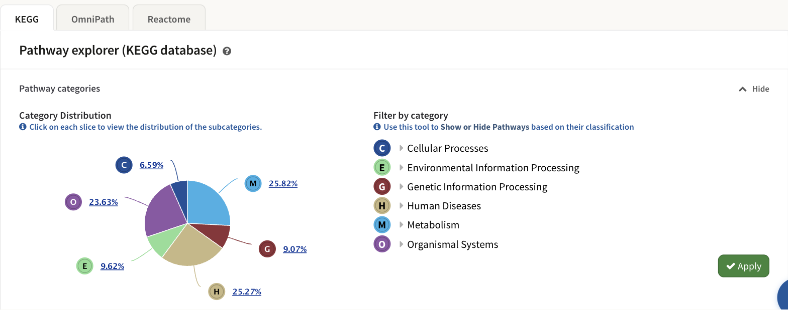

# Pathway classification

An enrichment run returns far more pathways than you asked about. A mouse job
matches human disease maps; a plant job matches mammalian signalling. The
classification browser is how you put those aside: it shows how the pathways
this job found are distributed across the source database's own hierarchy, and
lets you hide whole branches of it before you read anything else.

*The KEGG tab of the pathway explorer. The pie is the distribution; the tree
beside it is the filter; nothing changes until **Apply**. Illustrated with the
STATegra 5-omic example.*

## One explorer per database

The classification browser is not KEGG-only. It is built once per pathway
database the job used, and each copy is a tab: **KEGG**, **Reactome**,
**MapMan**, **OmniPath**. Each tab has its own pie, its own filter tree and
its own network, over that database's pathways alone. A job that used a single
database has no tab bar.

The card is headed **Pathway explorer (*database* database)** and holds two
things: the **Pathway categories** band described here, and
[the pathway network](4_3_pathways_network.md) below it. The band folds away
with the **Hide** control on its right, which gives the network the whole
card; the control names what clicking it does — it reads **Hide** while the
band is open and **Show** once it is folded.

## Which hierarchy, and how much of it

Each database supplies its own classification, and PaintOmics stores exactly
two levels of it, whatever depth the source has:

| Database | Level 1 | Level 2 |
|---|---|---|
| **KEGG** | The top-level category of KEGG's pathway BRITE hierarchy, `br08901` — *Metabolism*, *Genetic Information Processing*, *Environmental Information Processing*, *Cellular Processes*, *Organismal Systems*, *Human Diseases*, *Drug Development* | That hierarchy's second level, around fifty entries |
| **Reactome** | The top-level Reactome event the pathway sits under | The event one level below it |
| **MapMan** | The primary column of the MapMan classification table | Its secondary column. A bin the table does not list is filed under *Not classified / Unclassified* |
| **OmniPath** | One of eight categories assigned from keywords in the pathway's own name — *Cancer*, *Infection and inflammation*, *Immune signalling*, *Nervous system*, *Cell cycle, death and autophagy*, *Metabolism*, *Development and tissue remodelling*, and *Signal transduction* for everything else | The annotation resource the pathway came from, such as SIGNOR or NetPath |

Two consequences worth knowing.

Only the classifications your job actually matched appear. The mouse example
above shows six KEGG top-level categories, not seven: no *Drug Development*
map was found for it.

OmniPath's level 1 is not a curated hierarchy. It is a keyword rule applied to
the pathway name at installation time, so it is a browsing aid rather than a
statement about biology, and anything the keywords miss lands in *Signal
transduction*. Level 2, the source resource, is exact. See
[OmniPath](1_6_omnipath.md).

Each classification is given a colour by name, and it keeps that colour
everywhere on the page: the pie wedge, the letter badge in the tree, the
colour stripe in the [enrichment table](4_1_pathway_enrichment.md), and the
node colouring in the network.

## The pie

**Category Distribution** shows what share of this database's visible pathways
falls into each level-1 classification. Each wedge is labelled with its
percentage and a coloured letter badge — C, E, G, H, M, O in the mouse KEGG
example. Percentages are of the pathways this database found, so the pie
always sums to 100% within its own tab.

Click a wedge to drill down into that classification's level-2 entries; the
chart's own back link returns to the top level.

The pie is redrawn from what is left every time you press **Apply**, so it is
a picture of the filtered result rather than of the raw one. If you hide
everything, it becomes a single red **No pathways** slice.

## The filter tree

**Filter by category** is the same hierarchy as a tree, three levels deep:
level-1 classification, then level-2, then the individual pathways. Click a
row's text to expand or collapse it.

The two classification levels each carry three words on the right, revealed
when you hover the row:

* **Hide** ticks nothing below this row.
* **Show** ticks everything below it.
* **Custom** is not a control. It is a state indicator: clicking it does
  nothing, and it lights up on its own when some but not all of the rows below
  are ticked. Untick one pathway inside a fully shown classification and its
  parents switch from **Show** to **Custom** by themselves.

The third level is a plain tick-box per pathway, with no Hide/Show pair.

Nothing you do in the tree takes effect until you press **Apply**.

## Apply, and what it changes

**Apply** commits the selection, and it is not a filter on one table. The set
of visible pathways is a property of the job, and everything on the results
screen reads it:

* the pie is redrawn from the pathways that remain;
* this database's pathway network is rebuilt, so hidden pathways stop being
  nodes;
* the [enrichment table](4_1_pathway_enrichment.md) drops their rows —
  including on a multi-database job, where that one table lists every
  database;
* the **Pathways found** and **Significant** counters recount, overall and per
  database;
* the FDR-adjusted p-values are recomputed;
* the selection is stored with the job, so it survives a reload and anyone
  opening the job's link sees the same filtered view.

Each tab filters only its own database. Hiding a KEGG category leaves
Reactome's tree exactly as it was — but because the enrichment table is
shared, its rows change either way.

!!! warning "Filtering changes the FDR values"
    A false discovery rate correction depends on how many tests are in the
    family, and hiding pathways removes tests. PaintOmics therefore asks the
    server for a fresh set of adjusted p-values over the pathways that remain
    each time you apply a filter, and swaps them into the table. The raw
    p-values never move; the FDR columns do. If you are going to quote an FDR
    value, say what was filtered when you read it.

## Where to go next

* [Pathway enrichment](4_1_pathway_enrichment.md) — the table this filter
  feeds, and what each of its columns means.
* [The pathway network](4_3_pathways_network.md) — the other half of the same
  card, and its own filters on top of this one.
* [The KEGG pathways database](1_1_kegg.md),
  [Reactome](1_2_reactome.md), [MapMan](1_3_mapman.md) and
  [OmniPath](1_6_omnipath.md) — where each hierarchy comes from.
