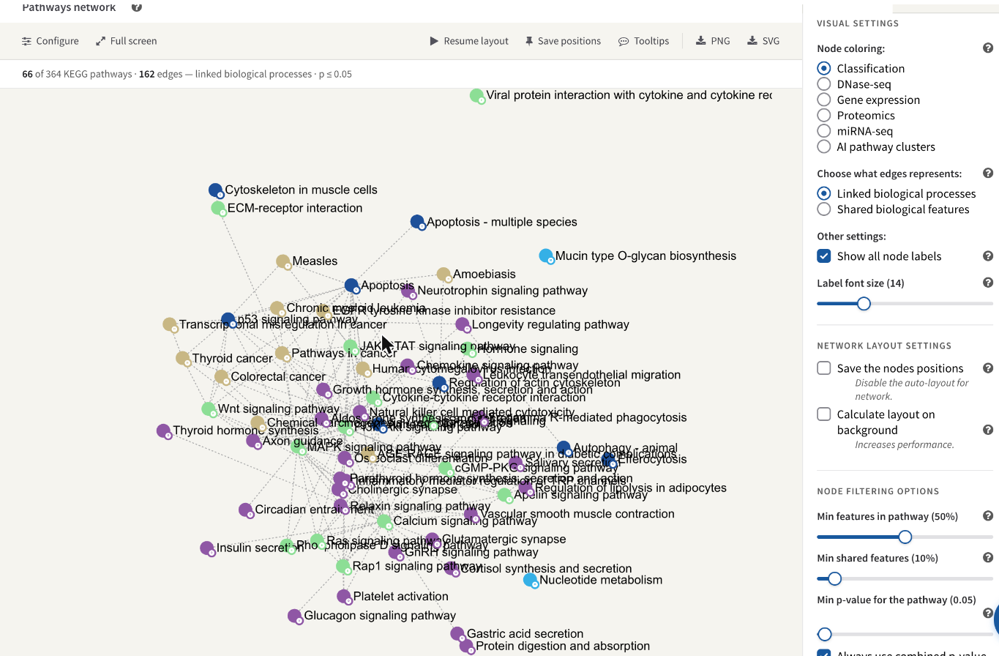
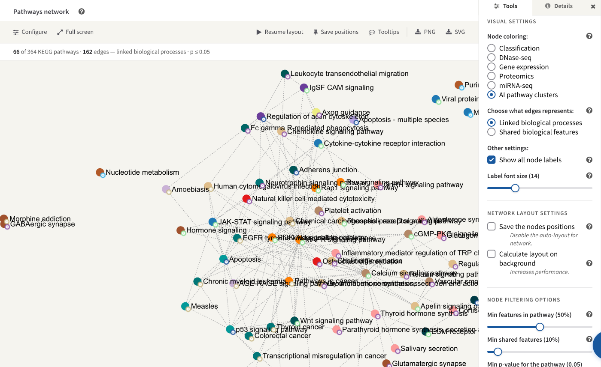
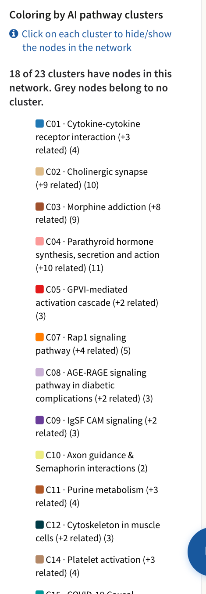

# The pathway network

The pathway network draws your result as a graph: one node per enriched
pathway, one edge wherever two pathways are related. It is the quickest way to
see whether a long list of significant pathways is one story or several
unrelated ones.

It sits in the lower half of the **Pathway explorer** card on the results
screen, under the heading **Pathways network**. Each pathway database gets its
own network inside its own tab, with its own settings. A network is built the
first time you open its tab — until then the canvas reads *Building
network…* — and while the layout runs the nodes move without their edges or
their classification badges, which are drawn once it stops.

*The KEGG network of the STATegra example: 66 of the 364 matched pathways drawn, 162 edges, nodes coloured by classification, with the Visual settings pane on the right.*

## What a node is

A node is one pathway of this database that passed four tests:

* your input matched at least one feature in it;
* it is still showing under the category filter in the band above the network
  (see [Pathway classification](4_2_kegg_categories.md));
* your input covers enough of it — the **Min features in pathway** filter;
* its p-value is at or below the **Min p-value for the pathway** threshold.

The organism's whole-metabolism map (`mmu01100` for mouse) is left out
deliberately: it contains most of metabolism, so it would connect to almost
everything and tell you nothing.

**Size** is derived from how far the pathway's p-value sits below the
threshold, and the drawn range is stretched across the whole network. So within
one graph the largest node is the most significant pathway on screen and the
smallest is the one sitting at the cut-off. It is a ranking, not a scale: the
same pathway will be drawn at a different size once you move the threshold or
change which p-value is being read.

**The letter badge** at the bottom right of a node is the initial of the
pathway's main classification, in that classification's colour. It is drawn
whatever colouring you choose, so you can still read the classification while
the fill colour is showing something else.

**Hovering** a node haloes it and everything it is joined to. Hold for about
half a second and a card appears with the pathway's name, its classification,
its trend for the omic you are colouring by, and two buttons: **Show details**
opens the full per-omic table in the **Details** pane beside the graph, and
**Paint** leaves the results screen and opens that pathway's
[painted diagram](5_1_browsing_pathways.md). Nodes can be dragged, and the
canvas pans and zooms.

### The status line

The line under the toolbar says exactly what was drawn, so a graph that is
nearly empty can be told from one that failed to build:

> **66** of 364 KEGG pathways · **162** edges — linked biological processes · p ≤ 0.05

In shared-features mode it also carries the similarity threshold. If there are
nodes but no edges at all it adds a warning that no pathway pair passed the
edge filter and suggests the other edge type — that case is a filter result,
not a bug.

## The two kinds of edge

The **Choose what edges represents** radio pair decides what an edge means.
The two are unrelated: pathways that share many of your genes may have no link
in the database, and linked pathways may share nothing you measured.

**Linked biological processes** is the default. The edge is a statement the
database itself makes about the two pathways: in KEGG, a link drawn on one
pathway map to another map; in Reactome, the pathway hierarchy — two processes
under a common parent, or one nested inside another — together with any
sub-pathway a diagram embeds. These edges are read from the installed database,
so they say nothing about your data; the same pairs would be joined for any job
on this organism.

**Shared biological features** derives the edges from your own results
instead. For every pair of drawn pathways, PaintOmics pools the genes and the
compounds your input matched in each and computes the Sørensen–Dice
coefficient

> S = 2 |A ∩ B| / (|A| + |B|)

An edge is drawn where S is at least **Min shared features**, dotted, and
thicker the higher S. A pathway with no matched feature cannot have an edge in
this mode. Note that a coefficient counts features, not their importance: two
pathways can score highly because they share a handful of ubiquitous enzymes.

!!! note
    The in-app help tip beside **Min shared features** still describes an older
    rule — a percentage of the smaller pathway. What is actually compared
    against the slider is the Dice coefficient above, which uses the sizes of
    both pathways.

## The Visual settings pane

The rail to the right of the graph has two panes, chosen by the tabs at its
top. **Tools** holds everything that changes what is drawn, under the heading
**Visual settings**; the toolbar's **Configure** button brings it forward.
**Details** holds the legend for the current colouring, and the detail of the
last pathway you opened. The **×** beside the tabs hides the rail and gives the
graph the whole card, and the bottom edge of the panel can be dragged to make
the canvas taller.

Nothing in the Tools pane takes effect until you press **Apply** at the foot of
it, which rebuilds the network. Settings belong to one database tab — the KEGG
and Reactome networks of the same job are configured separately — and are saved
with the job on the server, so re-opening the job, or opening a link somebody
shared with you, shows the same view. On a job opened read-only a notice at the
top of the page says changes will not be saved; see
[Accounts, storage and sharing](2_2_cloud_drive.md).

### Node coloring

| Option | What the colour means |
|---|---|
| **Classification** | The pathway's main classification in this database — the default, and the same palette the category pie and the table's colour stripe use. |
| One entry per gene-based omic | The metagene cluster the pathway falls into for that omic, i.e. the regulatory trend its features follow. Grey means the pathway has no metagene for that omic. See [Metagenes](4_7_Metagenes.md). |
| **AI pathway clusters** | The cluster the AI report was written from. Only offered once an interpretation has finished and produced a partition; grey means the pathway is in no cluster. See [The pathway interpretation](ai-interpretation.md). |

Only gene-based omics are offered as colourings; there is no metagene
clustering for compound data.

The **Details** pane is the legend for whichever of these is in force.
Colouring by classification lists every classification with its letter badge.
Colouring by an omic reports how many of that omic's clusters have nodes in
this network out of how many exist, and draws each one's trend; clicking a
trend hides that cluster's nodes and clicking it again brings them back. The
same click-to-hide works on the AI cluster list, which gives each cluster's
colour, identifier, label and member count.

*The same KEGG network coloured by **AI pathway clusters** instead of by
classification. The option appears in **Node coloring** only after an
interpretation has produced a partition, and — like every other setting in this
pane — it does nothing until **Apply** is pressed.*

*The matching legend, in **Details**: how many of the report's clusters have
nodes in this network, and one row per cluster with its colour, its `Cnn`
identifier, the label the agent gave it and how many pathways it holds. Click a
row to hide that cluster's nodes.*

Under the omic-cluster legend there is a **Modify number of clusters** slider
(1 to 20) with its own **Apply**. It re-runs the clustering for that omic and
that database with the number of clusters you ask for and replaces the
pathways' cluster assignments. It is a queued server job, not an instant
redraw, and it is hidden on a read-only job.

### Labels

**Show all node labels** is on by default and draws a label for every node.
Turn it off and a label appears only once its node is large enough on screen,
which is what zooming in does; the help tip warns that showing every label
costs performance. **Label font size** is a slider from 1 to 50, default 14.

### Network layout settings

The layout is force-directed: nodes repel each other and edges pull their two
ends together, so groups of related pathways settle next to one another. It stops on
its own once the graph settles, or after 20 seconds, whichever comes first, and
can be run again at any time from the toolbar's **Resume layout**.

| Control | What it does |
|---|---|
| **Save the nodes positions** | Pins every node where it currently sits, so the arrangement is restored next time instead of being recomputed. With positions pinned, opening the network no longer runs the layout at all. Unticking it and pressing Apply throws the pinned positions away. |
| **Auto-save positions** | Appears once positions are pinned. Re-saves them on every **Apply**, instead of your having to press **Save positions** in the toolbar first. |
| **Calculate layout on background** | Computes the layout without animating it and applies the finished arrangement in one go. Faster on a large network, but nothing moves on screen until it is done. |

If some nodes have pinned positions and the filters then admit nodes that have
none — you lowered a threshold, or showed a category again — the layout is run
once to place them, and the nodes you had already pinned keep the positions you
gave them.

## Node filtering options

The last group in the Tools pane decides which pathways become nodes at all.

### Min features in pathway

A pathway is dropped unless your input covers at least this share of it. The
slider runs from 0 to 100% in steps of 5, and it starts at **50% for a job that
includes gene-based data and 10% for a compound-only job** — a metabolomics
platform covers far less of a pathway than an RNA-seq experiment does. On the
STATegra metabolomics data the median coverage was 10.1%: at 50% only 6 of its
140 pathways cleared the bar, against 75 at 10%.

What is divided by what:

* the numerator is the number of features of that pathway your input matched —
  matched genes plus matched compounds;
* the denominator counts the pathway's own size **over the kinds of feature you
  submitted, and nothing else**. A transcriptomics or proteomics job is
  measured against the pathway's genes, a metabolomics-only job against its
  compounds, and a job carrying both against the sum of the two.

!!! warning "The filter does not apply to every database"
    Whether the coverage filter runs at all is decided by the feature count the
    pathway carries in the installed database, and that count has always meant
    *genes*. Where it is missing or zero, **no coverage filter is applied to
    that pathway at any slider setting** — it is drawn however little of it you
    matched. That is deliberate: those pathways have never been filtered on
    coverage, and switching a 50% filter on for them now would empty the
    network rather than clean it up.

    In practice this means: an [OmniPath](1_6_omnipath.md) network is never
    coverage-filtered, because OmniPath ships no such count; neither is a
    [MapMan](1_3_mapman.md) network, because every bin carries zero; and 220 of
    the 584 mouse KEGG maps are exempt for the same reason. Reactome pathways
    and the remaining KEGG maps do carry a count and are filtered normally. So
    the same slider position means different things in different database tabs,
    and the node count in an OmniPath tab will not move when you drag it.

### Min shared features

The similarity an edge must reach in **Shared biological features** mode,
default 10%. It compares against the Dice coefficient described above and has
no effect at all in **Linked biological processes** mode.

### Min p-value for the pathway

The significance cut-off a pathway must clear to be drawn: a slider from 0.005
to 1 in steps of 0.005, default 0.05. It is also the reference node size is
computed from, so moving it rescales the nodes as well as changing which ones
appear.

### Which p-value is read

Two controls decide *which* p-value the threshold is applied to. Both live
under the slider.

**Always use combined p-value** is ticked by default. When the network is
coloured by one omic, ticking it keeps the filter on the combined p-value
across all your omics; unticking it makes the filter use that omic's own
p-value, so the graph shows the pathways that are significant for the data you
are looking at. It makes no difference when colouring by classification or by
AI clusters, which always use the combined value. Which combination is used —
Fisher or Stouffer — is whatever is selected in the **Show combined p-values**
control of the [enrichment table](4_1_pathway_enrichment.md) below.

**P-value selection criteria** chooses between the raw p-value (**None**, the
default) and the two multiple-testing corrections, **FDR BH** and **FDR BY**.
Adjusted values are stricter, so expect fewer nodes.

Where the selected p-value has one value per condition, the network compares
the smallest of them — a pathway significant in any one condition is drawn.

## The toolbar

| Button | What it does |
|---|---|
| **Configure** | Brings the **Tools** pane of the rail forward, and re-opens the rail if it was hidden. |
| **Full screen** | Expands the graph, its toolbar and its rail to fill the window, so you can rearrange a crowded network. The button becomes **Exit full screen**; **Esc** also returns it to the page. |
| **Resume layout** / **Stop layout** | Starts or stops the force-directed layout. If node positions are pinned, resuming asks you to confirm first, because it discards them. |
| **Save positions** | Pins the nodes where they are now — the same thing as ticking **Save the nodes positions** — and confirms with a brief *Saved*. Use it after arranging a network by hand. |
| **Tooltips** | Turns the hover card on and off. It is on when the page loads. |
| **PNG** | Stops the layout and downloads the canvas as it appears, as `paintomics_network_<database>_<jobID>.png`. It captures the visible canvas, so pan and zoom to frame what you want first — nodes off screen are not in the file. |
| **SVG** | Stops the layout and downloads a vector version with the node labels and the underlying data, as `paintomics_network_<database>_<jobID>.svg`. This is the one to use for a figure you intend to edit. |

## Reading it honestly

The network is a view of the enrichment result, not a separate analysis. Every
node in it is a row of the [enrichment table](4_1_pathway_enrichment.md), and
every threshold in the Tools pane changes what you see without changing what
was computed. Two consequences are worth keeping in mind.

An edge is not evidence of a mechanism. In the default mode it is a curation
decision made by KEGG or Reactome, and in the other mode it is an overlap
between two feature lists your own input produced.

And the graph you export is the graph your filters left. The status line above
the canvas records the thresholds that produced it — quote them alongside the
figure, or the same job will look like a different result at another setting.
