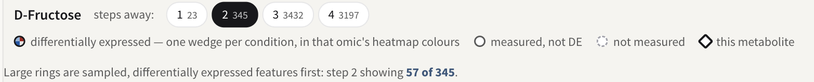

# Metabolite hub analysis

This panel answers one question: which of your metabolites have differentially
expressed genes concentrated around them in the KEGG network? A metabolite
whose immediate enzymatic neighbourhood is full of regulated genes is a
candidate point of metabolic control, and that is a different finding from a
pathway being enriched — the neighbourhood crosses pathway boundaries.

It is a card on the Step 3 results page, below the pathway explorer, and it has
its own entry in the contents rail. It appears only when the job carried
compounds that were matched to KEGG and at least one feature was flagged as
relevant; a gene-only job never shows it.

*The ranked metabolite list, the ring network for the selected compound, and
its per-step scores. Illustrated with the STATegra 5-omic example.*

## The network it walks

The network is built from the organism's own KEGG pathway maps (the KGML files
installed with the species), all of them merged into a single graph:

* every enzyme-to-substrate and enzyme-to-product link KEGG records in a
  reaction;
* every relation KEGG records between two entries in a map, carrying its
  relation type and subtype;
* pathway cross-reference entries are dropped — they are links between maps,
  not biological entities.

Because the maps are merged, a walk that starts in one map can leave it. This
is a KEGG-only analysis: Reactome, MapMan and OmniPath contribute nothing to
it, whichever databases the job used.

## What "steps away" means

One step is a direct link. Two steps allows one intermediate node, three steps
allows two, and so on, out to four. Each ring is exclusive — a gene appears in
the ring where it is first reached — while the scores are cumulative: the
step-2 row counts everything within two steps, step 1 included.

Four radii are offered because no single one is right. Direct neighbours are
few and specific: for most compounds there are only a handful of enzymes, so a
real signal can fail to reach significance. Wider radii bring in far more genes
and dilute the association, but they are where a response distributed over a
whole branch of metabolism shows up. PaintOmics therefore scores all four and
ranks each metabolite on its **best** step — the one with the lowest FDR — and
tells you which step that was. Selecting a metabolite opens the network at its
best step.

Most compounds run out of new neighbours well before step 4. When that
happens, the later steps score exactly the same genes as the last step that
grew, and the panel says so rather than leaving you to wonder why the numbers
repeat.

## The ranked list

The left rail lists every scored metabolite, most significant first. Each row
carries the compound's name, its KEGG id, its FDR, the number of
differentially expressed genes in its best step's neighbourhood, and which step
that was. Rows tint by significance: one colour below FDR 0.05, a weaker one
below 0.1. The line above the list reads `<N> metabolites · <M> with FDR <
0.05`, so you can see the shape of the result before reading a single row.

* **Search metabolites** filters the list as you type, matching the name or the
  KEGG id. It filters only — it never changes the ranking or the scores.
* **Rank by** reorders the list: **FDR** (the default), **% DE neighbours**,
  **DE neighbours**, or **Name**. The first three all read from the
  metabolite's best step, so the three orderings can disagree: a compound with
  a small, dense neighbourhood ranks high on % DE and low on DE neighbours,
  and a compound in a big neighbourhood does the reverse. FDR is the only one
  of the four that weighs a density against the size of the neighbourhood it
  came from: 2 DE genes out of 3 and 200 out of 300 are the same **% DE** and
  not the same evidence.

Which metabolites are in the list at all: those flagged as relevant in your
data **and** present in the organism's KEGG network. A compound that mapped to
a KEGG id but appears in none of that organism's maps cannot be scored. If your
job flags no metabolite as relevant, every measured metabolite in the network
is scored instead — nothing on screen distinguishes the two cases, so check
your relevant features list if the list is longer than you expected.

## The per-step table

Clicking a metabolite opens a card at the foot of the network stage with one
row per step, the step you are currently viewing highlighted.

| Column | What it is |
|---|---|
| Step | The radius: everything within this many links of the metabolite. |
| DE | How many genes in that neighbourhood are differentially expressed — that is, listed in the relevant features file of any omic that measured them, for at least one condition. |
| Measured | How many genes in that neighbourhood your data measured at all. This is the denominator of everything to its right. |
| % DE | DE ÷ Measured. |
| Percentile | Where that density ranks against the other compounds in the organism's KEGG network whose neighbourhood is of a similar size. 90% means it is at or above 90% of them. |
| p | A one-sided binomial test: the probability of seeing at least this many DE genes out of **Measured**, if each gene were differentially expressed at the job's overall rate. |
| FDR | That p-value after Benjamini–Hochberg correction. |

Two counts on the screen deliberately measure different things, and the note
under the table says so. The table counts **only genes your data measured**,
and counts them **cumulatively** out to that step. The step chips above the
network count **every node** in one single ring — genes and compounds,
measured or not. So a chip reading `2` beside a table row reading `33` is not a
contradiction; the two are not meant to add up.

Rows that repeat the step before them are greyed, and their tooltip explains
why: no new neighbours were reached at that step, so they score an identical
set of genes. The line under the table names the last step that grew.

## How p and FDR are computed

The null rate is taken from your own data. PaintOmics counts every gene you
uploaded that appears in the organism's KEGG network, and the share of those
that are differentially expressed; that share is the rate each neighbourhood is
tested against. The test is one-sided — it asks only whether the neighbourhood
is *richer* in differentially expressed genes than your dataset as a whole. A
neighbourhood in which no gene was measured gets p = 1 rather than a score.

Every gene-based omic counts. A gene is measured if any omic measured it, and
differentially expressed if any of them flagged it, in any condition.

The **Percentile** column is a different comparison and answers a different
question. Neighbourhood sizes are sorted into five equal groups, and each
metabolite's density is ranked only against compounds in its own size group
(falling back to the whole background if that group holds fewer than two
compounds). This is deliberate: a radius-4 neighbourhood covering a large part
of the network would otherwise be compared with compounds that have three
neighbours, and the comparison would mostly measure connectivity. The reference
set is every *other* compound in the organism's KEGG network — including
compounds your experiment never measured, whose density is then 0% — so the
percentile places you against the network, not against your own metabolite
panel.

**FDR** is Benjamini–Hochberg over a single family: every scored metabolite at
every one of its four steps, corrected together. That is one correction for the
whole table you are reading, not one per step.

### What the p-values do and do not assume

* The binomial treats the genes in a neighbourhood as independent draws at the
  overall DE rate. Neighbouring genes are co-regulated and share pathways, so
  that assumption is optimistic; treat a marginal p-value as weaker than it
  looks.
* A metabolite's four rows are nested by construction — step 2's gene set
  contains step 1's — so they are four views of the same evidence, not four
  independent tests. Metabolites that sit near each other in the network share
  most of their neighbours, for the same reason. The single BH family is what
  keeps the four radii from being counted as four separate discoveries, but no
  correction can turn dependent rows into independent ones.
* The DE rate that sets the null comes from the same data being tested.
* Only genes enter the counts. Neighbouring *compounds* are drawn in the
  network but never counted in **DE** or **Measured**.
* "Hub" here means the density of the transcriptional response around a
  metabolite. No centrality is computed, and a metabolite with a high score is
  not thereby a topological hub of the network.

## Reading the picture

*The steps-away chips, each with the number of genes at that radius, and the
node key: a filled wedge ring for a differentially expressed gene (one wedge
per condition, in that omic's heatmap colours), a hollow circle for a gene
you measured that is not differential, a dotted circle for one you did not
measure, and a diamond for the metabolite the ring is centred on.*

The selected metabolite sits at the centre as a bold diamond; its neighbours
are placed on faint guide circles, one per step, each labelled `step N`.
Compounds are diamonds and genes are round. The node key names four states:

* **differentially expressed** — the node is filled with one wedge per
  condition, each wedge coloured by that condition's value on the same scale as
  that omic's [heatmaps](5_3_heatmaps.md). There is deliberately no single
  "up" or "down" colour: a feature in a time course has one value per
  condition and they frequently disagree.
* **measured, not DE** — hollow, with a solid outline.
* **not measured** — hollow, with a dashed outline.
* **this metabolite** — the seed, at the centre.

Only the seed and the differentially expressed nodes are labelled; a
four-step neighbourhood can hold thousands of nodes and labelling them all is
unreadable. Hovering any node gives its full name, its id, its state, how many
steps away it is, and its value in each condition. Arrowheads are drawn only
where KEGG records a relation subtype for that link, and an inhibiting relation
ends in a bar instead of an arrow.

The four **steps away** chips each carry the number of nodes exactly that many
steps out. Clicking one lights every ring up to it and dims the rest; nothing
is refetched, so it is instant. A chip whose ring is genuinely empty is
disabled and shows `0`, and its tooltip says there are no neighbours exactly
that many steps out.

!!! warning "The drawing is a sample; the numbers are not"
    Large rings are drawn from a sample — around 40 nodes per ring, with any
    allowance an inner ring did not need passed outward — and the sample keeps
    **differentially expressed features first**, then the best-connected nodes.
    The ring label and
    the notice above the network say so — `step 3 (40 of 312)`. This means the
    visible proportion of filled nodes in a sampled ring is higher than the true
    proportion, so never judge density by eye from a sampled ring: read **% DE**
    in the table, which is computed over the whole neighbourhood. A node whose
    every link was sampled away is not drawn at all, and the ring's count
    subtracts it.

## Clicking a node

Any node other than the metabolite at the centre opens its own card, naming it
and saying how many steps it is from the metabolite, with two tabs. Clicking
the centre node, or the empty canvas, brings back the per-step table.

**Expression** fetches that feature's values across every omic that measured
it, and draws a heatmap and a line chart per omic. This is fetched when you
click, which is why it is one feature at a time.

**Connections** lists every link that node has *in the step you are currently
viewing*, grouped by pathway, with differentially expressed partners first, and
a count line reading how many partners, links and pathways there are. The chips
above the list — one per state, one per pathway — filter both the list and the
highlight in the graph. Each link is filed under a single pathway, so a
reaction that KEGG records in several maps appears here under one of them.

The card can be dragged taller by the grip on its top edge, and closed with the
× — which also clears the highlight in the graph.

!!! note "Organisms without KGML"
    The graph is built from the KEGG pathway maps (KGML) held for your organism.
    Where a server has none for it — which organisms those are depends on how
    that server's KEGG data was installed — the graph falls back to a stored
    table of neighbourhoods instead. The panel says so above the network: only
    direct neighbours can be drawn and relation types are unavailable, so no
    arrowheads and no relation labels. The scores are still computed out to four
    steps, because the stored table lists each metabolite's neighbourhood at
    every radius from one to four.

## Where to go next

* [Metabolite class activity](4_5_metabolite_class_activity_analysis.md) asks
  the complementary question: whether a whole compound class moved.
* [Pathway enrichment](4_1_pathway_enrichment.md) tests pathways as units,
  where this panel ignores pathway boundaries.
* [Preparing your data](2_1_accepted_input.md) covers the relevant features
  file, which is what makes a feature count as differentially expressed here.
* [KEGG in PaintOmics](1_1_kegg.md) covers the database this analysis is built
  from.
