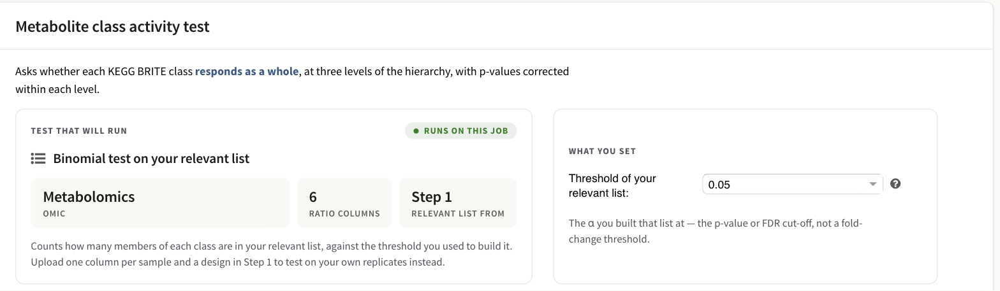
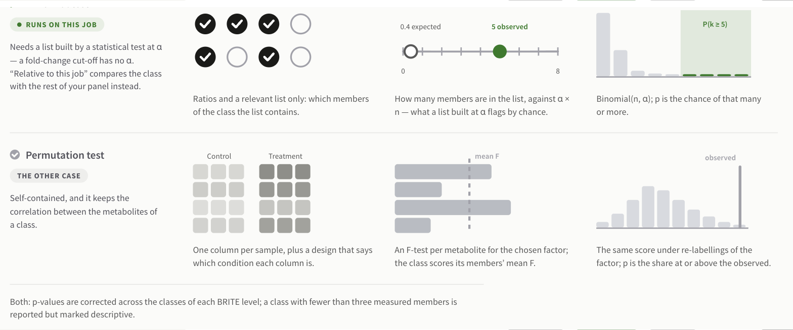
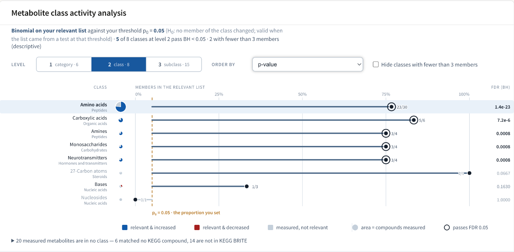

# Metabolite class activity

A targeted metabolomics panel is chosen because you already expect its
compounds to move. That leaves pathway enrichment with nothing to work with:
most of what you measured changes, so there is no unchanging background to test
against, and too few of any pathway's compounds are measured for the pathway to
come out significant. This analysis asks a different question of the same data
— **does a whole chemical class respond, rather than one metabolite?** — and it
asks it of every KEGG BRITE class your compounds fall into.

You configure it on **Step 2**, in the card headed **Metabolite class activity
test**, and you read the answer on **Step 3**, in the card headed **Metabolite
class activity analysis**. Both appear only when the job matched compounds.

## The two tests, and which one your job gets

There are two tests, and PaintOmics chooses between them from what your
metabolomics upload contains. It tells you which one you will get before you
run anything.



*The Step 2 card on the STATegra five-omic example. The left panel names the
test that will run and the numbers it rests on; the right panel holds the one
number you set.*

| What the tested omic carries | Test that runs |
|---|---|
| One column per **sample**, plus an applied experimental design, with at least two replicates in every condition | **Permutation test on your replicates** |
| Anything else — ratios or per-condition values — plus a relevant-features list | **Binomial test on your relevant list** |

The relevant-features list in the second row is not a precondition. That file is
optional on the upload form, and the binomial runs without it — it simply has
nothing to count. No member of any class is flagged, so every class scores
`p = 1`, whichever null you chose. A result where every class scores 1 and not
one counted member appears anywhere means the list is missing, not that nothing
moved.

The permutation test needs all three of the following:

* the omic's values file has one column per sample, and a design maps every one
  of those columns to a condition. The design comes either from the
  **Experimental design** field on the Metabolomics card in Step 1 (optional
  there, two columns — `Ctr_0H_B1`, tab, `Ctr_0H` — or a MORE-style 0/1 design
  matrix), or from the **Replicate detection** card on Step 2;
* the factor under test has at least two levels;
* every combination of factor level and stratum holds at least two columns.

With no design at all the binomial simply runs, and the Step 2 card says so
before you submit. When a design is there but one of the other two conditions
fails, the binomial runs instead and the Step 3 result carries a message naming
the reason and the offending conditions — *"The permutation test needs at least
two replicates per condition; … The binomial test on your relevant list ran
instead."*

Change the replicate handling on Step 2 and the card redraws: the plan, the
**Factor to test** combo and the threshold label all switch between the two
cases without reloading the page.

### The binomial test on your relevant list

For a class with `n` measured members of which `k` are in your relevant-features
list, the p-value is `P(K ≥ k)` for `K ~ Binomial(n, p₀)`. What `p₀` is decides
what the test means, and you choose it:

* **A number you set** (0.01, 0.05, 0.10, or anything you type strictly between
  0 and 1). The null is *no member of this class truly changed*: under it a
  member reaches your relevant list only through a type-I error, at exactly the
  rate α of the test you used to build that list. This is a self-contained
  test — the answer does not depend on how much of the rest of your panel
  moved. Three flagged members out of four is `p = 0.0005` at α = 0.05.
* **Relative to this job (automatic)**. The null becomes the observed relevant
  proportion of the whole classified panel: the number of measured metabolites
  in your relevant list that KEGG BRITE can classify, divided by the number it
  can classify at all, computed separately for each condition. The null is now
  *this class behaves like the rest of the panel* — a competitive question, and
  a different one.

The competitive null has a limitation you should know before you pick it. The
class being tested is part of its own background, and on a targeted panel where
most of what was measured moves, `p₀` is high and small classes cannot reach
significance whatever they do: with `p₀ = 0.75`, a class of four scores
`p = 0.32` even when all four members are relevant. That is the arithmetic of
the test, not a bug in your data.

### The permutation test on your replicates

With replicates, the noise scale comes from your own measurements and no
threshold is needed.

Per metabolite, PaintOmics fits an F-test for the factor you are asking about —
its main effect plus its interaction with the other factors of your design,
which are held as strata:

```
full     y ~ strata + factor + factor:strata
reduced  y ~ strata
F = [(RSS_reduced − RSS_full) / df1] / [RSS_full / df2]
```

Each class is then scored by the **mean F of its members**, and that score is
compared with the same score computed after re-labelling the factor *within
each stratum*, 2,000 times by default (a server setting, and never fewer than
100). The p-value is the share of re-labellings at or above the observed mean F,
so the smallest reachable p-value is `1 / (permutations + 1)`. The random seed
is derived from the job id, so re-running the same job gives the same numbers.

Two properties are worth the cost. It shuffles samples, never metabolites, so
the correlation between members of a class survives into the null and the test
does not overstate the way an independence-assuming combination would. And it
is self-contained: the answer does not depend on what fraction of your panel
moved.

Two things it does on its own:

* if the values are all positive and span more than 50-fold they look like raw
  intensities rather than log ratios, and are log2-transformed before testing.
  This is the one of the two it tells you about, in the message box on Step 3;
* a metabolite with any missing column is fitted without the interaction term,
  so that every re-labelling of it is fitted at the same degrees of freedom.
  Nothing on the page says so.



*The comparison band at the foot of the Step 2 card: the same three columns —
input, score per class, what it is compared with — for both tests, the one that
runs on this job first.*

## What you set on Step 2

| Control | When it appears | What it does |
|---|---|---|
| **Factor to test** | Only when a design is applied and your condition names encode more than one crossed factor | Which factor the permutation test asks about. The others are held as strata. Options are labelled with the factor's own values and level count (`Ctr, Ik (2 levels)`), fewest levels first, which is also the server's default |
| **Threshold of your relevant list** — labelled **Fallback threshold** when a design is applied | Whenever the job matched compounds | The α of the per-metabolite test you used to build the relevant list |

Condition names are split into tokens on `_`, `-` or `.`; a token position
counts as a factor when every condition name splits the same way and that
position takes more than one value but fewer than all of them. `Ctr_0H` …
`Ik_24H` therefore offers a two-level treatment factor and a six-level time
factor.

The threshold field wants **the p-value or FDR cut-off you used**, not a
fold-change cut-off — a fold-change list has no α, and the binomial's null is
built entirely out of α. The field accepts a typed value and rejects anything
outside 0 and 1 (`"30" is not a threshold between 0 and 1…`), because the
server would otherwise discard the number silently and fall back to the
competitive null, which is a different hypothesis. 1.0 is not offered at all: it
makes every class score exactly `p = 1.0`.

!!! warning "The threshold has a default, and it is always submitted"
    The field arrives set to **0.05**, and **Next step** posts every form on the
    page whether or not you opened this card. A job where you ignore the class
    activity card therefore runs the binomial against a fixed `p₀ = 0.05`, not
    against the automatic proportion. If your relevant list was built at a
    different α, or by a rule with no α at all, change this field — it changes
    every class's p-value.

Under the permutation test the threshold no longer decides the class p-value.
It is still read for one thing: it is the BH cut-off behind the count of members
that respond individually (`k of n respond on their own`), which falls back to
0.05 when you have not set one.

## Three BRITE levels, and how the p-values are corrected

KEGG BRITE br08001 files compounds in a three-level hierarchy — 9 top-level
categories (Organic acids, Lipids, Carbohydrates, Nucleic acids, Peptides,
Vitamins and cofactors, Steroids, Hormones and transmitters, Antibiotics), 36
classes below them, and subclasses below those. PaintOmics runs the whole test
at all three levels, and you switch between them on Step 3. Only classes that
actually hold one of your measured compounds are shown.

A measured metabolite is one trial in every class it reaches, and it is counted
once: if one name was ticked under two KEGG ids in Step 2 (Alanine as C00041 and
C01401), it is still one measurement, in both the numerator and the denominator.
A compound that BRITE files under more than one class does count in each of
them.

**p-values are Benjamini–Hochberg corrected within each level, separately** —
and, for the binomial, separately within each condition. Two consequences:
switching level changes the FDRs you see, and an FDR at level 3 is not
comparable with one at level 1.

**A class with fewer than three measured members is reported but marked
descriptive.** It is still tested, and its p-value still enters the correction
of its level, but it is drawn in grey, never gets the "passes FDR" ring, and is
never counted among the classes that pass. Three of three relevant is weak
evidence however small the p-value looks, and a one-member class is not a class
test at all. A tick-box on Step 3 hides them.

## Reading the result on Step 3

The card sits in the results column between the [metabolite hub
analysis](4_4_metabolite_hub_analysis.md) and the [pathway enrichment
table](4_1_pathway_enrichment.md).



*The result for the STATegra five-omic example: the binomial against a threshold
of 0.05, level 2 of the hierarchy, eight classes, five of them passing.*

The line under the heading is the whole caption of the chart: which test ran,
what it was compared with, how many classes at this level pass BH < 0.05, and
how many are descriptive. Under the binomial it also names the null in the words
of the question it asks — *H₀: no member of the class changed* against a
threshold you set, or *H₀: the class is like the rest of the panel* under the
automatic proportion. Under the permutation test it names the sample and
condition counts, the factor, the strata and the number of re-labellings.

Above the chart, in an amber box, are any messages the analysis had to make: a
fallback from the permutation test to the binomial and why, a second compound
omic that was not tested, or a log2 transformation that was applied.

### The controls

* **Level** — `1 category`, `2 class`, `3 subclass`, each with the number of
  classes your data reaches at that level. It opens on level 2.
* **Order by** — *Share in relevant list* (or *Effect (mean F)* under the
  permutation test), *p-value*, *Class size*, *Name*. The binomial opens ordered
  by p-value, the permutation test by effect: when most of a targeted panel
  moves, every self-contained p-value is small and the mean F is what separates
  the classes.
* **Condition** — under the binomial, when your relevant-features file carries
  one column per condition and the test therefore ran separately in each. A
  relevance file with a single flag per compound pools every condition into one
  test, and the selector does not appear. The permutation test has no condition
  selector: its factor and strata take that role.
* **Hide classes with fewer than 3 members**.

### The chart

One row per class, ranked. Every element carries a number:

| On the row | What it is |
|---|---|
| The label | the class name, with its parent class beneath it |
| The disc | its **area** is `n`, the compounds of that class you measured — the largest class in the level fills its row |
| The filled sweep of the disc | `k / n`: the members that count — in the relevant list, or responding on their own under the permutation test |
| Blue and red in the sweep | the direction of those members: blue increased, red decreased. Always split under the permutation test; under the binomial only when your values cross zero, since an abundance-only panel has no direction to claim and the sweep stays one slate wedge |
| The pale remainder of the disc | measured, but not relevant (not responding) |
| The stem and dot | the reading on the axis. Binomial: the share `k/n` on a 0–100% axis, growing from `p₀`. Permutation: the class's mean F on a log axis, growing from `F = 1` |
| The dashed amber line | `p₀`, labelled with where it came from — *the proportion you set* or *rest of this job*. Under the permutation test it is instead a plain line at `F = 1 · no effect` |
| The dark ring around the dot | this class passes FDR 0.05 |
| The short amber tick (permutation only) | the 95th percentile of that class's own re-labelled null; a dot past it is significant at about 0.05 before correction |
| The number beside the dot | `k/n`, or the mean F to one decimal |
| **FDR (BH)** at the right | the adjusted p-value, in bold when it passes. Below 1e-4 it is printed in exponential form |
| A grey row | fewer than three measured members: descriptive only |

The legend under the chart prints only the keys that chart uses: *relevant &
increased* / *relevant & decreased* (or *responds & …*), or a single *relevant*
key when no direction is shown; *measured, not relevant*; *area = compounds
measured*; *tick = 95th percentile of the re-labelled null* under the
permutation test; and *passes FDR 0.05*.

Hovering a row rings it, dims the others, and replaces the caption with that
class's own numbers — name, parent, `k/n` and the percentage (or the mean F),
`p`, `FDR BH`, and ▲/▼ counts where direction is known. Clicking a row opens its
compounds below, inside the same card: a heatmap with one row per compound and
one cell per condition, the same values as lines beside it, both painted on that
omic's colour scale, and an **Only relevant** tick-box. The top-ranked class is
open when the card first draws.

### "N measured metabolites are in no class"

Under the legend is a collapsed line naming everything your panel measured that
never reached a class — for example *20 measured metabolites are in no class —
6 matched no KEGG compound, 14 are not in KEGG BRITE*. Open it and both groups
are listed by name. It exists because the numbers on the chart are not your
panel size, and this is the difference.

A compound ends up there for one of two reasons:

* **No KEGG match.** The name in the first column of your values file was never
  matched to a KEGG compound, so it is not in the analysis at all. Fix it by
  giving that metabolite a KEGG-recognised name or a KEGG `C` identifier — see
  [preparing your data](2_1_accepted_input.md) and the compounds
  disambiguation section of [your first analysis](8_step_by_step.md).
* **Outside br08001.** It matched a KEGG compound, but that compound is not
  filed anywhere in the BRITE chemical hierarchy. Nothing on your side fixes
  this; the hierarchy simply does not cover every KEGG compound.

Under the permutation test this list also carries each metabolite's F, with the
ones that respond on their own in bold — so a compound that clearly moved but
belongs to no class is still visible rather than silently dropped.

## What the STATegra examples do

Both are described on [the example datasets](examples.md) page.

**STATegra — real mouse Ikaros time course (5 omics)** gets the **binomial
test**. Its Metabolomics omic is six columns of Ikaros-versus-control ratios,
one per time point, with a relevant-features list — there are no replicate
columns and no design, so there is nothing to permute. The screenshot above is
that job: the binomial against the default `p₀ = 0.05`, five of eight level-2
classes passing, Amino acids at 23 of 30 relevant.

**STATegra metabolomics — replicates and experimental design** gets the
**permutation test**. It is the same measurements at sample level — 58 analytes
across 36 samples, Ikaros-induced and control at six time points, three
biological replicates each — shipped with an experimental design file that maps
every column to its condition (`Ctr_0H` … `Ik_24H`). Those condition names
encode two crossed factors, so **Factor to test** appears; the default is the
two-level treatment factor, with the six time points held as strata.

!!! note "More than one compound omic"
    The test reads a single compound omic: the one carrying a design if any
    does, otherwise the first parsed. Any other compound omic's classes show the
    binomial result only, and the result says so. The Step 2 card, however,
    always describes the *first listed* compound omic — so with two compound
    omics where the second is the one carrying the design, the card can name the
    wrong omic and the wrong test. With a single metabolomics omic, which is the
    ordinary case, the card is right.
