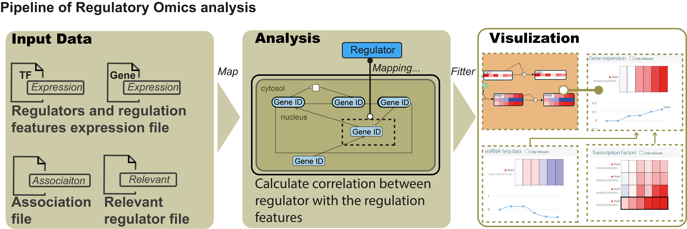

    

# Regulatroy omics analysis

## Introduction

PaintOmics 3 provided the Regulatory Omics option designed to upload data on features such as microRNA-seq, acting as regulators of gene expression. PaintOmics 4 extends this functionality to accept any type of trans-acting element operating on genes, transcripts or proteins and includes filtering functions to extract meaningful regulatory relationships. In addition to microRNA-seq, transcription factors (TF) and splicing factors (SF), detected by RNA-seq, RNA-binding proteins identified by CLIP-seq, etc., can be analysed with this option. The Regulatory Omics option takes a trans-regulatory-feature data matrix with expression or activity values for regulators in the conditions of the study. The regulator-gene/protein mapping file is provided by the user, together with an optional list of significant deferentially expressed regulators. PaintOmics 4 filtering options include thresholds for positive or negative correlation to select the expected regulatory relationships. Applying these criteria, regulatory features will be mapped to their targeted features and their corresponding pathways. A pathway enrichment score is calculated either based on the number of regulators mapping to each pathway or on the number of regulated genes present in the pathway. Enriched pathways for the Regulatory Omics modality represent biological processes that are significantly impacted by that regulatory layer (Figure 1).

    
    
<b>Figure 1:</b> The pipeline of Regulatory Omics analysis in PaintOmics 4

## Input data

### Regulators expression and relevant files

Table 1 A shows the example of regulator expression files First column must contain the feature name or identifier of the regulators. Remaining columns contains the quantification values for each sample in the experiment, preferably in logarithmic scale.

### Association and relevant associaiton files

### Parameters

Omic Name

