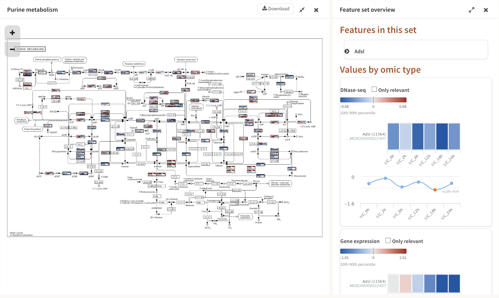
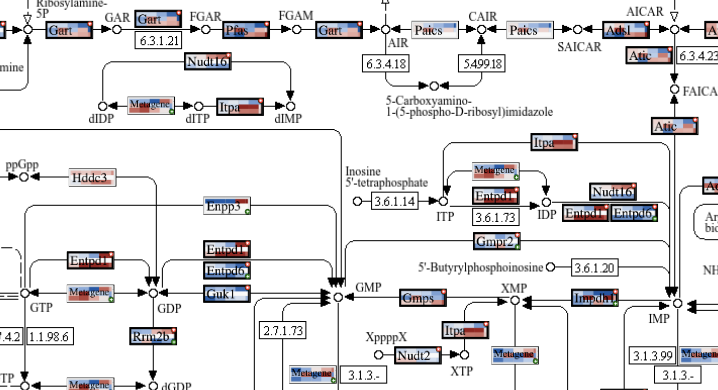

# The pathway view

The pathway view is where your measurements are drawn onto a pathway diagram.
Every feature the job matched gets a small heatmap painted over its position on
the map: one row per omic, one cell per condition. This page covers that
screen — how a box is built, what its colours mean, every button on the
toolbar, both side panels, and exactly what the **Download** button produces.

## Getting here

There are three ways in, and they all open the same view:

* Step 3, the **Pathway enrichment** table: click the paint-brush icon in the
  **Paint** column of any row. This is the usual route — see
  [pathway enrichment](4_1_pathway_enrichment.md).
* Step 3, the pathways network: hover a node and click **Paint** in the
  tooltip that opens.
* An AI interpretation report: every pathway named in the report is a link,
  and clicking it paints that pathway. See
  [the pathway interpretation](ai-interpretation.md).

KEGG, Reactome and MapMan pathways are all painted the same way. OmniPath
publishes no diagram, so an OmniPath pathway opens as an interaction network
instead — see [OmniPath pathways](#omnipath-pathways-open-as-a-network) below.

*Purine metabolism from the STATegra 5-omic example, with the diagram panel expanded to the full width.*

## The workspace

The screen is up to three columns wide.

| Column | What it holds |
|---|---|
| The diagram panel | The pathway artwork with your values painted on it. Open unless you close it with its own X — **Show Pathway** brings it back. |
| The secondary panel | Either the **Global heatmap** or the **Feature set overview** for one box. |
| The auxiliary panel | Either **Pathway information** or **Visual settings**. 300 px wide. |

Each of the last two columns holds one panel at a time, and the application
switches them silently: pressing **Settings** closes **Pathway information**,
opening a box's details closes the **Global heatmap**, and vice versa. The
consequence worth knowing is that the evidence overlay's legend lives inside
**Pathway information**, so opening **Settings** takes it off screen until you
press **Search** again.

The diagram panel's header carries a close button, an expand/shrink pair that
gives the diagram the whole row or hands the width back, and **Download**. The
two middle panels can also be resized by dragging their left edge; the diagram
panel and the 300 px auxiliary panels cannot.

*The diagram panel and, beside it, the Feature set overview for one gene — its colour legend, its per-condition bars and its line chart.*

## The toolbar

Six buttons sit above the workspace.

| Button | What it does |
|---|---|
| **Settings** | Opens the **Visual settings** panel: which omics are drawn, and how they are coloured. |
| **Search** | Opens the **Pathway information** panel. This is the panel a pathway opens with. |
| **Show Heatmap** | Opens the **Global heatmap** panel — every feature in this pathway, as one heatmap per omic. See [heatmaps](5_3_heatmaps.md). |
| **Show Pathway** | Brings the diagram panel back after you have closed it. |
| **Go back** | Returns to Step 3. |
| **History** | Slides open a panel of the pathways you have opened in this session. |

**History** lists up to eight pathway thumbnails, newest first; clicking one
reopens that pathway and moves it to the front. Close it with its own X, by
clicking anywhere outside it, or with the Escape key. The last five pathway views are
kept in memory, so switching back to a recent one is instant and its zoom and
panel state come back with it; the sixth pathway pushes the oldest out.

**Go back** re-shows Step 3 without re-running anything, and scrolls you to the
**Pathway enrichment** heading rather than to the top of the page — you land
back at the table you came from. It also closes the History panel and every
feature pop-up you had left open, pinned ones included.

## How your values are drawn

Wherever the job matched at least one of your features to a position on the
map, PaintOmics paints a small heatmap over that position:

* **one row per omic you have chosen to draw.** Gene-based omics are drawn on
  gene boxes, compound-based omics on compound entries. Which omics get a row
  is set in **Visual settings**, and it is not all of them by default — see
  below.
* **one cell per column of that omic's file**, in the order your file had them.
  If the omic has a replicate-to-sample mapping and the view is in samples
  mode, it is one cell per biological sample instead.
* **a plain pale-grey row** where that omic has no value for this feature, so
  the omics stay in the same order on every box and a gap is visible as a gap.
* **the feature's name**, printed across the box wherever the box is wide
  enough to carry it.

A box wide enough to be framed is framed in light grey, and the frame turns
**black** when the feature is on your relevant list for any omic, or has a
relevant association. Three corner glyphs carry the rest:

| Glyph | Corner | Meaning |
|---|---|---|
| Red circled star | top right | The feature is relevant for at least one omic. |
| Gold circled star | top left | The feature has a relevant association — a significant regulator link from a [regulatory omic](4_6_Regulatory_omics.md). |
| Green circled plus | bottom right | More than one feature shares this position. |

*One box per drawn position, each split into one row per omic and one cell per condition. Red stars mark relevant features; green pluses mark positions holding more than one feature; boxes labelled "Metagene" are crowded positions painted as a trend.*

Per-condition significance is deliberately **not** marked on the diagram box.
The white stars that say "this feature is significant in this condition" are
drawn in the hover pop-up and in the panel heatmaps, where there is room for
them to be read.

### When several features share one box

Features are grouped by their coordinates on the artwork, so anything the map
draws in the same place becomes one box. What that box shows depends on how
crowded the position is.

* **Up to five features.** The box shows the first feature in the set that is
  relevant for any omic, or simply the first feature if none of them is. The
  green plus marks that others are hidden, and the hover pop-up says
  "*N* more Genes at this position." with **Prev.** / **Next** links that step
  through them, repainting the box as you go.
* **More than five features.** PaintOmics computes PCA metagenes for the
  position and paints the first one instead of any individual feature, so a
  dense node shows the trend of its whole group rather than one arbitrary
  member. Those boxes are labelled **Metagene**. A metagene is a zero-centred
  trend and not a measurement of the omic, so it is coloured against the range
  of the metagenes themselves rather than the omic's reference values. See
  [metagenes](4_7_Metagenes.md).

!!! warning "A diagram row shows one value per omic"
    Where several features of the same omic match one entry — three miRNAs
    against one target gene, two uploaded metabolites against one KEGG
    compound — the row on the diagram shows only the first of them. All of them
    appear in the hover pop-up's heatmap and in the panel heatmaps, which is
    where to look when a box seems to be hiding something. See
    [feature details](5_2_detailed_views.md).

## What the colours mean

The default scale is a diverging ramp: a faintly toned neutral at zero, blue
below it, red above it. It is built so that lightness falls steadily towards
either end, which means "further from zero" always reads as "darker" even for a
reader who cannot separate the two hues; the hue itself is fixed on each side
and never walks from one pole to the other.

A value past the end of the range is not clipped to the end colour. It keeps
the same hue and goes darker still, so "off the scale" stays legible as more of
the same thing. (This applies to the default scale. On **Green-Black-Red** an
out-of-range value simply saturates at the pole.)

### Where the ends of the scale come from

The ends are set per omic, in **Visual settings** → **Coloring options** →
**Reference values**, and they are computed from every value in that omic's
uploaded file — not from the features in the pathway you happen to be looking
at. Two pathways of the same job are therefore directly comparable.

| Option | The ends of the scale are |
|---|---|
| **Percentiles 10 and 90** (the default) | The 10th and 90th percentile of that omic's values. A tenth of the data at each end is past the scale, which is what stops a handful of extreme values flattening everything else. |
| **Global Min/Max (including outliers).** | The smallest and largest value in the file. |
| **Global Min/Max (without outliers).** | The smallest and largest value left after dropping everything outside Q1 − 1.5 × IQR to Q3 + 1.5 × IQR — the box plot's whiskers. |
| **Custom values** | Wherever you put the two handles of the slider, which spans the omic's full observed range. |

Two rules are applied on top of whichever you pick. If the resulting range
crosses zero it is made symmetric, so an equal move up and down reads equally
strongly. If it does not cross zero, the pale end is the end nearer zero, so a
set of all-negative values still darkens as it gets more negative.

Every colour legend in Step 4 — under each omic heading in the **Global
heatmap** and **Feature set overview** panels — states its minimum, its
maximum, a zero tick where the range crosses zero, and the reference in words:
*10th-90th percentile*, *interquartile range*, *full range* or *custom range*.
Two legends of the same width can be showing very different amounts of data, so
the caption is worth reading.

## Visual settings

**Settings** opens a 300 px panel of every drawing option for this job, with a
green **Apply** at the bottom. **Apply** repaints the diagram, the open
pop-ups and the open heatmap panels from data the browser already holds, so
nothing is recomputed and no analysis is re-run.

**Choose the omics to draw** lists your omics under *Gene based omics* and
*Compound based omics*, each with an eye toggle. An open green eye means the
omic gets a row in every painted box; a red crossed-out eye means it is left
out. This is the control that decides how many rows a box has.

!!! warning "Not every omic is drawn to begin with"
    A pathway opens drawing the **first three gene-based omics and the first
    compound-based omic** of the job. A job with four gene-based omics — the
    STATegra 5-omic example is one — paints only three of them until you switch
    the fourth on here.

**Coloring options** holds two groups. **Reference values** gives every omic
its own fieldset with the four choices in the table above; picking **Custom
values** enables that omic's two-handle slider. **Color scale** offers
**Blue-Grey-Red** (the default) and **Green-Black-Red**, each with a live
swatch drawn by sampling the same function that paints the cells, so the
preview cannot drift from what you get.

**Replicate display** appears only when at least one omic had a
replicate-to-sample mapping applied in Step 2. **Show all replicates** draws
one cell per uploaded column; **Show samples (averaged)** draws one cell per
biological sample — the mean across its replicates — and relabels every axis in
Step 4 with the sample names. Where a mapping exists, **Show samples
(averaged)** is what the view opens with, so a painted box can legitimately
have fewer cells than your file has columns.

Applied settings are stored with the job. The omics you chose, the colour
references, the colour scale, your custom slider values and any evidence boxes
you dragged come back when you paint the next pathway, and when you reopen the
job later.

## Pathway information

This is the panel a pathway opens with, and the one **Search** brings back.

*The Pathway information panel: the search box, the classification chips, one row per omic with matched (relevant) counts and the p-value, and the start of the trend charts.*

**Search in this pathway** matches your query as a case-insensitive substring
against every identifier and name in the pathway — KEGG identifiers, resolved
feature names, and the identifiers you uploaded — and suggests completions once
you have typed two characters. Press Enter or **Search**. The panel then
reads "Found *N* features." with one expandable card per hit. A card carries
**Find in Pathway**, which resets the zoom, switches every box containing that
feature to show it and flashes a label over each of them for about 1.7 seconds,
and **Show details**, which opens the
[Feature set overview](5_2_detailed_views.md) for that box. **Back to Pathway
details** returns you to the rest of the panel.

Below the search box the panel names the pathway and shows its
[classification](4_2_kegg_categories.md) as chips — *Metabolism* and
*Nucleotide metabolism* for Purine metabolism above — then a table with one row
per omic:

* **Matched** is how many of this pathway's features that omic matched, with
  how many of those are on your relevant list in brackets. In the example
  above, DNase-seq matched 115 features of Purine metabolism and 32 of them are
  relevant.
* **p-value** is that omic's [enrichment p-value](4_1_pathway_enrichment.md)
  for this pathway. Small means this pathway holds more of your relevant
  features than its size would explain.
* The chevron expands one row per condition, each with its own matched
  (relevant) counts and its own p-value. The summary row shows the first
  condition's counts beside the global p-value, so the counts can differ from
  condition to condition where a feature was not measured everywhere.
* The plus expands the alphabetical list of the features that omic matched,
  each with the identifier you uploaded for it and its relevance stars.

Under the table, each **gene-based** omic gets a small chart of the pathway's
major trends — its metagenes — introduced by a line saying how many major
trends the pathway has, with a **Heatmap** / **Line chart** toggle that opens on
the line chart. An omic with nothing in this pathway says "No data for this
pathway." Compound-based omics do not get a trend block in this panel.

## Moving around the diagram

The artwork is scaled to fit the panel rather than scrolled: it is measured
against the space available and shrunk to fit both dimensions, and every
painted box is scaled by the same factor, so the whole map stays visible
however narrow the column gets. Opening a heatmap panel beside it re-fits it.

To look closely: drag the diagram to pan it, use the mouse wheel to zoom, or
use the **+** and **−** buttons in the corner of the panel, which step the zoom
to 110% and 90% each press.

## Downloading the diagram

**Download**, in the diagram panel's header, produces a PNG of the map as it is
currently painted. What goes into the file:

* the pathway artwork;
* every painted feature box, with the omics, colour scale and reference values
  in force at the moment you press the button;
* the [evidence overlay](#the-evidence-overlay), including any regulator boxes
  you have dragged;
* the credit line "Created with PaintOmics 4" in the corner.

The whole map is exported, whatever you have zoomed or panned to, and rendered
at three times the artwork's own size; the file arrives as
`paintomics_<pathway>_<jobID>.png`.
Pop-ups, side panels and heatmaps are not part of it, and there is no
table-of-numbers export from this step — the **Global heatmap** panel has no
download button, and neither the values nor the p-values behind the diagram can
be exported as a file from here.

**Download** is present on an OmniPath pathway too, but do not press it there.
The export copies the pathway artwork, and an OmniPath pathway has none — the
interaction network has taken the diagram's place. No file is produced, and the
message "Generating image, please wait..." that appears first has no **Close**
button and nothing left to finish, so it stays on screen over the whole
application and you have to reload the page to get past it. To keep a picture of
an OmniPath network, use a screenshot.

## The evidence overlay

A job that ran the [MORE regulatory analysis](4_6_Regulatory_omics.md) also
draws a few of MORE's fitted regulator-to-target relationships over the
diagram. Nothing has to be switched on: the layer is requested automatically
when the pathway opens, and jobs without a MORE analysis simply never see it.
A server setting does not gate it.

Every mark is violet and deliberately unlike the map's own printed arrows, so
the layer reads as an annotation rather than as curated biology. Within that
one hue:

| Mark | Meaning |
|---|---|
| Solid line | **Corroborated** — a curated database records this interaction. |
| Dashed line | **Novel** — both partners are curated, and nothing links them. |
| Dotted line | **No coverage** — one partner has no curated interactions at all, so the databases have no opinion either way. |
| Arrowhead / bar at the target end | The sign of MORE's fitted coefficient: arrow for positive, bar for negative. |
| Hollow arrowhead | The box it lands on holds several genes, so the link cannot say which one is acted on. |
| Dashed violet frame | A regulator parked beside its target — either a copy of a box drawn elsewhere on the map, or a box the layer added for a regulator the map does not print at all. Added boxes are painted with the regulator's own values on the same colour scale as every other box. |
| Solid violet ring | A regulator the map already draws next to its target; it is ringed and joined by an arrow rather than copied. |

Any dashed violet box can be dragged somewhere clearer — the position is saved
with the job and carried into the exported PNG — and clicking one opens that
regulator's own profile in the Feature set overview. Hovering a mark gives a
tooltip naming the regulator and target, the evidence class, the fitted
coefficient and the condition it came from, the R² of the target's whole model,
and any corroborating database with the pathways and PMIDs behind it.

The **Evidence overlay** card in the **Pathway information** panel is where the
layer accounts for itself. It says how many relationships were drawn, counts
each class, names which databases corroborated anything on this map, and then
lists what it could not draw: relationships past the readability cap, ones
acting on a target the map does not draw, regulators with nowhere free to sit,
interactions curated on a different map, and so on. It also carries **Hide
layer**, and — wherever the layer parked or added a box — **Reset positions**,
which becomes active once you have dragged one.

!!! warning "Read the layer as a sample, and the direction as this job's model"
    At most **eight** relationships are drawn per map. That is the measured
    readability ceiling, not a measure of how many there are: on the STATegra
    mouse job a single KEGG map carries a median of 11 and up to 196 of them.
    The card tells you how many it left out. Separately, *corroborated* is an
    existence claim only — MORE's coefficient sign and the curated sign agree
    58.3% of the time against 52.8% expected by chance, so the arrow or bar is
    this job's model speaking, never a curated claim.

## OmniPath pathways open as a network

OmniPath is an interaction resource and ships no diagram, so its pathways are
drawn as a graph instead of a raster. Each gene is a node carrying the same
painted glyph it would have on a KEGG map — same rows, same colours — and the
edges are OmniPath's signed, directed interactions: green with an arrow for
stimulation, red with a bar for inhibition, grey and unarrowed for unsigned.

The strip above the network holds that colour key, a **Layout** menu (*Rings
(by connectivity)*, *Cascade (follows direction)* and *Clusters
(force-directed)*; rings is chosen for you above 45 genes and clusters below,
until you pick one yourself), a **Causal edges only** checkbox, and a status
line giving the gene and interaction counts and saying so explicitly when a cap
has hidden edges. Hovering a gene dims everything outside its neighbourhood;
clicking one opens the same Feature set overview a painted box opens. See
[the OmniPath interaction network](1_6_omnipath.md).

## Where to go next

* [Feature details](5_2_detailed_views.md) — the hover pop-up, the Prev./Next
  cycling, the external links, and the **Feature set overview** panel.
* [Heatmaps](5_3_heatmaps.md) — the **Global heatmap** panel, its clustering
  options and what its row labels mean.
