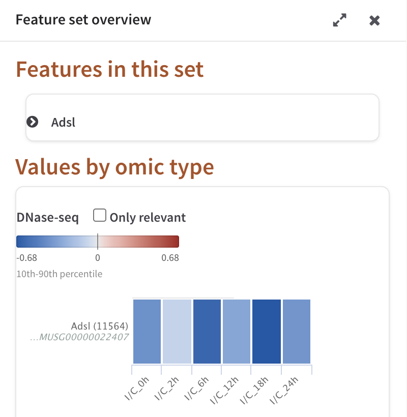

# Feature details

Every painted box on a pathway diagram carries the values PaintOmics matched to
that point of the map. This page covers the two ways to read them: the small
popup that opens on the box itself, and the **Feature set overview** panel
behind its **Show details** button. For the diagram as a whole — how the boxes
are painted, and the colour settings they obey — see
[the pathway view](5_1_browsing_pathways.md).

## The popup on a painted box

Hover a painted box for half a second and a small window opens beside it.
Clicking the box opens the same window at once and pins it. An unpinned window
stays while the pointer is over it or over the box, and closes half a second
after the pointer leaves both; a pinned one stays until you close it, so you can
leave several open over the diagram and compare them. Dragging a window anywhere
also pins it.

Three tools sit in the window header:

| Tool | What it does |
|---|---|
| Pin | **Keep or not this window open**. Toggles to an unpin once the window is pinned. |
| Plus | **Show or hide more information** — reveals the feature's other names and its external links. Toggles to a minus. |
| Close | **Close this window**. |

The title is the map's own label for that box, or the feature's name where the
map has none. A red star after the name means the feature is relevant — your
relevant-features file listed it for at least one condition. A gold star means
it has a relevant association, which is what a significant regulator link
produces (see [Regulatory omics](4_6_Regulatory_omics.md)).

Pinned windows do not survive a change of pathway: opening another map, or
pressing **Go back**, closes all of them.

### Heatmap and Line chart

The body of the window shows the same numbers two ways, switched by the
**Heatmap** / **Line chart** pair of buttons.

**Heatmap** draws one row per measured value and one cell per experimental
column, labelled with the omic name and the feature's display name — its
symbol where PaintOmics resolved one, otherwise the identifier you uploaded.
Cells are coloured on that omic's colour scale, the same scale the
diagram box uses — with one exception: a box that was collapsed to
[metagenes](4_7_Metagenes.md) is painted on the metagenes' own range, centred on
zero, while the popup keeps colouring on the omic's. On such a box the shades in
the popup and the shades on the diagram do not correspond, and only the numbers
in the hover readout are comparable.

A star on a cell marks a condition for which the feature is relevant; stars are
only drawn when the omic has more than one column, and a relevant-features file
with a single column of identifiers means "relevant overall" and produces no
per-cell stars at all — only the star beside the name. Marking single
conditions needs a [per-condition relevance file](2_1_accepted_input.md), one
column per value column. An omic with no value for this feature still gets a
row, drawn plain grey, so the omics stay in the same order from box to box.
Hovering a cell gives the untruncated row name, the column it belongs to and the
value itself.

Two things about the rows are worth knowing:

* The popup lists **every** omic of the feature's type that you uploaded, not
  just the ones you chose to draw on the diagram. A gene box shows all
  gene-based omics; a compound circle shows all compound-based omics.
* Where several measurements of one omic matched the same feature — three
  miRNAs against one gene, two uploaded metabolites against one compound — the
  popup draws **one row each**. The diagram box only ever draws one row per
  omic, so the popup is where you find out there is more than one measurement
  behind a box.

**Line chart** plots the same values rescaled onto the colour reference, so
that the two ends of the colour scale sit at −1 and +1; the three grey
gridlines are drawn at −1, 0 and +1. A point outside the reference range
gets an orange marker: it is off the end of the scale, and the diagram cannot
distinguish it from any other value out there. This chart carries no column
labels — read the conditions off the heatmap.

### More than one feature at the same position

A pathway map often draws several of your matched features at one point — a
KEGG box that stands for several genes of the same orthology group, for
instance. PaintOmics keeps everything drawn at one position together as a
*feature set*, paints one member of it, and marks the box with a green plus at
the bottom right.

The popup then carries a line reading "N more Genes at this position." with
**Prev.** and **Next** links. Stepping through them changes which feature the
popup describes *and* repaints the box on the diagram to match.

Where more than five features share a position, PaintOmics computes metagenes
for that position and paints the first metagene instead of any single feature.
The popup then gains a **Genes** / **Metagenes** pair of buttons, and
**Prev.** / **Next** steps through whichever of the two is selected. See
[Metagenes](4_7_Metagenes.md) for what a metagene is and how it is coloured.

### External links

The plus tool expands the window with a block listing any other names the
feature carries and links out to the databases that hold it:

| Feature type | Links |
|---|---|
| Gene | KEGG, Ensembl Genomes, Ensembl (vertebrates), GeneCards (human jobs only), related publications at PubMed, NCBI Gene, all NCBI databases |
| Compound | KEGG, PubChem Compound, ChEBI |

## Feature set overview

**Show details**, at the foot of the popup, closes it and opens the **Feature
set overview** panel between the diagram and the side panel. The same panel
opens from the **Show details** button on a search result in the **Pathway
information** panel, and from a click on a gene node in an OmniPath network,
where there is no diagram box to hover.

The panel is titled for the *set*, not for one feature, because that is what a
box is: everything the map draws at that one position. If the box you clicked
stands for a single feature, the set has one member.

Its header carries hide, expand and shrink controls, and its left edge can be
dragged to give the charts more room. Only one panel can occupy that slot, so
opening it closes the [Global heatmap](5_3_heatmaps.md), and opening the Global
heatmap closes it.

*Feature set overview for a single-feature box: the collapsed feature card, then the DNase-seq block with its colour legend and one row of six conditions.*

### Features in this set

The first section lists every feature drawn at that position as a collapsible
card. Expanding one draws that feature's heatmap and line chart — the same pair
the popup shows, with the same meaning — followed by its external links. A card
whose feature is relevant carries the red star beside its name, and its body
carries the caption "Relevant for this omic", the same caption the popup
shows. Cards are rendered on first expansion, so a set with many members
opens quickly.

### Values by omic type

The second section turns the set around: instead of one block per feature, one
block per omic, holding every value that omic has for every feature in the set.

Each block has a heading with the omic's name, an **Only relevant** checkbox,
and a colour legend showing the two ends of the scale, a tick at zero when the
range crosses it, and a caption naming the reference the ends come from —
"10th-90th percentile" by default. This is the same reference the diagram is
painted with, and changing it in **Settings** repaints this panel too.

Below the legend the block draws a heatmap and, beside it, a line chart of the
same rows:

* **The heatmap.** One row per measured value, one cell per condition. The row
  label is the feature's symbol with its KEGG identifier above the identifier
  you uploaded, with a red star for relevant and a gold star for a relevant
  association; hover the label for both in full. Cells carry the same
  per-condition stars as the popup heatmap, under the same rule.
* **The line chart.** The same rows as raw values, one line each, with the
  real condition names on the axis. Hovering a row of the heatmap greys out
  every line in the chart except that row's, which is how you follow one
  feature through a crowded block.

Where a block holds more than five rows they are clustered before drawing —
euclidean distance, complete linkage — so that similar profiles sit next to
each other. No dendrogram is drawn here; for one, use the
[Global heatmap](5_3_heatmaps.md).

**Only relevant** redraws both charts with just the rows that are relevant, or
that carry a relevant association, for that omic. Unticking it brings the rest
back.

#### "scale max" and "scale min"

When the colour reference is narrower than the data — which it is by default,
since the 10th and 90th percentiles clip a tenth off each end — the line chart
draws two faint hairlines labelled **scale max** and **scale min** at the two
ends of the reference, and marks in orange every point outside them.

Read them as the limit of what the colours can tell you. Two features whose
values both sit above the **scale max** line are painted the same on the
diagram; the chart is where you see which of them is the larger. If the
reference covers the whole observed range — **Global Min/Max (including
outliers)** — nothing is clipped and the hairlines are not drawn.

#### Metagene blocks

Where the position was collapsed to metagenes, each omic gets a second block
headed "*omic* (metagenes)" with its own heatmap and line chart, so the
computed trends can be read beside the individual features they summarise.

### Neighbouring features

For a compound box only, the panel ends with a **Neighbouring features**
section: type a number of steps from 1 to 4 and press **Show Features**, and
PaintOmics pulls that metabolite's neighbours from the KEGG compound
interaction network and draws them as Gene expression and Metabolomics blocks,
each with its own **Only relevant** checkbox. The section is hidden on gene
boxes, where there is nothing to look up.

Every way this can come back empty is answered on the panel in words rather
than silently: no level typed, a level outside 1 to 4, no interaction network
installed for this species, this metabolite absent from the network, no
neighbours at that number of steps, or neighbours that carry no measured values
in the omics you uploaded. The same network drives the
[metabolite hub analysis](4_4_metabolite_hub_analysis.md), which ranks
metabolites by how differentially expressed their neighbourhood is.
