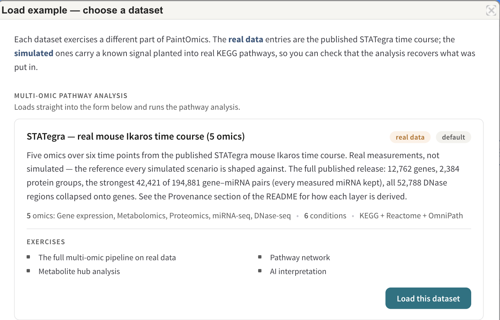
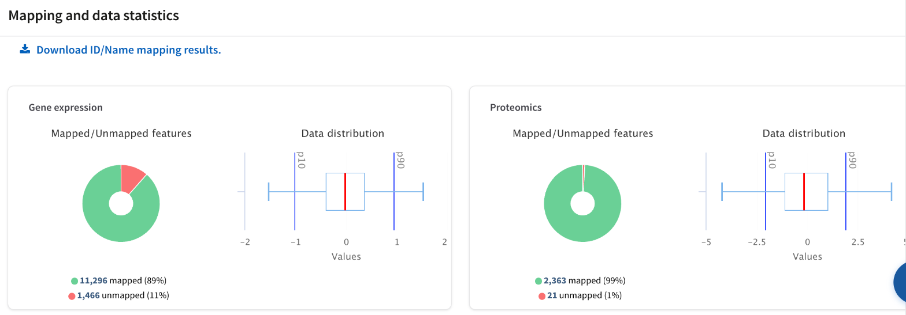
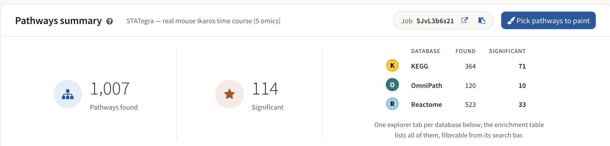
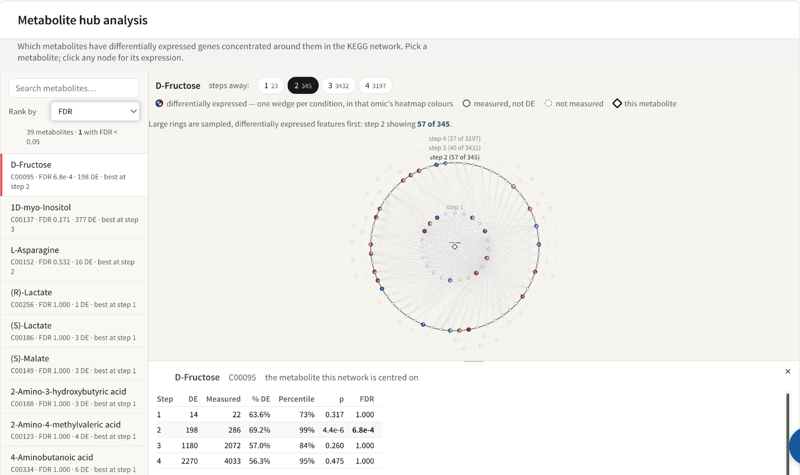
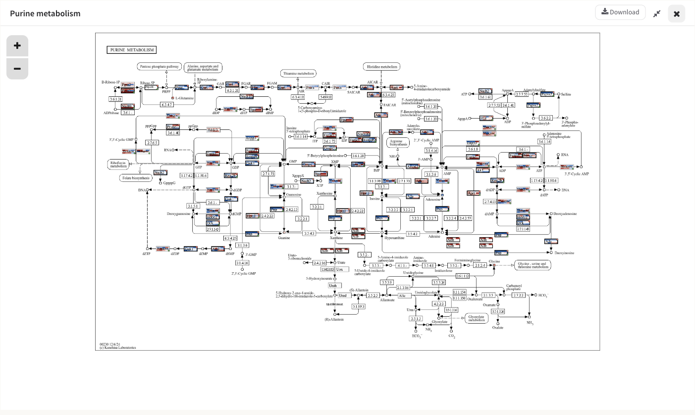
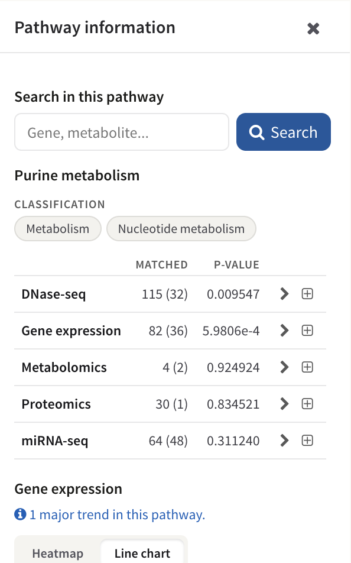
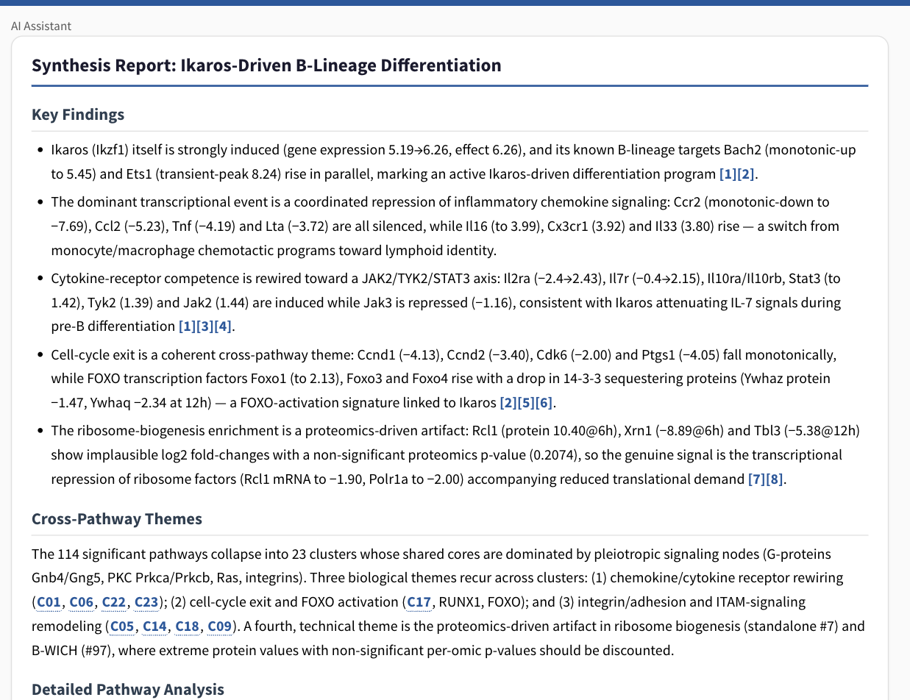

# A worked example: RNA-seq and DNase-seq

This page follows one real analysis from the files to a conclusion. The
reference pages are organised by feature; this one is organised by the
question, and it uses the numbers a single run actually produced rather than
invented ones. It is a companion to [Your first analysis](8_step_by_step.md),
which is the screen-by-screen mechanical guide — that page tells you where to
click, this one tells you what to make of what appears. Read that one first, or
keep it open beside this.

Every figure and every number below comes from one job: the bundled
**STATegra — real mouse Ikaros time course (5 omics)** example, run against
KEGG, Reactome and OmniPath for *Mus musculus*.

## The experiment

Ikaros is a transcription factor required for B-cell lineage commitment. In the
published STATegra experiment, a mouse B3 pre-B cell line carries an inducible
Ikaros construct; tamoxifen switches it on, and five omic layers are measured
at six time points afterwards. Each value in the uploaded files is an
Ikaros-over-control log2 ratio at one time point, averaged over three
biological replicates per arm. The six conditions are `IKvsCtr_0h`, `_2h`,
`_6h`, `_12h`, `_18h` and `_24h`.

The data are from Gomez-Cabrero et al., *STATegra, a comprehensive multi-omics
dataset of B-cell differentiation in mouse*, Sci Data 6:256 (2019),
[doi:10.1038/s41597-019-0202-7](https://doi.org/10.1038/s41597-019-0202-7).

| Layer | What it measures | Identifiers in the file | Source accession |
|---|---|---|---|
| Gene expression | Transcript abundance, 12,762 genes | Ensembl gene IDs | GSE75417 |
| Proteomics | 2,384 protein groups | Gene symbols | PXD003263 |
| miRNA-seq | 42,421 gene–miRNA pairs, paired against the miRBase target table | `gene:::miRNA` associations | GSE75394 |
| DNase-seq | Chromatin accessibility, 52,788 consensus regions collapsed onto genes | Ensembl gene IDs after region assignment | GSE75390 |
| Metabolomics | 58 analytes | Compound names | MetaboLights MTBLS283 |

*The dataset used throughout this page. **Load example** in the top bar loads
it, files and all, so you can reproduce every figure below.*

The question the analysis is being asked is a single one: **does inducing one
transcription factor produce a change that is coherent across chromatin,
transcript, protein and metabolite, and if so, where?**

## First, the layers that are not gene-level

Three of the five layers measure something a pathway database has never heard
of. Pathways are drawn on genes and compounds, so a layer measured on anything
else has to be converted into one of those two before it can be enriched or
painted — and that conversion is an interpretation you are responsible for, not
a formatting step.

DNase-seq is the clearest case, and it is the reason this page exists.

### Turning an open region into a claim about a gene

A DNase-seq peak is an interval: chromosome, start, end. On its own it says
that a stretch of chromatin was more accessible after induction than before.
That is not yet a statement about any gene, and pathways contain no intervals.

PaintOmics closes the gap with **RGmatch**, which associates each region with
every gene within a search distance — one row per region–gene pair — and
records *which area* of the gene the region falls in: upstream, promoter, TSS,
first exon, first intron, gene body, downstream. You then choose the areas that
carry your hypothesis. For an accessibility change you expect to act on
transcription initiation, promoter and TSS are the areas that matter, and a
region sitting in the gene body of a neighbouring gene is noise. Where several
kept regions land on the same gene, their values are summarised into one — by
default the mean. The settings and the defaults are on
[Preparing your data](2_1_accepted_input.md#matching-regions-to-genes-rgmatch).

In this dataset that step turns 52,788 consensus DHS regions into 23,273 gene
rows, and those rows are what the pathway analysis sees.

The reasoning is worth stating plainly, because the rest of the analysis
inherits it:

* **What you gain.** "A region opened" becomes "this gene's promoter opened",
  which is a claim a pathway can hold, can be tested for enrichment, and can be
  painted next to that gene's transcript and protein values.
* **What you assume.** That proximity implies regulation. It often does at a
  promoter and often does not at distance: an enhancer can act across hundreds
  of kilobases and skip the gene next to it, and a region within the search
  distance of two genes is credited to both. Neither error is visible
  downstream — by Step 2 the layer looks exactly like an ordinary gene-level
  omic.
* **What follows.** Treat a DNase-seq p-value as evidence about *accessibility
  near* the pathway's genes, not about the genes themselves. It is at its
  strongest when it agrees with the transcript layer on the same genes, which
  is exactly what the pathway view lets you check.

The miRNA layer has the same shape: miRNA quantification is paired with a
target-prediction table, and each `gene:::miRNA` pair carries the assumption
that the predicted target is a real one. Metabolomics has a smaller version of
the same problem — a compound *name* is not an identifier, and this run had 47
names that matched more than one KEGG compound.

## Step 2 — how much of each layer survived

| Omic | Mapped | Unmapped |
|---|---|---|
| Gene expression | 11,296 (89%) | 1,466 |
| Proteomics | 2,363 (99%) | 21 |
| miRNA-seq | 8,585 (100%) | 33 |
| DNase-seq | 16,491 (71%) | 6,782 |
| Metabolomics | 52 (90%) | 6 |

*Two of the five mapping cards. The doughnut is the mapped/unmapped split; the
box plot beside it is the distribution of the values that will be coloured,
with the 10th and 90th percentiles marked.*

Three things in that table are worth reading rather than glancing at.

**The spread is a property of namespaces, not of data quality.** Proteomics
maps at 99% because it arrives as gene symbols, which is close to the domain
KEGG is keyed on for mouse. Gene expression maps at 89% because Ensembl carries
gene models — predicted, non-coding, retired — that a curated identifier set
never adopted. Nothing was done wrong to the 1,466. See
[Supported identifiers](1_4_id.md).

**DNase-seq at 71% is the lowest, and it is the derived layer.** Its 23,273
rows are only as good as the genes RGmatch assigned regions to; a region whose
nearest gene has no entry in the pathway databases contributes nothing, however
clean the peak was. A low rate on a derived layer is a question about the
annotation and the assignment settings, not about the assay.

**Metabolomics is 52 features.** Not 52%, fifty-two features. Hold that number:
it governs everything the compound-based analyses can and cannot say later on
this page.

The 47 ambiguous compound names are settled on this screen, one card per name,
and it is worth the minute. *Alanine* is the standard trap: the bare name,
L-alanine, D-alanine and β-alanine are four separate KEGG compounds in
different pathways, and the exact-name match is not automatically the one you
measured.

## Step 3 — 1,007 pathways found, 114 significant

*The summary at the top of the results screen, with the per-database
breakdown.*

| Database | Found | Significant |
|---|---|---|
| KEGG | 364 | 71 |
| OmniPath | 120 | 10 |
| Reactome | 523 | 33 |
| **Total** | **1,007** | **114** |

"Found" means the pathway contains at least one feature you uploaded and
PaintOmics matched. "Significant" applies the threshold and the p-value
combination method currently set on the enrichment table, so both counters move
when you change those — see [Pathway enrichment](4_1_pathway_enrichment.md).

Do not read the three rows as a league table. Reactome finds the most pathways
and returns the fewest significant ones because it decomposes biology into many
small reaction sets, and each is tested against its own Reactome background;
KEGG's maps are larger and fewer. The databases differ in granularity, scope
and identifier type by design ([Reactome](1_2_reactome.md),
[OmniPath](1_6_omnipath.md)). A pathway significant in one and absent from
another is usually a difference in how biology was carved up, not a
contradiction.

114 significant pathways is also more than anyone can read. The network is the
tool that makes it tractable.

*66 of the 364 KEGG pathways, joined by 162 edges, filtered to p ≤ 0.05.*

The filter that draws this view keeps pathways at p ≤ 0.05 and edges where two
pathways share enough features. What it shows is that the 71 significant KEGG
pathways are not 71 independent findings: they are a much smaller number of
connected neighbourhoods, and a cluster of adjacent nodes is one story counted
several times. [The pathway network](4_3_pathways_network.md) covers the
colourings, the two kinds of edge, and how to read shared-feature edges without
over-claiming.

## The compound analyses, and their honest size

Two analyses on the results screen work on the metabolite layer. Both were run,
and both have to be read against those 52 mapped compounds.

*39 metabolites scored; D-Fructose is the one that survives correction.*

The hub analysis asks whether differentially expressed genes are concentrated
in the reaction neighbourhood around a metabolite. It scored 39 metabolites,
and **one** passed FDR < 0.05: **D-Fructose** (`C00095`), FDR 6.8e-4, with 198
differentially expressed genes in its neighbourhood, strongest at two steps
away.

One hit out of 39 is not a disappointing result; it is the resolution the
input supports. The FDR is Benjamini–Hochberg over every scored metabolite at
every radius at once, the null DE rate is taken from the same data being
tested, and the four radii of one metabolite are nested views of the same
evidence rather than four independent tests. The full set of assumptions is on
[Metabolite hub analysis](4_4_metabolite_hub_analysis.md), and they all argue
for reading a single well-separated hit rather than a ranking.

The class activity test also ran — the binomial, because this dataset uploads
six ratio columns and a relevant-features list rather than per-sample columns
and a design. At BRITE level 2, **5 of 8 classes passed BH < 0.05** and **2
classes had fewer than three members**, which is too few to test. Amino acids
scored 23 of 30 measured compounds relevant, FDR 1.4e-23.

That exponent needs a caveat in the same breath. The binomial's null is *no
member of this class truly changed*, so a member reaches the relevant list only
by type-I error at the α the list was built at — 0.05 here. Twenty-three of
thirty against a 0.05 null is astronomically unlikely by construction, which
means the number is a statement about **the relevant list you supplied**, and
it inherits every property of the test that produced it. It is not independent
corroboration. On a targeted 58-analyte panel where much of what was measured
moved, that is the expected shape of the answer, not a discovery. The
alternative competitive null and its own limitation are described on
[Metabolite class activity](4_5_metabolite_class_activity_analysis.md).

## One pathway, read properly

Purine metabolism is one of the significant KEGG maps. Opening it puts all five
layers on the same diagram.

*Purine metabolism with five omics over six time points. Each matched feature
is one box, split into one cell per condition, blue below the reference and red
above.*

*The per-omic table beside the map: matched features, how many were in the
relevant list, and the p-value for each layer.*

| Omic | Matched | Relevant | p |
|---|---|---|---|
| Gene expression | 82 | 36 | 5.9806e-4 |
| DNase-seq | 115 | 32 | 0.009547 |
| miRNA-seq | 64 | 48 | 0.311240 |
| Proteomics | 30 | 1 | 0.834521 |
| Metabolomics | 4 | 2 | 0.924924 |

This is the table the whole page has been building towards, because four of its
five rows teach something different.

**Gene expression and DNase-seq carry the pathway.** They are the two smallest
p-values, they are computed on overlapping gene sets, and they agree: the
transcript response and the accessibility signal near the same genes both
concentrate in this map. That agreement is the strongest single thing this run
says about Purine metabolism, and it is exactly the claim the region-to-gene
step was set up to allow. It remains conditional on the assignment: these are
regions *near* those genes.

**miRNA-seq matched 64 with 48 relevant, and still returned p = 0.311.** A high
relevant count is not evidence. The test is hypergeometric — it asks whether 48
of 64 is more than you would expect when a large share of the whole matched
miRNA background is already flagged relevant, and here it is not. Never read a
relevant count without its p-value, and never read a p-value without its
matched count.

**Proteomics matched 30 features and flagged 1.** With k = 1 the test has
essentially nothing to work with, and p = 0.83 records that. Protein-level
change is slower and shallower than transcript change; the honest reading is
that this run does not resolve a protein response in this pathway, not that
there is none.

**Metabolomics returned p = 0.92 on 4 matched compounds.** This is the number to
be blunt about. Purine metabolism contains dozens of compounds; four of them
were measured at all, because the panel has 58 analytes. Two of those four were
relevant. A p-value computed on n = 4 has almost no resolution, and the test is
right-tailed, so a pathway whose compounds are conspicuously *unchanged* can
never produce a small p-value either. **p = 0.92 records the absence of a
measurement, not the absence of an effect.** Reporting "metabolomics does not
support purine involvement" from this cell would be wrong.

The combined p-value in the enrichment table pools all five of these columns.
It is useful for ranking 1,007 pathways down to something readable; it is not a
substitute for this table. Read the per-omic columns of any pathway you intend
to make a claim about — the combination cannot tell you that two of its five
inputs were carried by four compounds and one flagged protein.

Clicking any painted box opens the feature across every omic that measured it,
which is where a per-gene version of the same cross-layer check lives; see
[Feature details](5_2_detailed_views.md) and
[The pathway view](5_1_browsing_pathways.md).

## What the AI made of the whole result

Asked to interpret the job, the agent produced **"Synthesis Report:
Ikaros-Driven B-Lineage Differentiation"**. It grouped the 114 significant
pathways into 23 clusters, 18 of which have nodes in the KEGG network, and
supported its statements with citations whose quoted text was checked verbatim
against the sources.

*The report opens with Key Findings, each tying a named observation to the
values behind it, then Cross-Pathway Themes referring to the clusters by the
identifiers it gave them.*

*Once an interpretation exists, **AI pathway clusters** appears as a node
colouring on the pathway network. Node-colouring changes take effect when
**Apply** is pressed.*

That recolouring is the most useful part of the interpretation for this
analysis, because it answers the question the raw network raised: it puts a
name on each connected neighbourhood and shows which of the 23 themes actually
have pathways in the network. Grey nodes belong to no cluster.

The report is a draft written by a language model, and it should be read the
way you would read a capable colleague's first pass: the evidence table it
builds is checkable against the enrichment table, its citations are checkable
against the papers, and both are worth checking.
[The pathway interpretation](ai-interpretation.md) sets out what it does, what
it is given, and what it cannot do.

## What this run shows, and what it does not

**It shows** that the chromatin and transcript layers respond coherently and
land on the same pathways, that the response is a small number of connected
neighbourhoods rather than 114 findings, and that one metabolite — D-Fructose —
has a transcriptional response concentrated around it that survives correction
across the whole table.

**It does not show** anything about purine metabolites, about most of the
proteome, or about which of the two lowest p-values in Purine metabolism is
causally upstream of the other. It does not show that a miRNA layer with 48
relevant features in a pathway is contributing to that pathway's significance.
And a p-value of 0.92 in this run is, in three of the five layers, a statement
about coverage.

!!! warning "One example is one example"
    These totals came from one job on one server. Pathway counts depend on the
    KEGG snapshot a host carries, so the same dataset yields different totals
    on a different installation, and the significant counts also move with the
    threshold and combination method set on the enrichment table. Use the
    shapes and the reasoning here; re-measure the numbers on your own run.

## Where to go next

* Run it yourself: the dataset and everything else in the catalogue are on
  [The example datasets](examples.md).
* The mechanics, screen by screen: [Your first analysis](8_step_by_step.md).
* Why the DNase layer looks the way it does:
  [Preparing your data](2_1_accepted_input.md#matching-regions-to-genes-rgmatch).
* What each p-value on this page is:
  [Pathway enrichment](4_1_pathway_enrichment.md).
* Grouping 114 pathways into something readable:
  [The pathway network](4_3_pathways_network.md) and
  [Pathway classification](4_2_kegg_categories.md).
