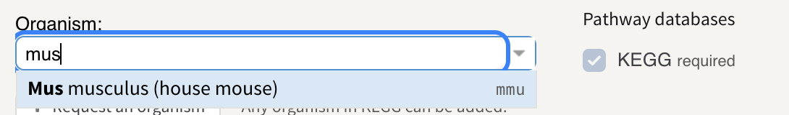
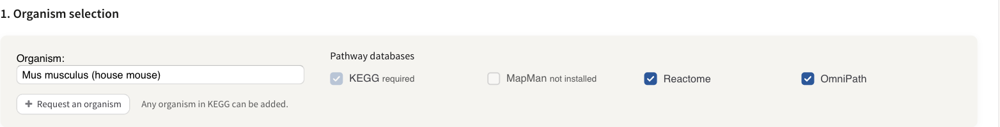
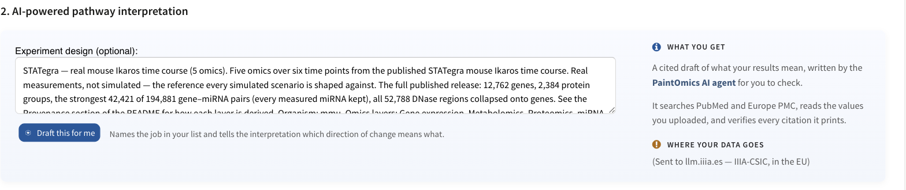
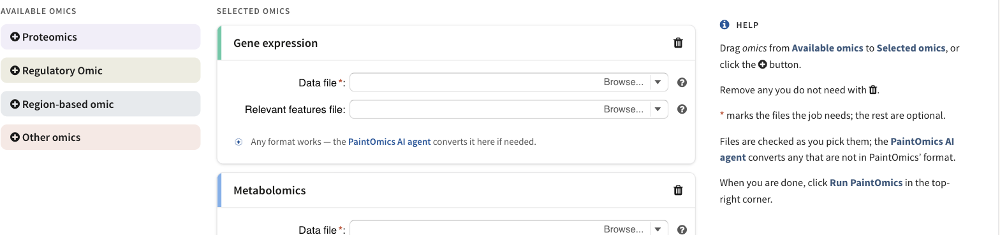
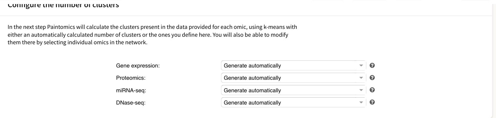
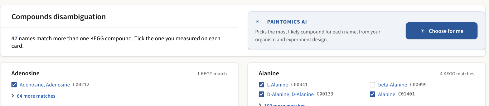

# Your first analysis

This page walks through a complete PaintOmics job, screen by screen. Every
figure is from the **STATegra — real mouse Ikaros time course** example: five
omics, six time points, mouse, run against KEGG, Reactome and OmniPath. You can
follow along exactly by choosing **Load example** at the top right of the
upload form.

A job has four screens:

1. **Upload** — choose the organism, describe your experiment for the AI
   interpretation, and add one panel per omic layer.
2. **Mapping** — check how many of your features PaintOmics could match, and
   settle any ambiguous compound names.
3. **Results** — the pathway summary, classification, network, metabolite
   analyses and the enrichment table.
4. **The pathway** — one diagram, painted with your values.

You do not need an account. A job is reachable from its own URL as soon as it
starts. Signing in adds saved jobs, file storage, control over who else can
open the job, and a longer retention window — 14 days rather than 7 on this
server's configuration. See
[Accounts, storage and sharing](2_2_cloud_drive.md).

---

## 1 · Upload

### Choose the organism

Type any part of a species name; the picker ranks matches as you type and shows
each one's KEGG organism code.

*The organism picker, mid-search. The KEGG organism code is shown on the right
of each match.*

Choosing the organism decides which pathway databases are available, because
each database is installed per species. The row ticks the ones this server has
for your organism and greys out the rest.

*KEGG is always present and cannot be unticked. Reactome and OmniPath are
installed for mouse on this server; MapMan is not, so it is shown as **not
installed**.*

Every installed database is ticked by default, so untick the ones you do not
want rather than hunting for the ones you do. If your species is missing
altogether, **Request an organism** sends the maintainers a request; any
organism KEGG carries can be installed.

### Decide about the AI interpretation

The second section sets up the AI interpretation. It is the one place your data
can leave the server, so it says plainly where it goes.

*Describing your experiment here is optional, but it is what tells the
interpretation which direction of change means what. **Draft this for me**
writes a description from the files you have chosen.*

Filling the **Experiment design** box does two things: it names the job in your
job list, and it gives the [AI interpretation](ai-interpretation.md) the
context it needs to read a fold change the right way round. Leaving it empty
does not disable anything.

!!! warning "Where your data goes"
    If you use the AI features, the values and pathway results for the job are
    sent to whichever gateway this server is configured to use. As shipped that
    is `llm.iiia.es`, operated by IIIA-CSIC (the Artificial Intelligence
    Research Institute of the Spanish National Research Council) and running in
    the EU; the form names the current one under **Where your data goes**, and
    the (!) beside it opens the full notice. Nothing goes out until you ask for
    something: **Draft this for me** sends the column names of the files you
    have picked, and the interpretation sends the job's results and values.

### Add your files

PaintOmics starts with two omic panels, **Gene expression** and
**Metabolomics**. Add more from the **Available omics** column on the left, and
remove any you do not need with the bin icon.

*The empty upload form. Drag an omic from **Available omics** into **Selected
omics**, or click its **+**. **Proteomics** is a shortcut with a fixed name and
disappears once used; the generic entries can be added more than once, as long
as each panel gets a different name.*

Each panel takes a **Data file** — one row per feature, one column per
condition — and, optionally, a **Relevant features file** listing the features
you consider significant. What those files must contain for each kind of omic
is set out in [Preparing your data](2_1_accepted_input.md).

*One omic panel. A red asterisk marks the file the job actually needs; the
rest are optional.*

**Browse…** lives inside the file field and offers three things:

*Uploading from your computer always works. **Use a file from My Data** needs
an account; **Clear selection** empties the field.*

You do not have to convert your files first, on a server that has the converter
turned on — it is off by default and the operator opts in. Where it is on,
PaintOmics checks each file as you pick it and offers anything that is not
already in its format to the [AI input converter](ai-input-converter.md), which
converts it in your browser and shows you what it did before you accept it.

*The software the converter reads, and the file types the form accepts.
**Download example data** gives you the whole example catalogue to inspect.*

When the form is complete, click **Run PaintOmics** in the top-right corner.
The job gets an ID and a URL immediately — you can close the tab and come back
to it.

---

## 2 · Mapping

PaintOmics converts the identifiers in your files into the ones each pathway
database is keyed on, and this screen is where you check that it went well. The
left-hand **Analyses** rail lists the sections; there is nothing to do here
except read them and, if you have metabolomics, settle any ambiguous names.

*The two summary cards at the top of the mapping screen.*

### How much of your data matched

*One card per omic: how many features were matched, and the distribution of
the values that will be used for colouring. The blue lines mark the 10th and
90th percentiles, which become the default ends of the colour scale.*

A low match rate is worth investigating before you go on: it usually means the
identifiers in that file are from a namespace PaintOmics could not resolve for
your species. See [Supported identifiers](1_4_id.md).

### One omic against several databases

*Read across a row to compare one omic between databases. The bar is the share
of that omic's input features carrying an identifier the database is keyed on.*

This table is **not a ranking**. The databases use different identifier types
and differ in scope by design — Reactome covers fewer mouse genes than KEGG
because it is a different kind of resource, not a worse one. What matters for
your result is pathway coverage, which Step 3 reports.

### The clustering setting

*One setting per gene-based omic. Left alone, PaintOmics picks the number of
k-means clusters itself; you can also fix it here, or change it later from the
pathway network.*

### Metabolite class activity

If you uploaded a compound-based omic, PaintOmics will also test whether whole
[KEGG BRITE classes](4_5_metabolite_class_activity_analysis.md) responded. This
panel tells you which of the two tests your data supports and why.

*What will run on this job, and the one thing you set: the threshold your
relevant-features list was built at.*

*The binomial test needs a relevant list built at a known α. The permutation
test needs one column per sample and an experimental design — upload those in
Step 1 and PaintOmics uses it instead.*

### Compound disambiguation

A metabolite name often matches more than one KEGG compound. PaintOmics ticks
its best guess and shows you every candidate.

*Each card is one name from your file. Tick the compound you actually
measured; **Choose for me** asks the AI to pick for all of them at once, using
your organism and experiment description.*

Getting this wrong changes which pathways a metabolite lands in, so it is worth
a minute — particularly for names like *Alanine*, where the generic entry and
the L- and D- forms are separate KEGG compounds. The exact-name match is not
automatically the right one.

Click **Next step** when you are satisfied.

---

## 3 · Results

### The summary

*How many pathways were found in total and how many are significant, broken
down by database.*

"Found" means the pathway contains at least one of your matched features.
"Significant" means its p-value is 0.05 or less — the combined p-value under
whichever method is chosen in **Show combined p-values** below, or the single
omic's own p-value on a one-omic job. The threshold is fixed and the FDR
setting does not enter it. Both counters follow the classification filter, so
hiding a category moves them.

### Classification

*One tab per database. The pie shows how the found pathways are distributed
across the top-level classification; the tree beside it filters the whole
results screen.*

The hierarchy is the database's own: KEGG BRITE for KEGG, and the equivalent
for Reactome, MapMan and OmniPath. See
[Pathway classification](4_2_kegg_categories.md).

### The pathway network

*Pathways as nodes, joined where they share biological processes or features.
Everything on the right changes what is drawn.*

This is the fastest way to see that a result is one story rather than forty
separate ones. [The pathway network](4_3_pathways_network.md) explains the
colouring, the two kinds of edge and the filters.

### The metabolite analyses

*Which metabolites have differentially expressed genes concentrated around them
in the KEGG reaction network. See [Metabolite hub
analysis](4_4_metabolite_hub_analysis.md).*

*Whether whole compound classes moved, at three levels of the KEGG BRITE
hierarchy. See [Metabolite class
activity](4_5_metabolite_class_activity_analysis.md).*

### The enrichment table

*Every pathway from every database, with one p-value column per omic and a
combined p-value. Sort by any column; the paint icon opens the pathway.*

The controls above the table decide what it shows and how significance is
computed — which databases to list, whether to show FDR-adjusted values, and
which method combines the per-omic p-values. [Pathway
enrichment](4_1_pathway_enrichment.md) explains each of them, and
**Download as XLS** exports exactly what you are looking at.

---

## 4 · The pathway

Clicking the paint icon on any row opens that pathway with your data on it.

*Purine metabolism, painted with five omics over six time points.*

*Each matched feature is one box, split into one cell per condition, left to
right in the order of your columns. On the default Blue-Grey-Red scale, blue is
below the reference and red above.*

*How many features of each omic this pathway matched, how many of those were
in your relevant list (in brackets), and the p-value for each.*

Clicking any painted box opens the feature itself — every omic that measured
it, as a heatmap or a line chart.

*One feature across all five omics. A box on a KEGG map can stand for several
genes, so the panel lists everything in the set.*

[The pathway view](5_1_browsing_pathways.md) covers the toolbar, the visual
settings and the export options; [Feature details](5_2_detailed_views.md) and
[Heatmaps](5_3_heatmaps.md) cover the two panels that open beside the map.

---

## What next

* Ask the AI agent to read the whole result and draft an interpretation:
  [The pathway interpretation](ai-interpretation.md).
* Model regulation explicitly, rather than layer by layer:
  [Regulatory omics with MORE](4_6_Regulatory_omics.md).
* Share the job, or keep it: [Accounts, storage and
  sharing](2_2_cloud_drive.md).
