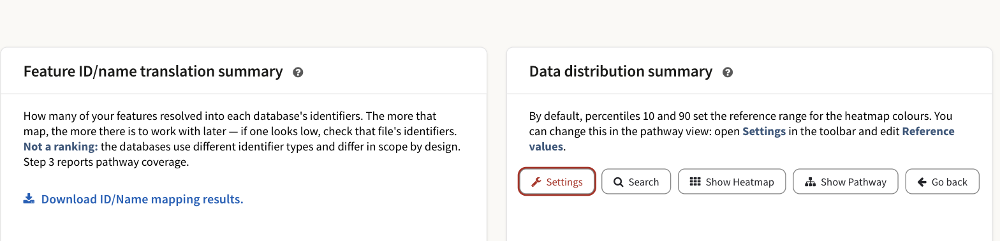

# Frequently asked questions

These are the questions the application's own refusals, limits and defaults
raise. Each answer is short and points at the page that covers the subject in
full.

## Before you run

### Do I need an account?

No. Every omic type, every pathway database, every result screen and every AI
feature works without signing in. An account adds three things: a list of your
jobs, storage for files you have already uploaded so you can reuse them, and a
longer retention window — 14 days instead of 7. Without an account the job's
URL is the only way back to it, so save it while the job runs. Full comparison
in [Accounts, storage and sharing](2_2_cloud_drive.md).

### Do my files have to be tab-separated plain text?

No. PaintOmics reads the first non-empty line of the file and takes a tab as
the column separator if that line contains one, a comma otherwise, so an
ordinary CSV is read as well as a TSV. A spreadsheet is a different matter: the
server does not open `.xlsx`, `.xls` or `.ods` files, and the upload form
instead offers to convert one in your browser first — a feature that ships
switched off and has to be enabled by whoever runs the server. See
[Preparing your data](2_1_accepted_input.md) and
[Converting your input files](ai-input-converter.md).

### Do I have to supply a relevant features file?

No. The row carries no required mark on the form — the red asterisk goes only
on the rows the job needs — and a job with only a values file runs. But be
clear about what you lose: the enrichment test counts how many of
a pathway's matched features are on your relevant list, so an omic uploaded
without one scores zero relevant features in every pathway and gets a p-value
of 1 everywhere. It will still be painted on the diagrams; it will contribute
nothing to the ranking. See [Pathway enrichment](4_1_pathway_enrichment.md).

### How large can my files be?

Everything you attach is sent in a single request, and the shipped
configuration refuses a request larger than **100 MB**. Separately, any values,
relevant-features or associations file is refused above **1,000,000 rows**,
with the message *"The file exceeds the maximum number of features allowed"*.
Both are settings on the server you are using, so another instance may allow
more or less.

### Why is my organism not in the list?

The picker holds the organisms this server has installed, which is a small
part of what KEGG carries. **Request an organism**, the action under the
Organism field, opens a dialog with a link to the full KEGG catalogue, the same
ranked picker with free text allowed, and an optional note; sending it files a
request with the people who run the server. Use the note to say which
identifiers your files carry — KEGG is keyed on NCBI Gene IDs, so Ensembl or
UniProt input needs the matching cross-reference table installed too.

!!! warning "Sign in first, or the request has no return address"
    The dialog does not ask for your email address. Sent from a session with an
    account, the request carries that account's address; sent anonymously, it
    reaches the maintainers with no way to answer you. If you are not signed
    in, write to the contact address on the [home page](index.md) instead.

### Why is a database greyed out for my species?

Because it is not installed for that organism on this server. KEGG is always
present and cannot be unticked — the server unions it into every job. MapMan,
Reactome and OmniPath are installed per species; when you choose an organism
the form asks the server which of them it has, ticks those, and labels the rest
**not installed**. Nothing on the form can change that; it is an installation
question for whoever runs the instance. What each one covers:
[KEGG](1_1_kegg.md), [Reactome](1_2_reactome.md), [MapMan](1_3_mapman.md),
[OmniPath](1_6_omnipath.md).

## When a file is refused

### My numbers use commas as the decimal mark

Every file you pick is checked in the browser before you submit anything, and
this is one of the few faults it can repair by itself — the others are blank
lines, spreadsheet title rows and columns that are empty on every row. If the
file is **tab-separated**, the
check turns amber and offers **Fix automatically**, which rewrites `0,77` as
`0.77` in the value columns and leaves the identifiers untouched. If the file
is **comma-separated**, it cannot be repaired: the decimal comma was already
read as a column break before PaintOmics saw the row, so the original numbers
are gone. Re-export that file with dots, or with tabs.

### The check rejects my file for something else

The browser check applies the same rules the server does, and names the rule
the file broke rather than quoting a line number. The faults it reports on a
values file include: a row with a different number of columns from the first
data row; an empty first cell, which is a feature with no identifier; a value
column holding text or symbols; a file with fewer than two columns; a file with
no data rows at all; and a file that is not saved as UTF-8. Relevant-features,
associations and design files are held to their own contracts and get their own
messages. What each file must contain is in
[Preparing your data](2_1_accepted_input.md).

If the fault is structural rather than mechanical — a spreadsheet, a DESeq2
table, a layout that does not fit the slot — the strip offers to hand the file
to the AI agent instead. That offer is printed whether or not the operator has
enabled the converter, so on a server where it is off the drawer opens and the
first step fails; see [Converting your input files](ai-input-converter.md).

### My omics have different numbers of conditions and the job is refused

A PaintOmics job has one set of conditions for all of its omics. The server
fixes the number of value columns from the first values file it reads and
refuses any omic that disagrees, naming both files: *"Every omic in one run
must have the same number of conditions."* The form catches the same
disagreement in the browser before you submit. The fix is to bring the files to
the same columns — one fold change per contrast in both, for instance — or to
run them as separate analyses. Where the AI converter is enabled, a
**Make them agree with the PaintOmics AI agent** button will attempt it for
you; it derives the narrower quantities from the wider omics' own columns and
never widens the narrow one. See
[when your omics disagree](ai-input-converter.md#when-your-omics-disagree-with-each-other).

### The job failed on the server with an error the form never showed

The browser check only sees files you pick with **Browse**, it reads only the
first few megabytes of a very large file, and it does not see a file taken from
**My Data** at all — so a fault can survive to the server. The error dialog
quotes the server's own message; most such dialogs also carry **Report error**,
which sends the message to the maintainers.

## While the job runs

### The page has been waiting a long time. Is anything happening?

The analysis runs in a queue on the server, not in your browser. The progress
dialog names the job, shows elapsed and estimated time, and prints the job's
URL. The queue applies no time limit of its own.

How long a job takes depends on the server and on what you submitted. The one
end-to-end timing PaintOmics records for itself is a useful yardstick: a
three-omic mouse job of 20,000 genes, 5,000 proteins and 400 metabolites over
six time points runs from the submitted files to the pathway results in about a
minute on an Apple-silicon machine with the databases installed locally —
repeated runs from cold measured between 39 and 58 seconds — most of it spent
matching your identifiers, building metagenes and scoring the metabolite hub
graph. A job carrying a MORE regulatory model is in a different class: the
bundled STATegra MORE example takes 234 s on the R PLS1 engine and 740 s on MLR,
against 0.1 s for the Rust PLS1 default. Numbers on your server will differ; the
shape of them will not.

### My MORE job was refused as too large

A regulatory model is costed before it is queued: PaintOmics estimates the
runtime from the shape of what you submitted and refuses anything it predicts
cannot finish inside the server's limit for a single analysis, 30 minutes as
shipped. The refusal quotes the shape, the estimate and what to change. The
usual causes, in order: a regulatory omic submitted without an association
file, so every regulator is paired with every gene; MLR, which is the slower
method; and simply too many genes. See
[the job is costed before it is queued](4_6_Regulatory_omics.md#the-job-is-costed-before-it-is-queued).

### I closed the tab, or the progress dialog turned into an error

The job is unaffected — it belongs to the server's queue, not to the page. Open
its URL (`<server>/?jobID=<job id>`) again, or **Recover** it from **My jobs**
if you are signed in. While it is still running you will get *"Your job … is
still running in the queue. Please, try again later"*, which is confirmation
that it is alive. The status poll does not retry, so a single dropped request
raises an error dialog for a job that is running perfectly well.

## After the job

### Why did only some of my features map?

Identifiers are looked up **exactly as they appear in your file**, against the
cross-reference table installed for your organism. A version suffix
(`ENSMUSG00000000001.5`), another species' identifiers, or an identifier type
this species was installed without will all fail to match. Metabolites are
matched by name, which is why Step 2 asks you to settle the names that fit more
than one KEGG compound.

*Step 2's summary cards. The left one reports, per database, how many of your
features resolved into that database's identifier type, and carries the
download link. It is not a ranking: the databases key on different identifiers
and differ in scope.*

**Download ID/Name mapping results**, on that card, gives you a zip holding —
for every omic — the identifiers that matched and the ones that did not. Read
the unmatched list first; it usually names the problem in its first ten lines.
Which identifier types exist for which species is in
[Supported identifiers](1_4_id.md).

### Can I download my results?

In pieces, yes:

| What | Where |
|---|---|
| Matched and unmatched identifiers, per omic, as a zip | **Download ID/Name mapping results**, on Steps 2 and 3 |
| A painted pathway diagram, as PNG | **Download** in the pathway toolbar |
| A pathway network, as PNG or SVG | The **PNG** / **SVG** buttons in the network toolbar |
| MORE's regulation-per-condition table, as TSV | **Download (TSV)** under that table |
| The pathway enrichment table, as XLS | **Download as XLS**, at the right-hand end of that table's toolbar |

The AI report has no export button; copy what you need out of it. Deletion is
permanent and there is no archive, so
take out whatever matters rather than relying on the job surviving.

### Can I share a job with a collaborator?

Yes — **Share** in the results toolbar. A job you ran while signed in is
private until you tick **Allow link sharing**; **Read-only (for others)** then
stops visitors re-running Step 2 or saving their visual settings over yours. A
job run without an account has no owner, so anyone holding its URL can already
open and change it, and it cannot be made read-only. Details in
[Sharing a job](2_2_cloud_drive.md#sharing-a-job).

### How long is my job kept?

Seven days for a job run without an account, fourteen for one belonging to a
registered account — counted **from the last time the job was opened**, not
from when it was submitted, so reopening a job resets its clock. Deletion takes
the results, the saved view and the AI interpretation with it. Both numbers are
server settings and the operator may have changed them; see
[How long a job is kept](2_2_cloud_drive.md#how-long-a-job-is-kept).

### The interface has started behaving oddly

Your browser keeps a copy of the job so the result screens stay quick, and that
copy can go stale.

A server update is not usually the cause. Each cached copy carries the version
of the format it was written in, and on the next load PaintOmics throws away a
copy written by an older version and fetches the job again from the server. The
same happens to a copy it cannot read back. Neither needs anything from you.

If you do want to shed the copy yourself, the thing to know is that it is held
in two places — session storage and IndexedDB — and that **Reset** in the
toolbar clears only the first. The IndexedDB copy survives it, and reopening the
job from its URL restores exactly the copy you were trying to get rid of. Two
things clear both: the **Discard the stored analysis and reload** link in the
dialog PaintOmics shows when it cannot start at all, and clearing this site's
stored data in your browser's own settings. Note the job's URL before you do
either. Afterwards, reopening the job from its URL fetches it fresh from the
server; nothing is lost, because the job itself lives there.

## The AI features

### Is my data sent anywhere?

If AI interpretation is enabled — and it ships enabled — the agent starts on
its own as soon as Step 2 finishes, and it sends pathway names and statistics,
the names of your matched features, **the measured values with their condition
labels** and your experiment description to the gateway named in section 2 of
the upload form. Pathway and feature names also reach PubMed and Europe PMC
when it searches. Your uploaded files are not sent as files, and unmatched
features are not sent at all. Read [What the AI does](ai-overview.md) before
you upload anything sensitive: there is no per-job opt-out on the form, so the
control you have is what you put in the files and in the condition labels.

### Why did the AI interpretation never start?

The common case is a server with the feature enabled but no API key for its
provider: the bar sits at 0%, "Not started", and never moves. Nothing was sent
and nothing was spent, and only an administrator can fix it. The other states —
the feature switched off, a stalled run you can retry, an expired session, a
job past its retention window — are listed in
[when it does not work](ai-interpretation.md#when-it-does-not-work).

## Citing PaintOmics

### How do I cite PaintOmics?

Cite the PaintOmics 4 paper: Liu *et al.*, *Nucleic Acids Research* **50**,
W551–W559 (2022), [doi:10.1093/nar/gkac352](https://doi.org/10.1093/nar/gkac352).
**More ▸ Cite PaintOmics** in the top bar links that paper and a BibTeX record
for it, together with PaintOmics 3, PaintOmics 2 and RGmatch. If your analysis
went through the region-to-gene matching, cite RGmatch as well.

## Still stuck

If your question is really "what is this screen for", the walkthrough answers
faster than a FAQ entry can.

* [Your first analysis](8_step_by_step.md) — a whole job, screen by screen.
* [The example datasets](examples.md) — run a job that is known to work, and
  compare it with yours.
* [Preparing your data](2_1_accepted_input.md) — what each file must contain.
* The [home page](index.md) has the address to write to, and the GitHub
  repository for bug reports.
