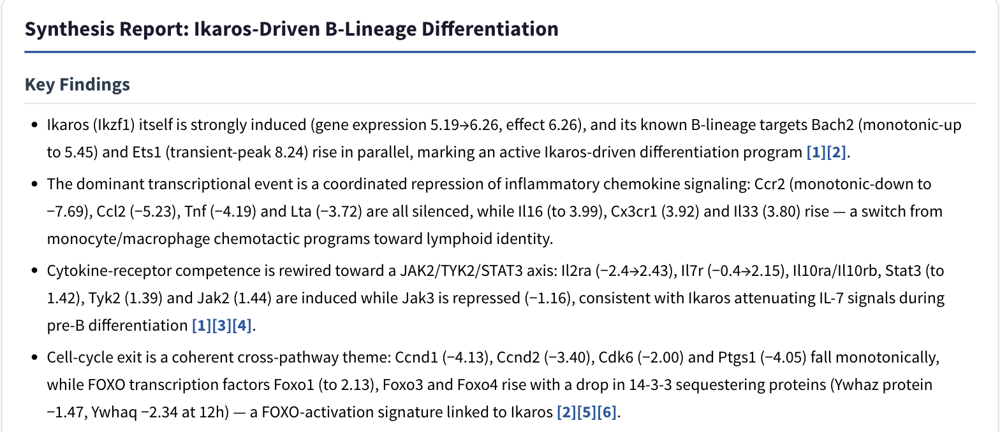
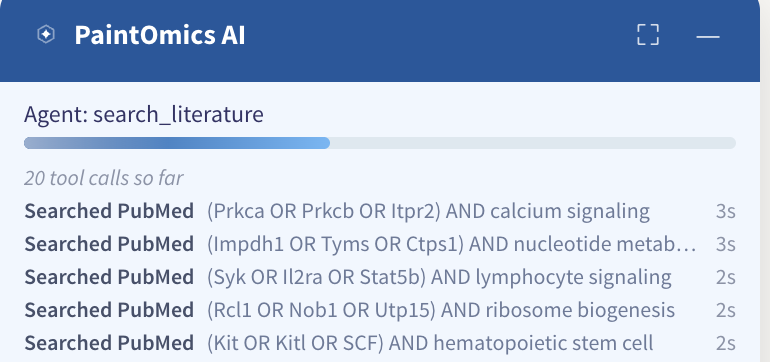
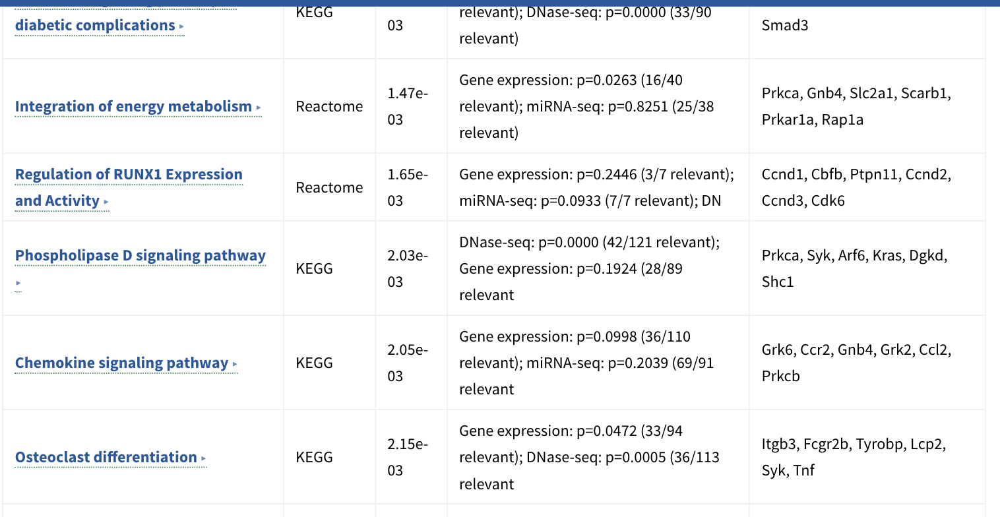
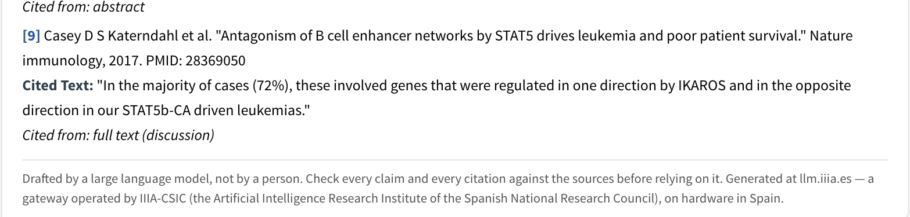
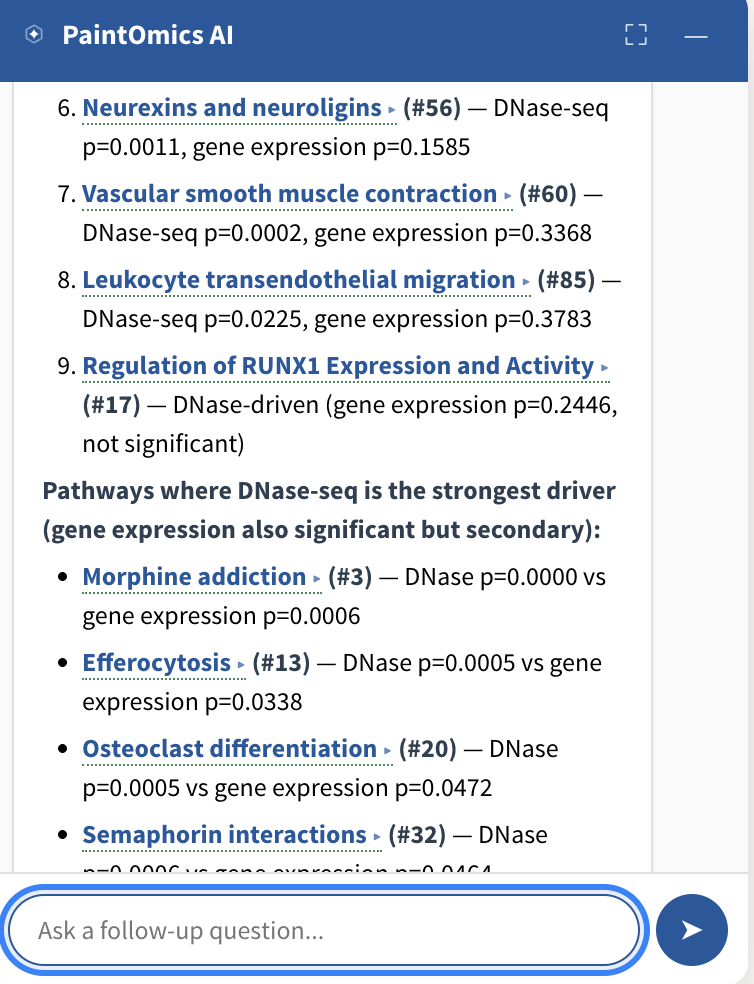

# The pathway interpretation

When a job finishes, the PaintOmics AI agent reads the result — your values,
your enriched pathways, and the literature — and writes a draft of what it
means, with a citation behind every claim it takes from a paper.

It is a draft for you to check, not a conclusion. What makes it worth the read
is that it is grounded in your own numbers: the agent queries the measurements
you uploaded, so it can say *"Ccnd1 (−4.13), Ccnd2 (−3.40) and Cdk6 (−2.00)
fall monotonically"* rather than *"cell-cycle genes were affected"*.

*The opening of a report on the STATegra example. The numbers in brackets are
this job's own measurements; `[1]`, `[2]` link to the papers on PubMed.*

## Starting it

You do not press anything. If AI interpretation is enabled on the server and
the job was submitted through the upload form, the pipeline is queued the
moment Step 2 finishes, and it runs while you look at your results.

The **AI Interpret** button in the Step 3 toolbar opens the panel; so does the
circular mark floating in the bottom-right corner, whose badge tells you the
state — spinning while it works, a green tick when the report is ready, a red
exclamation if it failed. The panel is anchored to the page rather than to the
results view, so it stays open and readable while you look at a painted
pathway.

Filling in **Experiment design** on the upload form is the single most useful
thing you can do for the quality of the result. Without it the agent has your
condition labels and nothing else, and it cannot know which direction of change
you consider the treatment.

## While it works

*A run in progress. The panel names the tool the agent is using, counts the
calls it has made, and lists the last six in plain words — "Searched PubMed",
"Read a paper", "Noted a finding", "Checked its citations" — each with how long
it took, if it took more than a second and a half.*

The feed is there so that a long run is legible rather than a spinner. It is
also the honest picture of how the agent works: it decides for itself which
pathways to examine, which genes to pull the values for, and what to search;
the budget for searches, papers and time is enforced by the tools, not by the
model's good intentions.

## What the report contains

Five written sections, in this order:

* **Key Findings** — three to five bullets, each tying a named observation to
  the values behind it.
* **Cross-Pathway Themes** — what recurs across the significant pathways, using
  the cluster ids described below.
* **Detailed Pathway Analysis** — a paragraph per pathway.
* **Suggested Follow-up Experiments** — three to five, prioritised, each with a
  technique, the reason, and what you would expect to see.
* **Limitations and Caveats**.

Then two tables that are **not** written by the model. They are rendered from
the job's own data, so the numbers in them cannot drift:

*The Enriched Pathway Summary: pathway, source database, combined p-value, the
per-omic p-values with relevant counts, and the genes driving it. Pathway names
are links.*

The second table, **Pathway Clusters**, lists the groups the agent formed by
shared matched features, each with its id, label, member pathways and the core
genes they share.

Finally, the references.

*Each reference carries the verbatim sentence the agent relied on and whether
it came from the abstract or the full text. The provenance line sits inside the
report block, so copying the text copies it too.*

Every citation is checked before you see it: the quoted sentence must actually
occur in the source. A claim whose citation cannot be verified is removed from
the report and the remaining citations are renumbered — so the absence of a
claim you expected is a signal, not an oversight.

!!! note "There is no export"
    The report lives in the panel. There is no download, no PDF, and no
    figures inside it. Select the text and copy it — the provenance line will
    come with it, which is the point.

## Following a thread

**Click a pathway name** anywhere in the report and two things happen at once:
the diagram opens in the main view, and the agent writes a focused
interpretation of that one pathway, citing only papers it already retrieved for
it. These are generated on demand and cached, so only the pathways you actually
open cost anything.

**Click a cluster id** (`C01`, `C02`, …) to jump to that cluster's row in the
Pathway Clusters table.

**Colour the network by the agent's clusters.** Once the report exists, every
[pathway network](4_3_pathways_network.md) gains an extra **Node coloring**
option, **AI pathway clusters**, whose legend names each cluster and lets you
hide its nodes.

**Ask a follow-up question** in the box at the foot of the panel. The question
goes to the model with the report as context *and* with the tools that read
this job's data, so it can answer about a specific gene or value rather than
only about the text it already wrote. The conversation is kept with the job.

*The answer to "Which of the significant pathways is driven mainly by the
DNase-seq layer rather than by gene expression?" — the per-omic p-values are
this job's, not the report's, and each pathway name opens its diagram.*

## When it does not work

| What you see | What it means |
|---|---|
| The bar sits at 0%, "Not started", and never moves | The server has AI interpretation enabled but no API key for its provider. Nothing was spent and nothing was sent; this needs a server administrator. |
| "AI interpretation is not enabled on this server." | `AI_INTERPRETATION_ENABLED` is off here. |
| "Pipeline interrupted (no progress for 10 min). Click Retry." | The run stalled and was marked dead. **Retry** re-queues it. |
| "Your session expired…" | Sign in again and reopen the job from your job list. |
| "This job is no longer stored on the server…" | The job passed its retention window — 7 days for a guest job, 14 for one belonging to a registered account. There is deliberately no Retry: the data it would interpret is gone. |

## What it cannot do

* It cannot see your uploaded files. It sees matched features, their values and
  their condition labels, and the pathway results.
* It cannot see features that failed to map. A pathway that is invisible to the
  enrichment is invisible to the agent.
* It does not know your hypothesis unless you wrote it in **Experiment
  design**.
* It is a language model. It can write a fluent, well-cited paragraph that is
  wrong about your biology. The citations are verified to be *real and
  correctly quoted*; that the argument built on them holds is your judgement,
  not the machine's.
