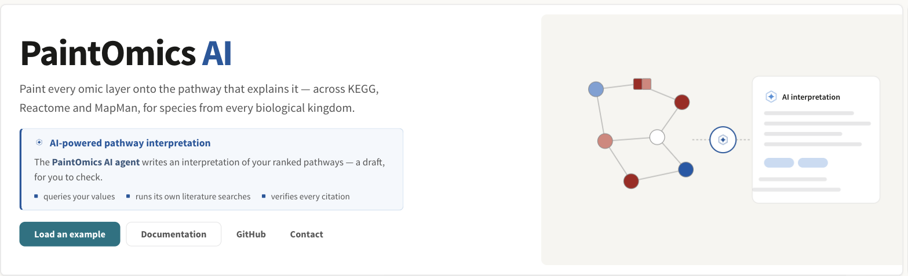

# PaintOmics

PaintOmics paints your omics measurements onto the pathways that explain them.
You upload one file per omic layer, it matches your identifiers to KEGG,
Reactome, MapMan and OmniPath, tests which pathways your data has moved, and
draws the result on the pathway diagrams themselves — every gene, protein,
transcript, region and metabolite you measured, coloured by what it did, in
every condition at once.

It runs in a browser and needs no account: a job gets its own URL the moment it
starts, and you can close the tab and come back to it.

*The home page. **Load an example** fills the form with a published dataset,
ready for you to press **Run PaintOmics** — the fastest way to see the whole
tool work.*

## What you can do with it

| | |
|---|---|
| **Integrate several omics at once** | Gene expression, proteomics, metabolomics, miRNA-seq and any region-based assay (DNase-seq, ChIP-seq, ATAC-seq, Methyl-seq) in one job, with a combined p-value per pathway. |
| **Work across four pathway databases** | [KEGG](1_1_kegg.md), [Reactome](1_2_reactome.md), [MapMan](1_3_mapman.md) and the [OmniPath](1_6_omnipath.md) interaction network, in whatever combination is installed for your species. |
| **See the whole time course on one diagram** | Each matched feature is drawn as one box per condition, so a trend is visible without leaving the map. |
| **Go beyond enrichment** | A [pathway interaction network](4_3_pathways_network.md), a [metabolite hub analysis](4_4_metabolite_hub_analysis.md), a [metabolite class activity test](4_5_metabolite_class_activity_analysis.md) and [regulatory modelling with MORE](4_6_Regulatory_omics.md). |
| **Ask the AI agent to read the result** | It queries your own values, searches the literature, checks every quotation it prints, and hands you a cited draft. See [What the AI does](ai-overview.md). |

## Start here

* **[Your first analysis](8_step_by_step.md)** — the whole tool, screen by
  screen, on a real dataset. Start here if you have never used PaintOmics.
* **[Preparing your data](2_1_accepted_input.md)** — what a values file and a
  relevant-features file look like, for each kind of omic.
* **[The example datasets](examples.md)** — twelve ready-made jobs, from a
  single gene-expression contrast to the full five-omic STATegra time course.
* **[A worked example](6_1_use_case.md)** — one real five-omic run followed from
  the files to a conclusion, and what that conclusion does not support.

## The three databases, and the fourth

KEGG is always installed. Reactome, MapMan and OmniPath are installed per
species, and the upload form ticks the ones your organism actually has — so
what you see offered is what this server can run. If your species is missing
entirely, **Request an organism** on the upload form sends the maintainers a
request; any organism KEGG carries can be installed.

## Getting help

Report a problem or ask a question at
[paintomicsai@gmail.com](mailto:paintomicsai@gmail.com), or open an issue on
[GitHub](https://github.com/ConesaLab/PaintOmics). If you use PaintOmics in
published work, the **More ▸ Cite PaintOmics** menu in the application gives
the BibTeX for each release.
